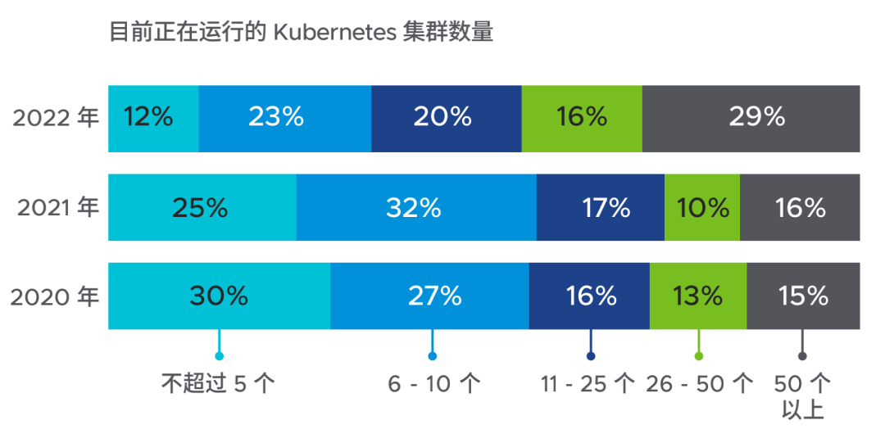
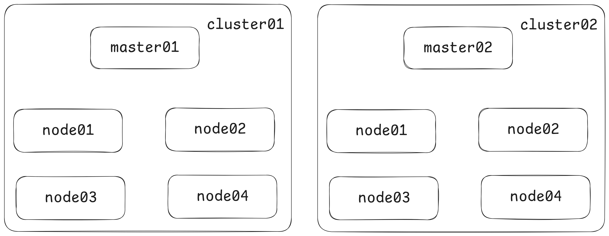
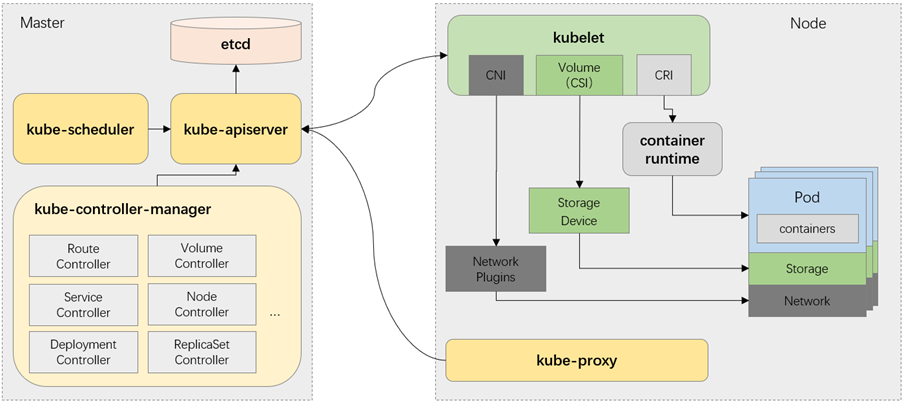

# 云计算的三种模式

## 单机到云原生的演变

## IAAS

Infrastructure as a Service  基础设施即服务

## PAAS

platform as a service  平台即服务

## SAAS

Software as a Service

# 容器编排工具

## Borg

Borg 是 Google 早期开发的集群管理系统，用于管理大规模的容器化⼯作负载。它是 Google 内部的⼀个关键基础设施，自 2003 年开始使用。

## Omega

Omega 是 Borg 的⼀个后继系统，于 2013 年开始开发，旨在解决 Borg 在大规模、动态、多租户环境下多租户、声 明 式 配 置。

## kubernetes

Kubernetes是一个可移植的、可扩展的开源平台，用于管理容器化的工作负载和服务，可促进声明式配置和自动化。kubernetes拥有一个庞大且快速增长的生态系统。kubernetes的服务、支持和工具广泛可用。

kubernetes这个名字源于希腊于，意为舵手或飞行员。k8s这个缩写是因为k和s之间有八个字符的关系。google在2014年开源了kubernetes项目。kubernetes建立在google在大规模运行生产工作负载方面拥有十几年的经验的基础上，结合了社区中最好的想法和实践。

# kubernetes优势

- 服务发现和负载均衡
- 存储编排（添加任何本地或云服务器）
- 自动部署和回滚

- 自动分配	CPU/内存资源
- 弹性伸缩
- 自我修复（需要时启动新容器）
- Secret（安全相关信息）和配置管理
- 大型规模的支持
  - 每个节点的Pod数量不超过	110
  - 节点数不超过	5000
  - Pod总数不超过	150000
  - 容器总数不超过	300000
- 开源

## kubernetes现状

# kubernetes组件

一个kubernetes集群由一组被称作节点的机器组成。这些节点上运行Kubernetes所管理的容器化应用。集群具有至少一个工作节点。

工作节点托管作为应用负载的组件的Pod。控制平面管理集群中的工作节点和pod。为集群提供故障转移和高可用性，这些控制平面一般跨多主机运行，集群跨多个节点运行。

**Mater：**集群中的一台服务器用作Master，负责管理整个集群。Master是集群的网关和中枢，负责诸如为用户和客户端暴露API、跟踪其他服务器的健康状态、以最优方式调度工作负载，以及编排其他组件之间的通信任务，它是用户或客户端与集群之间的核心联络点，并负载Kubernetes系统的大多数集中式管控逻辑。单个master节点即可完成其所有的功能，但出于冗余及负载均衡等目的，生产环境中通常需要协同部署多个此类主机。

**Node：** Node是Kubernetes集群的工作节点，负责接收来自master的工作指令相应地创建或销毁Pod对象，以及调整网络规则以合理地路由和转发流量等。理论上讲，Node可以是任何形式的计算设备，不过Master会统一将其抽象为Node对象进行管理。

Kubernetes将所有Node资源集结于一处形成一台更加强大的服务器，在用户将应用部署于其上时，Master会使用调度算法将其自动指派至某个特定的Node运行。在Node加入集群或从集群中移除时，Master也会按需重新编排影响到的Pod，于是用户无须关心其应用究竟运行何处。

## kubernetes核心组成

控制平面组件可以在集群中的任何节点上运行。然后，为了简单起见，设置脚本通常会在同一个计算机上启动所有控制平面组件，并且不会在此计算机上运行用户容器。

### Master组件

#### kube-apiserver

Api server负责输出restful风格的kubernetes API，它是发往集群的所有REST操作命令的接入点，并负责接收、校验并响应所有的REST请求，结果状态被持久存储于etcd中。因此，api server是整个集群的网关。

#### etcd

kubernetes集群的所有状态信息都需要持久存储于存储系统etcd中，不过，etcd是由CoreOS基于Raft协议开发的分布式键值存储，可用于服务发现、共享配置以及一致性保障（如数据库主节点选择、分布式锁等）。因此，etcd是独立的服务组件，并不隶属于Kubernetes集群自身。

etcd不仅能够提供键值数据存储，而且还为其提供了监听机制，用于监听和推送变更。Kubernetes集群系统中，etcd中的键值发生变化时会通知到api server。

#### kube-controller-manager

kubernetes中，集群级别的大多数功能都是由几个被称为控制器的进程执行实现的，这几个进程被集成于kube-controller-manager守护进程中。由控制器完成的功能主要包括生命周期功能和api业务逻辑。

#### kube-scheduler

Kubernetes是用于部署和管理大规模容器应用的平台，根据集群规模的不同，其托管运行的容器很可能会数以千计甚至更多。api server确认pod对象的创建请求之后，便需要由scheduler根据集群内各节点的可用资源状态，以及要运行的容器的资源需求做出调度决策。

### Node组件

#### kubelet

kubelet是运行于工作节点上的守护进程，它从api server接收关于pod对象的配置信息并确保他们处于期望的状态，kubelet会在api server上注册当前的工作节点，定期向master汇报节点资源使用情况。

#### kube-proxy

每个工作节点都需要运行一个kube-proxy守护进程，它能够按需为service资源对象生成iptables或者ipvs规则，从而捕获当前service的流量并将其转发至正确的后端pod对象。

#### 容器运行时环境

每个node都要提供一个容器运行时环境(CRI)，它负责下载镜像并运行容器。kubernetes支持多个容器运行时环境。

# kubernetes插件与附件

## 组件

- apiserver
- scheduler
- controller-manager
- kubelet
- kubeproxy
- ...

## 插件

- Docker
- CoreDNS
- Ingress Controller
- ...

## 附件

- premetheus
- dashboard
- federation
- ...

# 补充知识Restful

对应的中文是rest式的；Restful web service是⼀种常见的rest的应用,是遵守了rest风格的web服务；rest式的web服务是⼀种ROA(The Resource-Oriented Architecture)(面向资源的架构)。

在Restful之前的操作：

- http://127.0.0.1/user/query/1 GET根据用户id查询用户数据
- http://127.0.0.1/user/save POST新增用户
- http://127.0.0.1/user/update POST修改用户信
- http://127.0.0.1/user/delete/1GET/ POST删除用户信

RESTful用法：

- http://127.0.0.1/user/1 GET根据用户id查询用户数据
- http://127.0.0.1/user POST新增用户
- http://127.0.0.1/user PUT修改用户信
- http://127.0.0.1/user DELETE删除用户信