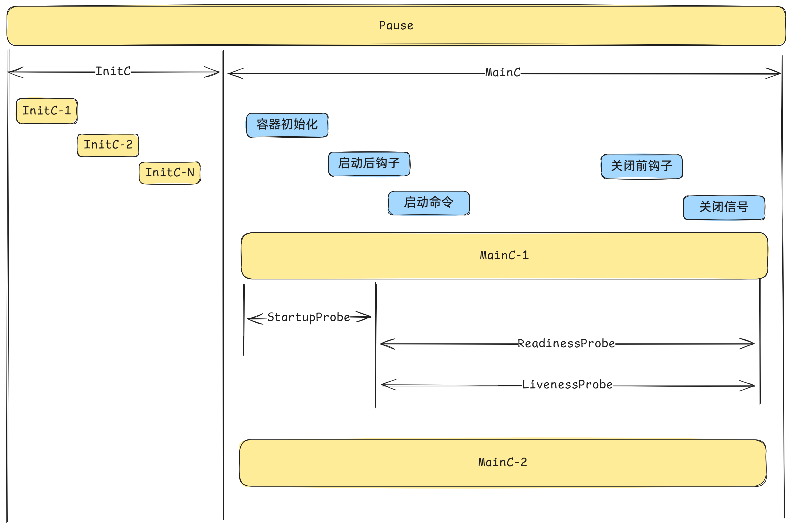
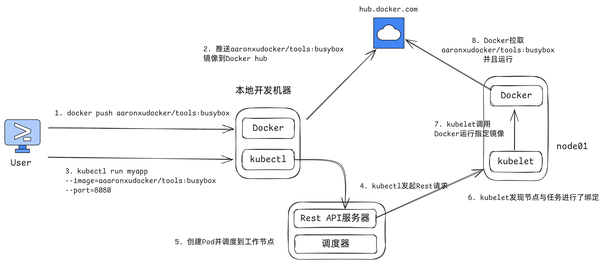

# Pod生命周期



init容器与普通的容器非常像，除了如下两点：

- init容器总是运行到成功完成为止
- 每个init容器都必须在下一个init容器启动之前成功完成

如果Pod的Init容器失败，Kubernetes会不断地重启该Pod，直到Init容器成功为止。然而，如果Pod对应的restartPolicy为Never，它不会重新启动

## 检测initC的阻塞性

```yaml
apiVersion: v1
kind: Pod
metadata:
  name: initc-1
  labels:
    name: initc
spec:
  containers:
  - name: myapp-container
    image: centos:7
    resources:
      limits:
        memory: "128Mi"
        cpu: "500m"
    command: ['sh', '-c', 'echo The app is running && sleep 10']
  initContainers:
  - name: init-myservice
    image: aaronxudocker/tools:busybox
    command: ['sh', '-c', 'until nslookup myservice; do echo waiting for myservice; sleep 2; done;']
  - name: init-mydb
    image: aaronxudocker/tools:busybox
    command: ['sh', '-c', 'until nslookup mydb; do echo waiting for mydb; sleep 2; done;']
```

```bash
# 查看日志，看到不停的在尝试
$ kubectl logs initc-1 -c init-myservice

# 创建svc资源，会通过CoreDNS自动将myservice解析成功，详解看后面的service部分
$ kubectl create svc clusterip myservice --tcp=80:80
```

如果initc执行失败了，那么就会重新执行所有的initc

```yaml
apiVersion: v1
kind: Pod
metadata:
  name: initc-2
  labels:
    name: initc
spec:
  containers:
  - name: myapp-container
    image: centos:7
    resources:
      limits:
        memory: "128Mi"
        cpu: "500m"
    command: ['sh', '-c', 'echo The app is running && sleep 10']
  initContainers:
  - name: init-myservice
    image: aaronxudocker/tools:busybox
    command: ['sh', '-c', 'until nslookup myservice; do echo waiting for myservice; sleep 2; done;']
  - name: randexit
    image: aaronxudocker/tools:randexitv1
    args: ['--exitcode=1']
```

```bash
$ kubectl get pod
NAME      READY   STATUS       RESTARTS      AGE
initc-1   0/1     Init:1/2     0             16m
initc-2   0/1     Init:Error   5 (97s ago)   3m42s
$ kubectl logs initc-2 -c randexit
休眠 4 秒，返回码为 1！
```

如果我们让initc的返回码直接为0，那么就可以看到pod正常启动

```bash
$ kubectl get pod
NAME      READY   STATUS     RESTARTS     AGE
initc-1   0/1     Init:1/2   0            19m
initc-2   1/1     Running    1 (7s ago)   72s
```

- InitC与应用容器具备不同的镜像，可以把一些危险的工具放置在initC中，进行使用
- initC多个之间是线性启动的，所以可以做一些延迟性的操作
- initC无法定义readinessProbe，其它以外同应用容器定义无异

# Pod探针

探针是由kubelet对容器执行的定期诊断。要执行诊断，kubelet调用由容器实现的Handler。有三种类型的处理程序：

- ExecAction：在容器内执行指定命令。如果命令退出时返回码为0则认为诊断成功
- TCPSocketAction：对指定端口上的容器的IP地址进行TCP检查。如果端口打开，则诊断被认为是成功的
- HTTPGetAction：对指定的端口和路径上的容器的IP地址执行HTTPGet请求。如果响应的状态码⼤于等于200且小于400，则诊断被认为是成功的

每次探测都将获得以下三种结果之一：

- 成功：容器通过了诊断。
- 失败：容器未通过诊断。
- 未知：诊断失败，因此不会采取任何行动

## 探针的分类

- startupProbe：开始探针，开始检测吗？
- livenessProbe：存活探针，还活着吗？
- readinessProbe：就绪探针，准备提供服务了吗？

### readinessProbe就绪探针

介绍：k8s通过添加就绪探针，解决尤其是在扩容时保证提供给用户的服务都是可用的。

> 选项说明
> - initialDelaySeconds：容器启动后要等待多少秒后就探针开始工作，单位“秒”，默认是0秒，最小值是0
> - periodSeconds：执行探测的时间间隔（单位是秒），默认为10s，单位“秒”，最小值是1
> - timeoutSeconds：探针执行检测请求后，等待响应的超时时间，默认为1s，单位“秒”，最小值是1
> - successThreshold：探针检测失败后认为成功的最小连接成功次数，默认值为1。必须为1才能激活和启动。最小值为1。
> - failureThreshold：探测失败的重试次数，重试一定次数后将认为失败，默认值为3，最小值为1。

#### 就绪探针实验

- 基于 HTTP GET 方式

```yaml
apiVersion: v1
kind: Pod
metadata:
  name: readiness-httpget-pod
  labels:
    name: myapp
spec:
  containers:
  - name: readiness-httpget-container
    image: nginx:latest
    imagePullPolicy: IfNotPresent
    readinessProbe:
      httpGet:
        port: 80
        path: /index1.html
      initialDelaySeconds: 1
      periodSeconds: 3
    resources:
      limits:
        memory: "128Mi"
        cpu: "500m"
```

```bash
# 当前处于没有就绪的状态
$ kubectl get pod
NAME                    READY   STATUS             RESTARTS        AGE
readiness-httpget-pod   0/1     Running            0               4m16s

# 创建一个index1.html
$ kubectl exec -it readiness-httpget-pod -c readiness-httpget-container -- /bin/bash
root@readiness-httpget-pod:/# echo "hehe" > /usr/share/nginx/html/index1.html

# 查看就已经处于就绪的状态了
$ kubectl get pod
NAME                    READY   STATUS             RESTARTS       AGE
readiness-httpget-pod   1/1     Running            0              5m40s

# 在运行过程中，就绪探测一直存在，如果不满足条件，会回到未就绪的情况
```

- 基于 EXEC 方式

```yaml
apiVersion: v1
kind: Pod
metadata:
  name: readiness-exec-pod
  labels:
    name: myapp
spec:
  containers:
  - name: readiness-exec-container
    image: aaronxudocker/tools:busybox
    imagePullPolicy: IfNotPresent
    command: ["/bin/sh", "-c", "touch /tmp/live ; sleep 60; rm -rf /tmp/live; sleep 3600"]
    readinessProbe:
      exec:
        command: ["test", "-e", "/tmp/live"]
      initialDelaySeconds: 1
      periodSeconds: 3
    resources:
      limits:
        memory: "128Mi"
        cpu: "500m"
```

```bash
# 可以看到在60秒后就变成非就绪状态了
$ kubectl get pod -w
NAME                 READY   STATUS    RESTARTS   AGE
readiness-exec-pod   1/1     Running   0          7s
readiness-exec-pod   0/1     Running   0          69s
```

基于TCP Check方式

```yaml
apiVersion: v1
kind: Pod
metadata:
  name: readiness-tcp-pod
  labels:
    name: myapp
spec:
  containers:
  - name: readiness-tcp-container
    image: nginx:latest
    imagePullPolicy: IfNotPresent
    readinessProbe:
      tcpSocket:
        port: 80
      initialDelaySeconds: 1
      periodSeconds: 3
    resources:
      limits:
        memory: "128Mi"
        cpu: "500m"
```

#### 就绪探针流量测试


在匹配可用pod的时候，标签必须匹配，状态必须是就绪状态。

```yaml
# pod-1.yaml
apiVersion: v1
kind: Pod
metadata:
  name: pod-1
  labels:
    app: myapp
spec:
  containers:
  - name: myapp-1
    image: nginx:latest
    resources:
      limits:
        memory: "128Mi"
        cpu: "500m"

# pod-2.yaml
apiVersion: v1
kind: Pod
metadata:
  name: pod-2
  labels:
    app: myapp
    version: v1
spec:
  containers:
  - name: myapp-1
    image: nginx:latest
    resources:
      limits:
        memory: "128Mi"
        cpu: "500m"
        
 # 确认状态已经就绪
 $ kubectl get pod --show-labels
NAME    READY   STATUS    RESTARTS   AGE     LABELS
pod-1   1/1     Running   0          2m31s   app=myapp
pod-2   1/1     Running   0          32s     app=myapp,version=v1
```

创建service资源

```bash
# 注意myapp就是标签为app=myapp的pod
# 此处不需要理解，后面会细讲，只是用来验证就绪探针对流量的影响
# 此处的作用是形成多个pod的负载均衡
$ kubectl create svc clusterip myapp --tcp=80:80
service/myapp created
$ kubectl get svc
NAME         TYPE        CLUSTER-IP    EXTERNAL-IP   PORT(S)   AGE
kubernetes   ClusterIP   10.0.0.1      <none>        443/TCP   46h
myapp        ClusterIP   10.8.74.201   <none>        80/TCP    6s
```

将两个pod中的主页文件修改一下，用来作为区分

```bash
# 如果pod中只有一个main容器，那么在exec的时候就不需要指定容器
$ kubectl exec -it pod-1 -- /bin/bash
root@pod-1:/# echo pod-1 > /usr/share/nginx/html/index.html
$ kubectl exec -it pod-2 -- /bin/bash
root@pod-2:/# echo pod-2 > /usr/share/nginx/html/index.html
```

验证负载均衡的状态

```bash
$ curl 10.8.74.201
pod-2
$ curl 10.8.74.201
pod-1
$ curl 10.8.74.201
pod-2
```

创建一个label为 `app: test` 的pod，看下是否能被匹配

```yaml
# 3.yaml
apiVersion: v1
kind: Pod
metadata:
  name: pod-3
  labels:
    app: test
    version: v1
spec:
  containers:
  - name: myapp-1
    image: nginx:latest
    resources:
      limits:
        memory: "128Mi"
        cpu: "500m"
```

查看pod状态，修改 `pod-3` 的网页内容

```bash
$ kubectl get pod --show-labels
NAME    READY   STATUS    RESTARTS   AGE     LABELS
pod-1   1/1     Running   0          11m     app=myapp
pod-2   1/1     Running   0          9m57s   app=myapp,version=v1
pod-3   1/1     Running   0          51s     app=test,version=v1

$ kubectl exec -it pod-3 -- /bin/bash
root@pod-3:/# echo pod-3 > /usr/share/nginx/html/index.html
```

验证负载均衡的状态,发现 `pod-3` 并不能被匹配上

```bash
$ curl 10.8.74.201
pod-1
$ curl 10.8.74.201
pod-2
$ curl 10.8.74.201
pod-1
$ curl 10.8.74.201
pod-2
$ curl 10.8.74.201
pod-2
$ curl 10.8.74.201
pod-1
```

创建一个不满足就绪条件的 `pod-4` 

```yaml
apiVersion: v1
kind: Pod
metadata:
  name: pod-4
  labels:
    app: myapp
    version: v1
spec:
  containers:
  - name: myapp-1
    image: nginx:latest
    readinessProbe:
      httpGet:
        port: 80
        path: /index1.html
      initialDelaySeconds: 1
      periodSeconds: 3
    resources:
      limits:
        memory: "128Mi"
        cpu: "500m"
```

修改主页内容

```bash
$ kubectl exec -it pod-4 -- /bin/bash
root@pod-4:/# echo pod-4 > /usr/share/nginx/html/index.html
```

查看状态是未就绪的

```bash
$ kubectl get pod --show-labels
NAME    READY   STATUS    RESTARTS   AGE     LABELS
pod-1   1/1     Running   0          17m     app=myapp
pod-2   1/1     Running   0          15m     app=myapp,version=v1
pod-3   1/1     Running   0          6m49s   app=test,version=v1
pod-4   0/1     Running   0          41s     app=myapp,version=v1
```

验证负载均衡

```bash
$ curl 10.8.74.201
pod-1
$ curl 10.8.74.201
pod-2
$ curl 10.8.74.201
pod-1
$ curl 10.8.74.201
pod-2
$ curl 10.8.74.201
pod-2
$ curl 10.8.74.201
pod-1
```

满足 `pod-4` 的就绪条件

```bash
$ kubectl exec -it pod-4 -- /bin/bash
root@pod-4:/# touch /usr/share/nginx/html/index1.html
```

再次验证负载均衡

```bash
$ curl 10.8.74.201
pod-1
$ curl 10.8.74.201
pod-2
$ curl 10.8.74.201
pod-4
```

### livenessProbe存活探针

介绍：k8s通过添加存活探针，解决虽然活着但是已经死了的问题。

> 选项说明
> - initialDelaySeconds：容器启动后要等待多少秒后就探针开始工作，单位“秒”，默认是0秒，最小值是0
> - periodSeconds：执行探测的时间间隔（单位是秒），默认为10s，单位“秒”，最小值是1
> - timeoutSeconds：探针执行检测请求后，等待响应的超时时间，默认为1s，单位“秒”，最小值是1
> - successThreshold：探针检测失败后认为成功的最小连接成功次数，默认值为1。必须为1才能激活和启动。最小值为1。
> - failureThreshold：探测失败的重试次数，重试一定次数后将认为失败，默认值为3，最小值为1。

#### 存活探针实验

- 基于 Exec 方式

```yaml
apiVersion: v1
kind: Pod
metadata:
  name: liveness-exec-pod
spec:
  containers:
  - name: liveness-exec-container
    image: aaronxudocker/tools:busybox
    imagePullPolicy: IfNotPresent
    command: ["/bin/sh", "-c", "touch /tmp/live; sleep 60; rm -rf /tmp/live; sleep 3600"]
    livenessProbe:
      exec:
        command: ["test", "-e", "/tmp/live"]
      initialDelaySeconds: 1
      periodSeconds: 3
    resources:
      limits:
        memory: "128Mi"
        cpu: "500m"
```

一段时间以后，可以看到发生重启的事件

```bash
$ kubectl get pod -w
NAME                READY   STATUS    RESTARTS   AGE
liveness-exec-pod   1/1     Running   0          11s
liveness-exec-pod   1/1     Running   1 (1s ago)   101s
liveness-exec-pod   1/1     Running   2 (1s ago)   3m20s
```

- 基于 HTTP Get 方式

```yaml
apiVersion: v1
kind: Pod
metadata:
  name: liveness-httpget-pod
spec:
  containers:
  - name: liveness-httpget-container
    image: nginx:latest
    imagePullPolicy: IfNotPresent
    livenessProbe:
      httpGet:
        port: 80
        path: /index.html
      initialDelaySeconds: 1
      periodSeconds: 3
      timeoutSeconds: 3
    resources:
      limits:
        memory: "128Mi"
        cpu: "500m"
```

删除 `index.html` 文件，使其不满足存活探测条件

```bash
# 在删除index.html之后，可以看到命令行退出了
$ kubectl exec -it liveness-httpget-pod -- /bin/bash
root@liveness-httpget-pod:/# rm -f /usr/share/nginx/html/index.html 
root@liveness-httpget-pod:/# command terminated with exit code 137
```

重新查看pod状态，可以看到重启了

```bash
$ kubectl get pod
NAME                   READY   STATUS    RESTARTS      AGE
liveness-httpget-pod   1/1     Running   1 (48s ago)   2m39s
```

在运行此pod的节点上查看docker的名字，容器名字是 `集群名-pod名-容器名-hash-重启次数(初始是0)`

```bash
$ docker ps -a |grep liveness-exec-container
18c5ba02d684   39286ab8a5e1                                        "/docker-entrypoint.…"   About a minute ago   Up About a minute                         k8s_liveness-exec-container_liveness-httpget-pod_default_aa36504e-23a9-48d1-988c-4de0398c474f_1
54b3a04bd6b0   39286ab8a5e1                                        "/docker-entrypoint.…"   3 minutes ago        Exited (0) About a minute ago             k8s_liveness-exec-container_liveness-httpget-pod_default_aa36504e-23a9-48d1-988c-4de0398c474f_0
```

- 基于 TCP Check 方式

```yaml
apiVersion: v1
kind: Pod
metadata:
  name: liveness-tcp-pod
spec:
  containers:
  - name: liveness-tcp-container
    image: nginx:latest
    imagePullPolicy: IfNotPresent
    livenessProbe:
      tcpSocket:
        port: 80
      initialDelaySeconds: 1
      periodSeconds: 3
      timeoutSeconds: 3
    resources:
      limits:
        memory: "128Mi"
        cpu: "500m"
```

### startupProbe启动探针

介绍：k8s在1.16版本后增加startupProbe探针，主要解决在复杂的程序中readinessProbe、livenessProbe探针无法更好的判断程序是否启动、是否存活。

> 选项说明
> - initialDelaySeconds：容器启动后要等待多少秒后就探针开始工作，单位“秒”，默认是0秒，最小值是0
> - periodSeconds：执行探测的时间间隔（单位是秒），默认为10s，单位“秒”，最小值是1
> - timeoutSeconds：探针执行检测请求后，等待响应的超时时间，默认为1s，单位“秒”，最小值是1
> - successThreshold：探针检测失败后认为成功的最小连接成功次数，默认值为1。必须为1才能激活和启动。最小值为1。
> - failureThreshold：探测失败的重试次数，重试一定次数后将认为失败，默认值为3，最小值为1。

#### 启动探针实验

```yaml
apiVersion: v1
kind: Pod
metadata:
  name: startupprobe-1
spec:
  containers:
  - name: startupprobe
    image: nginx:latest
    imagePullPolicy: IfNotPresent
    readinessProbe:
      httpGet:
        port: 80
        path: /index2.html
      initialDelaySeconds: 1
      periodSeconds: 3
    startupProbe:
      httpGet:
        path: /index1.html
        port: 80
      periodSeconds: 10
      failureThreshold: 30
    resources:
      limits:
        memory: "128Mi"
        cpu: "500m"
        
# 应用程序将会有最多 5 分钟 failureThreshold * periodSeconds（30 * 10 = 300s）的时间来完成其启动过程。如果到超时都没有启动完成，就会重启。
```

创建 `index1.html` 文件

```bash
$ kubectl exec -it pod/startupprobe-1 -- /bin/bash
root@startupprobe-1:/# touch /usr/share/nginx/index1.html

# 查看依旧是未就绪的状态
$ kubectl get pod
NAME             READY   STATUS    RESTARTS   AGE
startupprobe-1   0/1     Running   0          42s

# 创建index2.html文件
$ kubectl exec -it pod/startupprobe-1 -- /bin/bash
root@startupprobe-1:/# touch /usr/share/nginx/index2.html

# 查看状态
$ kubectl get pod
NAME             READY   STATUS    RESTARTS   AGE
startupprobe-1   1/1     Running   0          43s
```

此时删掉启动探测的 `index1.html` 会怎样？

# Pod钩子

Podhook（钩子）是由Kubernetes管理的kubelet发起的，当容器中的进程启动前或者容器中的进程终止之前运行，这是包含在容器的⽣命周期之中。可以同时为Pod中的所有容器都配置hook

Hook的类型包括两种：
- exec：执行一段命令
- HTTP：发送HTTP请求

在k8s中，理想的状态是pod优雅释放，但是并不是每一个Pod都会这么顺利
- Pod卡死，处理不了优雅退出的命令或者操作
- 优雅退出的逻辑有BUG，陷入死循环
- 代码问题，导致执行的命令没有效果

对于以上问题，k8s的Pod终止流程中还有一个"最多可以容忍的时间"，即graceperiod(在pod.spec.terminationGracePeriodSeconds字段定义)，这个值默认是30秒，当我们执行kubectl delete的时候也可以通过--grace-period参数显示指定一个优雅退出时间来覆盖Pod中的配置，如果我们配置的grace period超过时间之后，k8s就只能选择强制kill Pod。

值得注意的是，这与preStopHook和SIGTERM信号并行发⽣。k8s不会等待preStopHook完成。你的应用程序应在terminationGracePeriod之前退出。

## Pod钩子实验

- 基于 exec 方式

```yaml
apiVersion: v1
kind: Pod
metadata:
  name: hook-exec-pod
spec:
  containers:
  - name: hook-exec-container
    image: nginx:latest
    imagePullPolicy: IfNotPresent
    lifecycle:
      postStart:
        exec:
          command: ["/bin/sh", "-c", "echo postStart > /usr/share/message"]
      preStop:
        exec:
          command: ["/bin/sh", "-c", "echo preStart > /usr/share/message"]
    resources:
      limits:
        memory: "128Mi"
        cpu: "500m"
```

在这个pod的内部，写一个循环查看此文件的shell命令

```bash
$ kubectl exec -it pod/hook-exec-pod -- /bin/bash
root@hook-exec-pod:/# while true;
> do 
> cat /usr/share/message
> done

# 删除此pod就能看到结束的钩子信息了
```

- 基于 HTTP Get 方式

```bash
# 开启一个测试 webserver
$ docker run -it --rm -p 1234:80 nginx:latest
```

启动一个pod，然后再删除，查看nginx容器日志，可以看到记录了这两次的http请求

```yaml
2024/09/06 07:35:23 [error] 29#29: *1 open() "/usr/share/nginx/html/poststarthook.html" failed (2: No such file or directory), client: 192.168.173.101, server: localhost, request: "GET /poststarthook.html HTTP/1.1", host: "192.168.173.100:1234"
192.168.173.101 - - [06/Sep/2024:07:35:23 +0000] "GET /poststarthook.html HTTP/1.1" 404 153 "-" "kube-lifecycle/1.29" "-"
2024/09/06 07:35:45 [error] 29#29: *1 open() "/usr/share/nginx/html/prestophook.html" failed (2: No such file or directory), client: 192.168.173.101, server: localhost, request: "GET /prestophook.html HTTP/1.1", host: "192.168.173.100:1234"
192.168.173.101 - - [06/Sep/2024:07:35:45 +0000] "GET /prestophook.html HTTP/1.1" 404 153 "-" "kube-lifecycle/1.29" "-"
```

# 总结

Pod⽣命周期中的initC、startupProbe、livenessProbe、readinessProbe、hook都是可以并且存在的，可以选择全部、部分或者完全不用。

```yaml
apiVersion: v1
kind: Pod
metadata:
  name: lifecycle-pod
  labels:
    app: lifecycle-pod
spec:
  containers:
  - name: busybox-container
    image: aaronxudocker/tools:busybox
    command: ["/bin/sh","-c","touch /tmp/live ; sleep 600; rm -rf /tmp/live; sleep 3600"]
    livenessProbe:
      exec:
        command: ["test","-e","/tmp/live"]
      initialDelaySeconds: 1
      periodSeconds: 3
    lifecycle:
      postStart:
        httpGet:
          host: 192.168.173.100
          path: poststarthook.html
          port: 1234
      preStop:
        httpGet:
          host: 192.168.173.100
          path: prestophook.html
          port: 1234
      resources:
      limits:
        memory: "128Mi"
        cpu: "500m"
  - name: myapp-container
    image: nginx:latest
    livenessProbe:
      httpGet:
        port: 80
        path: /index.html
      initialDelaySeconds: 1
      periodSeconds: 3
      timeoutSeconds: 3
    readinessProbe:
      httpGet:
        port: 80
        path: /index1.html
        initialDelaySeconds: 1
        periodSeconds: 3
    initContainers:
    - name: init-myservice
      image: aaronxudocker/tools:busybox
      command: ['sh', '-c', 'until nslookup myservice; do echo waiting for myservice; sleep 2; done;']
    - name: init-mydb
      image: aaronxudocker/tools:busybox
      command: ['sh', '-c', 'until nslookup mydb; do echo waiting for mydb; sleep 2; done;']
```

# 调度Pod



