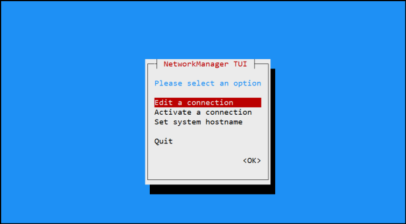

# 数据通信基础

- 数据从产生到传递到目的地的过程中会经历好几个过程，每个过程都负责加工自己这部分的内容，类似于工厂流水线
- 目前我们只需要有个最基本的概念：
  - IP地址是用来标识网络中位置的，比如你在江苏省xxx市xxx路xxx号
  - MAC地址是每个网络设备的唯一ID，比如你的身份证号码
  - 如果想要发送数据，必须(暂且认为必须)同时拥有IP和MAC地址
  - Linux的网络管理基础部分就是需要大家掌握IP地址的配置


## IP地址

- 在IP网络中，通信节点需要有一个唯一的IP地址
- IP地址用于IP报文的寻址以及标识一个节点
- IPv4地址一共32bits，使用点分十进制的形式表示


- IPv4地址由网络位和主机位组成
  - 网络位一致表示在同一个广播域中，可以直接通信
  - 主机位用于在同一个局域网中标识唯一节点

### IP地址的类别


- 早期参与互联网的设备不多，所以仅仅使用ABC类地址分配给用户即可
- 随着网络用户的增多，ABC类分配地址过于浪费，于是出现子网掩码方式划分网络位和主机位

### IP网络通信类型

- 单播(Unicast)
- 广播(Broadcast)
- 组播(Multicast)

### 子网掩码(Netmask)

- 网络掩码与IP地址搭配使用，用于描述一个IP地址中的网络部分及主机部分
- 网络掩码32bits，与32bits的IP地址一一对应，掩码中为1的位对应IP地址中的网络位，掩码中为0的位对应IP地址中的主机位


- 减少一个局域网中的设备数量可以有效降低广播报文消耗资源

- 可变长子网掩码可以将一个局域网中的主机地址分配的更加小


### 广播地址与网络号

- 在局域网中经常会有广播的需要(比如，mac地址查询，地址冲突检测等等)，所以将主机位全为1的地址做为本局域网的广播地址(注意！广播并不能跨越不同的局域网)
- 在网络中需要表示整个局域网，就像邮政编码表示一个大的区域一样，所以将主机位全为0的地址作为本局域网的网络号，用来代指整个网段
- 综上所述，计算产生的子网及每个子网的主机数量公式如下：


### 私有IP地址

- 如果要取得互联网合法地址用于通信，必须要找iana.org组织分配
- 很多企业内部都有大量的网络设备，大多数时候这些设备只需要内部通信即可
- 企业的网络管理员可以从如下网段中自行分配地址


- 私有IP地址空间中的地址不需要申请，随意使用，但是不能在互联网上与合法地址通信(因为对方没法回复你这个地址，因为世界上私有IP地址段无数个重复的，怎么知道回到谁那里呢)
- 而我们明明用的私有IP地址，也可以上网，因为我们需要先把自己的上网请求提交给网络中的网关(就是你家的出口路由器)，再由网关代替我们去获取内容转交给我们的电脑手机，而网关往往能从运营商那里得到一个合法的公有IP地址


# DHCP

DHCP（动态主机配置协议），主要用于给设备自动的分配IP地址以及网络信息，以便网络设备能够连接到网络并进行通信

DHCP给设备提供的信息如下：

- IP地址
- 子网掩码
- 网关地址
- DNS服务器地址
- 租约时间


## DHCP工作过程

1. 客户端启动时发送 DHCP 发现(DHCPDISCOVER)广播消息,寻找 DHCP 服务器。
2. DHCP 服务器收到广播消息后,会提供一个未被使用的 IP 地址以及其他网络配置信息(如子网掩码、默认网关、DNS 服务器等),并发送 DHCP 提供(DHCPOFFER)消息给客户端。
3. 客户端收到一个或多个 DHCP 提供消息后,会选择其中一个 DHCP 服务器提供的 IP 地址,并发送 DHCP 请求(DHCPREQUEST)消息确认。
4. DHCP 服务器收到客户端的 DHCP 请求消息后,会将该 IP 地址分配给客户端,并发送 DHCP 确认(DHCPACK)消息给客户端。
5. 客户端收到 DHCP 确认消息后,就可以使用分配到的 IP 地址和其他网络配置参数连接到网络了。


我们可以通过抓包软件，捕捉到主机通过DHCP方式获取ip的过程，一共有4个数据包：


其中每个数据包的作用如下：

1. `Discover`消息是用于客户端向整个内网发送广播，期待DHCP服务器进行回应
   1. 这个数据包中的重要内容就是：消息类型，客户端ID，主机名，请求获得的信息
2. `Offer`消息是DHCP服务器对客户的回应
   1. 这个消息中会回复对方所需要的所有信息
3. `Request`这个是客户端确认DHCP服务器的消息
   1. 这个消息和第一个消息差不多，但是消息类别变为`Request`，并且会携带请求的IP地址
4. `ACK`DHCP服务器给客户端的最终确认
   1. 这个消息和第二个消息差不多，但是消息类型变为`ACK`

## DHCP续租

DHCP分配的信息是有有效期的，再租约时间快到的时候，如果我们想要继续使用这个地址信息，就需要向DHCP服务器续租

这也是大家虚拟机上IP地址经常发生变化的原因，这是因为虚拟机上默认就是以DHCP的方式获得IP地址的

我们可以查看Linux上的网络配置信息，该信息位于`/etc/sysconfig/network-scripts/ifcfg-ens33`

```bash
[root@localhost ~]# cat /etc/sysconfig/network-scripts/ifcfg-ens33
TYPE="Ethernet"
PROXY_METHOD="none"
BROWSER_ONLY="no"
BOOTPROTO="dhcp"
DEFROUTE="yes"
IPV4_FAILURE_FATAL="no"
IPV6INIT="yes"
IPV6_AUTOCONF="yes"
IPV6_DEFROUTE="yes"
IPV6_FAILURE_FATAL="no"
IPV6_ADDR_GEN_MODE="stable-privacy"
NAME="ens33"
UUID="e4e0ca63-861a-4ea1-89bf-864bf897c381"
DEVICE="ens33"
ONBOOT="yes"
ZONE=public


# 可以看到配置中的BOOTPROTO字段是以dhcp来获得IP地址的。我们等会儿在带大家去修改这个网络配置信息
```

同样从VMware的虚拟网络设置中，也可以看到租约时间相关的内容


# DNS（域名解析）

DNS(Domain Name System) 是一套从域名到IP的映射的协议

在网络世界中，如果我们想要给某个机器，或者是某个网站去发送一个数据，都需要通过IP地址来找到对方，比如我们想要使用百度来搜索东西，就需要知道百度的IP地址，换句话说只要知道了百度的IP地址，我们就可以访问到百度

但是IP地址不易记忆，不可能记住每一个网站的IP地址是什么，于是早期的搞IT的那帮人研发出一个叫做主机名的东西。

最开始人们把IP和主机名的的对应关系记录在本地，这个文件目前在windows系统的`C:\Windows\System32\drivers\etc\hosts`中。但是后面发现并不好用，而且需要经常手动更新这个文件。类似于黄历


随着主机名越来越多，hosts文件不易维护，所以后来改用**域名解析系统DNS**：

- 一个组织的系统管理机构，维护系统内的每个主机的`IP和主机名`的对应关系
- 如果新计算机接入网络，将这个信息注册到`数据库`中
- 用户输入域名的时候，会自动查询`DNS`服务器，由`DNS服务器`检索数据库, 得到对应的IP地址。

## 域名

主域名是用来识别主机名称和主机所属的组织机构的一种分层结构的名称。
例如：http://www.baidu.com(域名使用.连接)

- com： 一级域名，表示这是一个企业域名。同级的还有 "net"(网络提供商)，"org"(非盈利组织) 等。
- baidu: 二级域名, 公司名。
- www: 只是一种习惯用法，并不是每个域名都支持。
- http:// :  要使用什么协议来连接这个主机名。


## 常见的域名解析服务器

- 114dns

​	114.114.114.114 

​	114.114.115.115

​	这是国内用户量数一数二的 dns 服务器，该 dns 一直标榜高速、稳定、无劫持、防钓鱼。

- Google DNS

​	8.8.8.8

​	8.8.4.4

​	......

可以理解为由这些服务器帮我们记录的域名和IP的对应关系，我们访问域名的时候去找这些dns服务器询问该域名对应的IP地址，当然，除了上述提到的这些dns服务器，三大运营商也提供了dns解析服务


## 域名解析的过程

1. 浏览器发起域名解析，首先查询浏览器缓存，如果没有，就查询hosts文件，如果没有就提出域名解析请求
2. 客户机提出域名解析请求，并将该请求发送给本地的域名服务器。
3. 当本地的域名服务器收到请求后,就先查询本地的缓存,如果有该纪录项,则本地的域名服务器就直接把查询的结果返回。
4. 如果本地的缓存中没有该纪录,则本地域名服务器就直接把请求发给根域名服务器,然后根域名服务器再返回给本地域名服务器一个所查询域(根的子域)的主域名服务器的地址。
5. 本地服务器再向上一步返回的域名服务器发送请求,然后接受请求的服务器查询自己的缓存,如果没有该纪录,则返回相关的下级的域名服务器的地址。
6. 重复第四步,直到找到正确的纪录。
7. 本地域名服务器把返回的结果保存到缓存,以备下一次使用,同时还将结果返回给客户机


# 配置网络服务

## 配置网络参数

使用nmtui命令来配置网络

```bash
[root@localhost ~]# nmtui
```




```bash
[root@localhost ~]# cat /etc/sysconfig/network-scripts/ifcfg-ens33 
TYPE=Ethernet
PROXY_METHOD=none
BROWSER_ONLY=no
BOOTPROTO=none
DEFROUTE=yes
IPV4_FAILURE_FATAL=no
IPV6INIT=yes
IPV6_AUTOCONF=yes
IPV6_DEFROUTE=yes
IPV6_FAILURE_FATAL=no
IPV6_ADDR_GEN_MODE=stable-privacy
NAME=ens33
UUID=7cb2fd3e-61dd-4856-87fa-c6db7ec0169b
DEVICE=ens33
ONBOOT=yes
IPADDR=192.168.91.128
PREFIX=24
# NETMASK= 255.255.255.0
GATEWAY=192.168.91.2
DNS1=114.114.114.114
DNS2=114.114.115.115
```

当修改完Linux系统中的服务配置文件后，并不会对服务程序立即产生效果。要想让服务程序获取到最新的配置文件，需要手动重启相应的服务，之后就可以看到网络畅通了

```bash
[root@localhost ~]# systemctl restart network
[root@localhost ~]# ping -c 4 114.114.114.114
PING 114.114.114.114 (114.114.114.114) 56(84) bytes of data.
64 bytes from 114.114.114.114: icmp_seq=1 ttl=128 time=17.0 ms
64 bytes from 114.114.114.114: icmp_seq=2 ttl=128 time=16.0 ms
64 bytes from 114.114.114.114: icmp_seq=3 ttl=128 time=16.6 ms
64 bytes from 114.114.114.114: icmp_seq=4 ttl=128 time=16.4 ms

--- 114.114.114.114 ping statistics ---
4 packets transmitted, 4 received, 0% packet loss, time 3006ms
rtt min/avg/max/mdev = 16.020/16.556/17.094/0.395 ms
```

## 手动修改配置文件


网卡配置文件参数

| 解释         | 参数                  |
| ------------ | --------------------- |
| 设备类型     | TYPE=Ethernet         |
| 地址分配模式 | BOOTPROTO=static      |
| 网卡名称     | NAME=ens33            |
| 是否启动     | ONBOOT=yes            |
| IP地址       | IPADDR=192.168.91.128 |
| 子网掩码     | NETMASK=255.255.255.0 |
| 网关地址     | GATEWAY=192.168.91.1  |
| DNS地址      | DNS1=114.114.114.114  |

最后需要重启网络服务并测试网络是否联通

# ifconfig

- Linux ifconfig命令用于显示或设置网络设备。

- ifconfig可设置网络设备的状态，或是显示目前的设置。

## 语法

```bash
ifconfig [网络设备][down up -allmulti -arp -promisc][add<地址>][del<地址>][<hw<网络设备类型><硬件地址>][io_addr<I/O地址>][irq<IRQ地址>][media<网络媒介类型>][mem_start<内存地址>][metric<数目>][mtu<字节>][netmask<子网掩码>][tunnel<地址>][-broadcast<地址>][-pointopoint<地址>][IP地址]
```

**参数说明**：

```bash
add<地址> 设置网络设备IPv6的IP地址。
del<地址> 删除网络设备IPv6的IP地址。
down 关闭指定的网络设备。
<hw<网络设备类型><硬件地址> 设置网络设备的类型与硬件地址。
io_addr<I/O地址> 设置网络设备的I/O地址。
irq<IRQ地址> 设置网络设备的IRQ。
media<网络媒介类型> 设置网络设备的媒介类型。
mem_start<内存地址> 设置网络设备在主内存所占用的起始地址。
metric<数目> 指定在计算数据包的转送次数时，所要加上的数目。
mtu<字节> 设置网络设备的MTU。
netmask<子网掩码> 设置网络设备的子网掩码。
tunnel<地址> 建立IPv4与IPv6之间的隧道通信地址。
up 启动指定的网络设备。
  -broadcast<地址> 将要送往指定地址的数据包当成广播数据包来处理。
  -pointopoint<地址> 与指定地址的网络设备建立直接连线，此模式具有保密功能。
  -promisc 关闭或启动指定网络设备的promiscuous模式。
[IP地址] 指定网络设备的IP地址。
[网络设备] 指定网络设备的名称。
```

## 实例

- 显示网络设备信息

```bash
[root@localhost ~]# ifconfig        
eth0   Link encap:Ethernet HWaddr 00:50:56:0A:0B:0C 
     inet addr:192.168.0.3 Bcast:192.168.0.255 Mask:255.255.255.0
     inet6 addr: fe80::250:56ff:fe0a:b0c/64 Scope:Link
     UP BROADCAST RUNNING MULTICAST MTU:1500 Metric:1
     RX packets:172220 errors:0 dropped:0 overruns:0 frame:0
     TX packets:132379 errors:0 dropped:0 overruns:0 carrier:0
     collisions:0 txqueuelen:1000 
     RX bytes:87101880 (83.0 MiB) TX bytes:41576123 (39.6 MiB)
     Interrupt:185 Base address:0x2024 

lo    Link encap:Local Loopback 
     inet addr:127.0.0.1 Mask:255.0.0.0
     inet6 addr: ::1/128 Scope:Host
     UP LOOPBACK RUNNING MTU:16436 Metric:1
     RX packets:2022 errors:0 dropped:0 overruns:0 frame:0
     TX packets:2022 errors:0 dropped:0 overruns:0 carrier:0
     collisions:0 txqueuelen:0 
     RX bytes:2459063 (2.3 MiB) TX bytes:2459063 (2.3 MiB)
```

- 启动关闭指定网卡

```bash
[root@localhost ~]# ifconfig eth0 down
[root@localhost ~]# ifconfig eth0 up
```

- 为网卡配置和删除IPv6地址

```bash
[root@localhost ~]# ifconfig eth0 add 33ffe:3240:800:1005::2/ 64 //为网卡设置IPv6地址
[root@localhost ~]# ifconfig eth0 del 33ffe:3240:800:1005::2/ 64 //为网卡删除IPv6地址
```

- 用ifconfig修改MAC地址

```bash
[root@localhost ~]# ifconfig eth0 down //关闭网卡
[root@localhost ~]# ifconfig eth0 hw ether 00:AA:BB:CC:DD:EE //修改MAC地址
[root@localhost ~]# ifconfig eth0 up //启动网卡
[root@localhost ~]# ifconfig eth1 hw ether 00:1D:1C:1D:1E //关闭网卡并修改MAC地址 
[root@localhost ~]# ifconfig eth1 up //启动网卡
```

- 配置IP地址

```bash
[root@localhost ~]# ifconfig eth0 192.168.1.56 
//给eth0网卡配置IP地址
[root@localhost ~]# ifconfig eth0 192.168.1.56 netmask 255.255.255.0 
// 给eth0网卡配置IP地址,并加上子掩码
[root@localhost ~]# ifconfig eth0 192.168.1.56 netmask 255.255.255.0 broadcast 192.168.1.255
// 给eth0网卡配置IP地址,加上子掩码,加上个广播地址
```

- 启用和关闭ARP协议

```bash
[root@localhost ~]# ifconfig eth0 arp  //开启
[root@localhost ~]# ifconfig eth0 -arp  //关闭
```

- 设置最大传输单元

```bash
[root@localhost ~]# ifconfig eth0 mtu 1500 
//设置能通过的最大数据包大小为 1500 bytes
```

