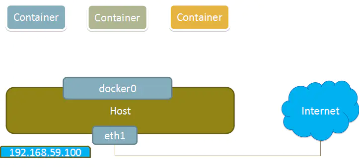
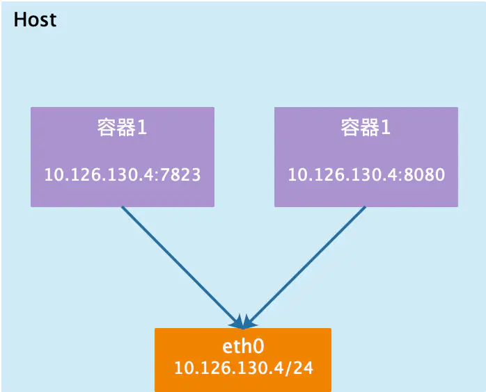
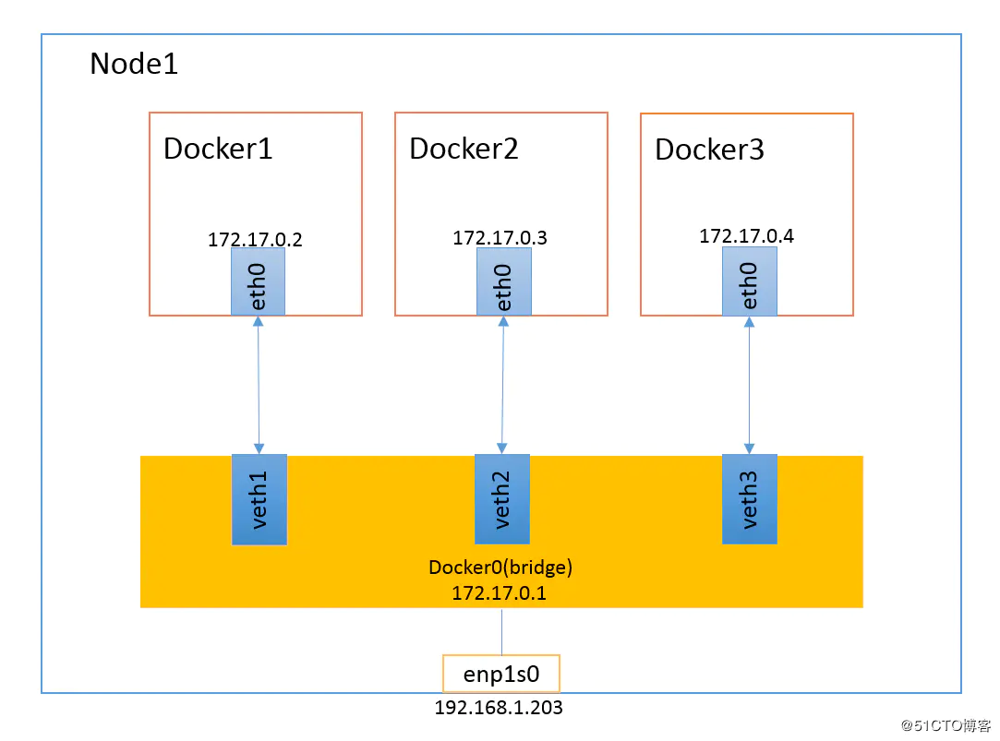

# 网络
容器网络是指容器能够连接和通信的能力，无论是容器之间还是与外部。

# 用户自定义网络
可以创建自定义的用户定义网络，并将多个容器连接到同一网络。一旦连接到用户定义的网络，容器可以使用容器 IP 地址或容器名称相互通信。

`Usage:  docker network create [OPTIONS] NETWORK`
```shell
# 使用bridge网络驱动创建网络并启动容器
docker network create -d bridge my-net
docker run --network=my-net -itd --name=container1 busybox
docker run --network=my-net -itd --name=container2 busybox
# 测试网络连接
[root@master01 ~]# docker exec -it container1 ping www.baidu.com
[root@master01 ~]# docker exec -it container1 cat /etc/hosts | grep 172
172.19.0.3	1adf81f08c86
[root@master01 ~]# docker exec -it container1 ping container2
```
# 网络驱动
Docker服务安装完成之后，默认在每个宿主机会生成一个名称为docker0的网卡，其ip地址都是172.17.0.1/16，并且会生成三种不同类型的网络。

```shell
[root@master01 ~]# docker network ls
NETWORK ID     NAME                     DRIVER    SCOPE
fe2c2cabeff7   bridge                   bridge    local
459b4a9926ed   host                     host      local
526baa2eb8f6   none                     null      local
```

| Docker网络模式 | 配置 | 说明 | 使用场景 |
|--------------|------|------|----------------|
| host模式 | --net=host | 容器和宿主机共享Network namespace，直接使用宿主机网络栈。容器不会获得独立的Network namespace，也不会配置独立的IP和端口。性能开销最小，但缺少网络隔离。 | 适用于对网络性能要求极高的场景，如高性能计算、流媒体服务等
| container模式 | --net=container:NAME_or_ID | 容器和指定的容器共享Network namespace。新容器使用已存在容器的网络栈，共享IP地址和端口范围。保持了其他资源（如文件系统、进程等）的隔离。 | 最典型应用是Kubernetes的Pod实现
| none模式 | --net=none | 容器拥有独立的Network namespace，但不做任何网络配置。容器没有网卡、IP、路由等网络配置，需要手动配置网络。 | 适用于对安全性要求极高的场景
| bridge模式 | --net=bridge | 默认网络模式。Docker daemon创建docker0虚拟网桥，通过veth pair连接容器，实现容器间的通信。支持端口映射和地址转换，提供基本的网络隔离。 | 最常用的网络模式

# 工作原理
## none网络类型


## container网络类型


## host网络类型



## bridge网络类型


**veth pair 对应关系**
```shell
[root@master01 ~]# ip link show | grep veth0f | awk '{print $1,$2}'
40: veth0fbbd68@if39
[root@master01 ~]# cat /sys/class/net/veth0fbbd68/ifindex
40
[root@master01 ~]# cat /sys/class/net/veth0fbbd68/iflink
39
[root@master01 ~]# docker exec -it container1 ip link show eth0
39: eth0@if40: <BROADCAST,MULTICAST,UP,LOWER_UP,M-DOWN> mtu 1500 qdisc noqueue
    link/ether 02:42:ac:13:00:03 brd ff:ff:ff:ff:ff:ff
```


# 扩展阅读
数据包过滤和防火墙： https://docs.docker.com/engine/network/packet-filtering-firewalls/

网络驱动：https://docs.docker.com/engine/network/drivers/
