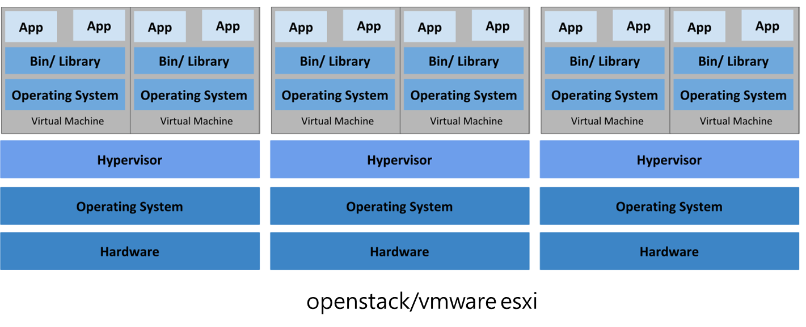
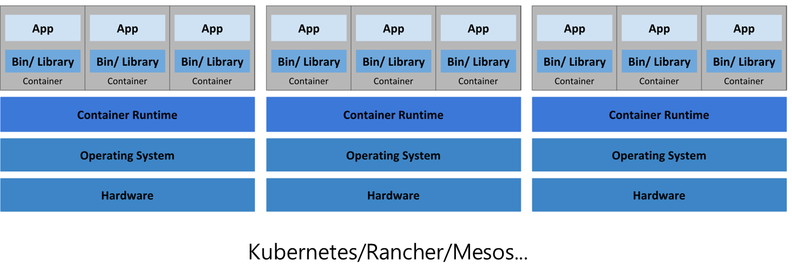
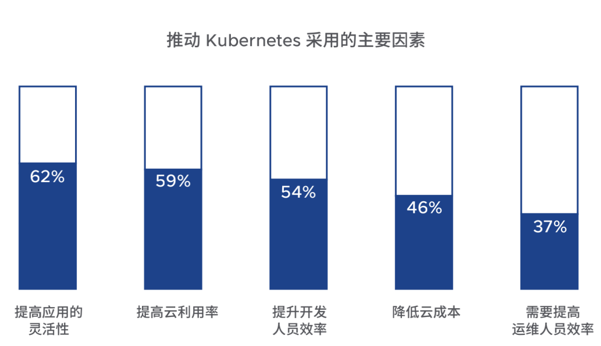

# 云计算的三种模式
## 单机到云原生的演变

## IAAS
Infrastructure as a Service  基础设施即服务

## PAAS
Platform as a service  平台即服务

## SAAS
Software as a Service

# 容器编排工具
## Borg
Borg 是 Google 早期开发的集群管理系统，用于管理大规模的容器化⼯作负载。它是 Google 内部的⼀个关键基础设施，自 2003 年开始使用。

## Omega
Omega 是 Borg 的⼀个后继系统，于 2013 年开始开发，旨在解决 Borg 在大规模、动态、多租户环境下多租户、声明式配置。

## kubernetes
Kubernetes 是一个可移植的、可扩展的开源平台，用于管理容器化的工作负载和服务，可促进声明式配置和自动化。kubernetes 拥有一个庞大且快速增长的生态系统。kubernetes 的服务、支持和工具广泛可用。

kubernetes 这个名字源于希腊于，意为舵手或飞行员。k8s 这个缩写是因为k和s之间有八个字符的关系。google 在 2014 年开源了 kubernetes 项目。kubernetes建立在 google 在大规模运行生产工作负载方面拥有十几年的经验的基础上，结合了社区中最好的想法和实践。

# kubernetes优势
- 服务发现和负载均衡
- 存储编排（添加任何本地或云服务器）
- 自动部署和回滚

- 自动分配	CPU/内存资源
- 弹性伸缩
- 自我修复（需要时启动新容器）
- Secret（安全相关信息）和配置管理
- 大型规模的支持
  - 每个节点的Pod数量不超过	110
  - 节点数不超过	5000
  - Pod总数不超过	150000
  - 容器总数不超过	300000
- 开源

## kubernetes现状

# kubernetes组件

一个kubernetes集群由一组被称作节点的机器组成。这些节点上运行Kubernetes所管理的容器化应用。集群具有至少一个工作节点。

工作节点会托管Pod，而Pod就是作为应用负载的组件。控制平面管理集群中的工作节点和Pod。在生产环境中，控制平面通常跨多台计算机运行，一个集群通常运行多个节点，提供容错性和高可用性。

## 控制平面组件（Control Plane Components）
控制平面组件会为集群做出全局决策，比如资源的调度。以及检测和响应集群事件，例如当不满足部署的 `replicas`字段时，要启动新的Pod）。

控制平面组件可以在集群中的任何节点上运行。然而，为了简单起见，设置脚本通常会在同一个计算机上启动所有控制平面组件，并且不会在此计算机上运行用户容器。

### kube-apiserver
`kube-apiserver`负责公开Kubernetes API，处理接受请求的工作，是控制平面的前端。

`kube-apiserver`设计上考虑了水平扩缩，所以可通过部署多个实例来进行扩缩，并在这些实例之间平衡流量。

### etcd
一致且高可用的键值存储，用作Kubernetes所有集群数据的后台数据库。

### kube-scheduler
`kube-scheduler`负责监视新创建的、未指定运行节点（node）的Pods，并选择节点来让Pod在上面运行。

调度决策考虑的因素包括单个Pod及Pods集合的资源需求、软硬件及策略约束、亲和性及反亲和性规范、数据位置、工作负载间的干扰及最后时限。

### kube-controller-manager
`kube-controller-manager`负责运行控制器进程，控制器通过 API 服务器监控集群的公共状态，并致力于将当前状态转变为期待状态。

不同类型的控制器如下：
- 节点控制器（Node Controller）：负责在节点出现故障时进行通知和响应。
- 任务控制器（Job Controller）：监测代表一次性任务的 Job 对象，然后创建 Pod 来运行这些任务直至完成。
- 端点分片控制器（EndpointSlice controller）：填充端点分片（EndpointSlice）对象（以提供 Service 和 Pod 之间的链接）。
- 服务账号控制器（ServiceAccount controller）：为新的命名空间创建默认的服务账号（ServiceAccount）。
- ...

## Node组件
节点组件会在每个节点上运行，负责维护运行的 Pod 并提供 Kubernetes 运行环境。
### kubelet
`kubelet`会在集群中每个节点（node）上运行。它保证容器（containers）都运行在Pod中。

`kubelet`接收一组通过各类机制提供给它的PodSpec，确保这些 PodSpec 中描述的容器处于运行状态且健康。kubelet不会管理不是由 Kubernetes创建的容器。

### kubelet
kube-proxy 是集群中每个节点（node）上所运行的网络代理， 实现 Kubernetes 服务（Service） 概念的一部分。

kube-proxy 维护节点上的一些网络规则， 这些网络规则会允许从集群内部或外部的网络会话与 Pod 进行网络通信。

如果操作系统提供了可用的数据包过滤层，则 kube-proxy 会通过它来实现网络规则。 否则，kube-proxy 仅做流量转发。

### 容器运行时（Container Runtime）
这个基础组件使Kubernetes能够有效运行容器。 它负责管理 Kubernetes 环境中容器的执行和生命周期。

Kubernetes支持许多容器运行环境，例如 containerd、 CRI-O 以及 Kubernetes CRI (容器运行环境接口) 的其他任何实现。

## 插件（Addons）
插件使用Kubernetes资源（DaemonSet、Deployment等）实现集群功能。因为这些插件提供集群级别的功能，插件中命名空间域的资源属于`kube-system`命名空间。

### DNS 
尽管其他插件都并非严格意义上的必需组件，但几乎所有 Kubernetes 集群都应该有集群 DNS，因为很多示例都需要 DNS 服务。

集群DNS是多个 DNS 服务器一起工作，为 Kubernetes 服务提供 DNS 记录。

Kubernetes 启动的容器会自动将这些 DNS 服务器配置其 DNS 搜索列表中。

### Web 界面（仪表盘）
Dashboard 是 Kubernetes 集群的通用的、基于 Web 的用户界面。 它使用户可以管理集群中运行的应用程序以及集群本身， 并进行故障排。

### 容器资源监控 
容器资源监控 将关于容器的一些常见的时间序列度量值保存到一个集中的数据库中， 并提供浏览这些数据的界面。

### 集群层面日志 
集群层面日志机制负责将容器的日志数据保存到一个集中的日志存储中， 这种集中日志存储提供搜索和浏览接口。

### 网络插件 
网络插件是实现容器网络接口（CNI）规范的软件组件。它们负责为 Pod 分配 IP 地址，并使这些 Pod 能在集群内部相互通信。

# 扩展阅读
[Kubernetes CRI (容器运行环境接口)](https://github.com/kubernetes/community/blob/master/contributors/devel/sig-node/container-runtime-interface.md)

[网络插件](https://v1-29.docs.kubernetes.io/zh-cn/docs/concepts/extend-kubernetes/compute-storage-net/network-plugins/)

[集群网络](https://v1-29.docs.kubernetes.io/zh-cn/docs/concepts/cluster-administration/addons/#networking-and-network-policy)

[控制器列表]()

[ETCD](https://etcd.io/docs/)