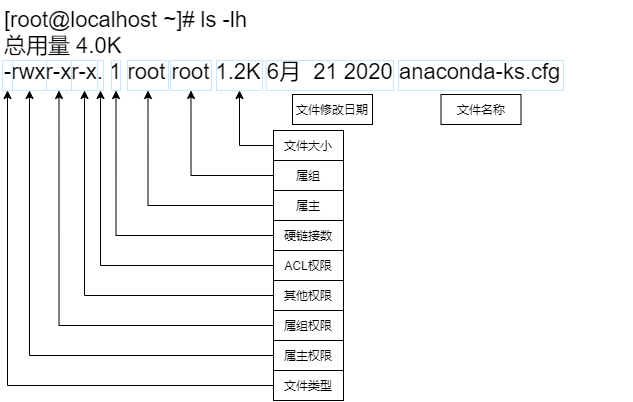
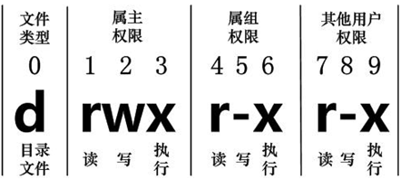

# 文件权限

文件权限设置：可以赋予某个用户或组，能够以何种方式，访问某个文件

Linux 系统是一种典型的多用户系统，不同的用户处于不同的地位，拥有不同的权限。

为了保护系统的安全性，Linux 系统对不同的用户访问同一文件（包括目录文件）的权限做了不同的规定。

在 Linux 中我们通常使用以下两个命令来修改文件或目录的所属用户与权限：

* chown (change ownerp) ： 修改所属用户与组。
* chmod (change mode) ： 修改用户的权限。

在 Linux 中我们可以使用 ll 或者 ls –l 命令来显示一个文件的属性以及文件所属的用户和组



每个文件的属性由左边第一部分的 10 个字符来确定（如下图）。



从左至右用 0-9 这些数字来表示。

* 第 0 位确定文件类型，第 1-3 位确定属主（该文件的所有者）拥有该文件的权限。
* 第4-6位确定属组（所有者的同组用户）拥有该文件的权限，第7-9位确定其他用户拥有该文件的权限。
* 其中，第 1、4、7 位表示读权限，如果用`r`字符表示，则有读权限，如果用`-`字符表示，则没有读权限；
* 第 2、5、8 位表示写权限，如果用`w`字符表示，则有写权限，如果用`-`字符表示没有写权限；第 3、6、9 位表示可执行权限，如果用`x`字符表示，则有执行权限，如果用`-`字符表示，则没有执行权限。

# 修改文件属主chown

chown用于设置文件所有者和文件关联组的命令

chown 需要超级用户`root`的权限才能执行此命令

```shell
chown [选项]... [所有者][:[组]] 文件...
```

## 选项

* **-R**: 处理指定目录以及其子目录下的所有文件
* **-v**: 显示详细的处理信息

## 实例

* 设置所有者为root

```shell
[root@localhost ~]# chown root anaconda-ks.cfg
```

* 将文件的拥有者设置为user01，允许使用的组设置为it

```shell
[root@localhost ~]# chown user01:it file.txt
```

* 将目录下的所有文件拥有者设置为user01，允许使用的组设置为it

```shell
[root@localhost ~]# chown -R user01:it dir/*
```

# 修改文件权限chmod

chmod是控制用户对文件的权限的命令

```shell
chmod [选项]... 模式[,模式]... 文件...
```

## 模式

mode : 权限设定字串，格式如下 :

```shell
[ugoa...][[+-=][rwx]...][,...]
```

* `u`表示该文件的拥有者，`g`表示与该文件的拥有者属于同一个群体(group)者，`o`表示其他以外的人，`a`表示这三者皆是。
* `+`表示增加权限、`-`表示取消权限、`=`表示唯一设定权限。
* `r`表示可读取，`w`表示可写入，`x`表示可执行
* `r``w``x`权限对文件和目录的意义

| 权限      | 对文件的影响         | 对目录的影响                                               |
| :-------- | :------------------- | :--------------------------------------------------------- |
| r(读取)   | 可以读取文件的内容   | 可以列出目录的内容(文件名)，可以使用ls命令                 |
| w(写入)   | 可以更改文件的内容   | 可以创建或删除目录中的任一文件，可以使用touch、rm命令      |
| x(可执行) | 可以作为命令执行文件 | 可以访问目录的内容(取决于目录中文件的权限)，可以使用cd命令 |

## 八进制语法

chmod命令可以使用八进制数来指定权限。文件或目录的权限位是由9个权限位来控制，每三位为一组，它们分别是文件所有者（User）的读、写、执行，用户组（Group）的读、写、执行以及其它用户（Other）的读、写、执行。历史上，文件权限被放在一个比特掩码中，掩码中指定的比特位设为1，用来说明一个类具有相应的优先级。

| #    | 权限           | rwx  | 二进制 |
| :--- | :------------- | :--- | :----- |
| 7    | 读 + 写 + 执行 | rwx  | 111    |
| 6    | 读 + 写        | rw-  | 110    |
| 5    | 读 + 执行      | r-x  | 101    |
| 4    | 只读           | r--  | 100    |
| 3    | 写 + 执行      | -wx  | 011    |
| 2    | 只写           | -w-  | 010    |
| 1    | 只执行         | --x  | 001    |
| 0    | 无             | ---  | 000    |

例如， 765 将这样解释：

* 所有者的权限用数字表达：属主的那三个权限位的数字加起来的总和。如 rwx ，也就是 4+2+1 ，应该是 7。
* 用户组的权限用数字表达：属组的那个权限位数字的相加的总和。如 rw- ，也就是 4+2+0 ，应该是 6。
* 其它用户的权限数字表达：其它用户权限位的数字相加的总和。如 r-x ，也就是 4+0+1 ，应该是 5。

## 选项

* **-f**: 若该文件权限无法被更改也不要显示错误讯息
* **-v**: 显示权限变更的详细资料
* **-R**: 对目前目录下的所有文件与子目录进行相同的权限变更(即以递归的方式逐个变更)

## 实例

* 限制用户user1对`file`文件的写入

```shell
[root@localhost ~]# chmod a-w /home/user1/file 
[root@localhost ~]# ls -lh /home/user1/file 
-r--r--r--. 1 user1 user1 0 4月  13 10:56 /home/user1/file
[root@localhost ~]# su - user1
上一次登录：二 4月 13 10:47:41 CST 2021pts/1 上
[user1@localhost ~]$ echo "hello world" >> file 
-bash: file: 权限不够
```

* 限制所有用户删除dir目录下的文件

```shell
[root@localhost ~]# chmod a-w /home/user1/dir/
[root@localhost ~]# ls -lhd /home/user1/dir
dr-xr-xr-x. 2 user1 user1 18 4月  13 10:58 /home/user1/dir
[root@localhost ~]# su - user1
上一次登录：二 4月 13 10:57:11 CST 2021pts/1 上
[user1@localhost ~]$ cd dir/
[user1@localhost dir]$ rm -rf test 
rm: 无法删除"test": 权限不够
```

# 文件访问控制列表

文件访问控制列表（Access Control Lists，ACL）是Linux开的一套新的文件系统权限管理方法。

传统的Linux文件系统的权限控制是通过user、group、other与r（读）、w（写）、x（执行）的不同组合来实现的。随着应用的发展，这些权限组合已不能适应现时复杂的文件系统权限控制要求。例如，我们可能需把一个文件的读权限和写权限分别赋予两个不同的用户或一个用户和一个组这样的组合。传统的权限管理设置起来就力不从心了。

文件访问控制列表可以针对文件单独设置某个用户或者用户组队文件的管理权限。

## getfacl命名

获取文件访问控制列表的详细内容

```shell
getfacl [-aceEsRLPtpndvh] file ...
```

### 选项

* **-a**：仅显示文件访问控制列表
* **-d**：仅显示默认的访问控制列表
* **-c**：不显示注释表头
* **-e**：显示所有的有效权限
* **-E**：显示无效权限
* **-R**：递归显示子目录
* **-t**：使用制表符分隔的输出格式

### 实例

* 查看acl权限列表

```shell
[root@localhost ~]# getfacl anaconda-ks.cfg 
# file: anaconda-ks.cfg
# owner: root
# group: root
user::rwx
group::r-x
other::r-x
```

* 查看acl权限列表，不显示注释表头

```shell
[root@localhost ~]# getfacl -c anaconda-ks.cfg 
user::rwx
group::r-x
other::r-x
```

## setfacl命令

用来设置更精确的文件权限

```shell
setfacl [-bkndRLP] { -m|-M|-x|-X ... } file ...
```

### 选项

* **-m**：更改文件的访问控制列表
* **-M**：从文件读取访问控制列表条目更改
* **-x**：根据文件中访问控制列表移除条目
* **-X**：从文件读取访问控制列表条目并删除
* **-b**：删除所有扩展访问控制列表条目
* **-k**：移除默认访问控制列表
* **-d**：应用到默认访问控制列表的操作
* **-R**：递归操作子目录

### 实例

* 给指定用户添加acl权限
* 首先用户user1是没有`/workdir`的权限的

```shell
[root@localhost ~]# groupadd worker
[root@localhost ~]# mkdir /workdir
[root@localhost ~]# chown root:worker /workdir
[root@localhost ~]# chmod 770 /workdir  # 不允许其他用户对目录的权限
[root@localhost ~]# ll -d /workdir/
drwxrwx---. 2 root worker 6 4月  14 09:14 /workdir/
[root@localhost ~]# su - user1
[user1@localhost ~]$ cd /workdir/
-bash: cd: /workdir/: 权限不够
```

* 单独给予user1的可读和可进入权限

```shell
[root@localhost ~]# setfacl -m u:user1:rx /workdir/
[root@localhost ~]# getfacl -c /workdir
user::rwx
user:user1:r-x      # 成功添加user1对workdir的权限
group::rwx
mask::rwx
other::---
[root@localhost ~]# su - user1
[user1@localhost ~]$ cd /workdir/
[user1@localhost workdir]$ ll -d
drwxrwx---+ 2 root worker 6 4月  14 09:14 .    # 权限位后面多了一个"+"，表示存在ACL权限
[user1@localhost workdir]$ touch file
touch: 无法创建"file": 权限不够
```

* 移除user1的访问控制列表权限

```shell
[root@localhost ~]# setfacl -x u:user1 /workdir/
[root@localhost ~]# getfacl -c /workdir/
user::rwx
group::rwx
mask::rwx
other::---
```

* 创建worker2组，然后给这个组访问acl的权限，将user1加入worker2组验证是否成功

```shell
[root@localhost ~]# groupadd worker2
[root@localhost ~]# setfacl -m g:worker2:rwx /workdir
[root@localhost ~]# usermod -aG worker2 user1
[root@localhost ~]# su - user1
[user1@localhost ~]$ cd /workdir/
[user1@localhost workdir]$ touch file
```

* 对workdir设置的acl权限并不会被之后在workdir下创建的子文件和子目录继承，可以设置默认ACL权限，来让目录下面的新建文件和文件夹都继承父目录的权限

```shell
[root@localhost ~]# setfacl -b /workdir
[root@localhost ~]# setfacl -m d:u:user1:rx /workdir
# 在前面加上一个d,就可以设置默认facl权限
[root@localhost ~]# getfacl -c /workdir
user::rwx
group::rwx
other::---
default:user::rwx    # 前面多出来了default
default:user:user1:r-x
default:group::rwx
default:mask::rwx
default:other::---
[root@localhost ~]# touch /workdir/newfile
[root@localhost ~]# getfacl -c /workdir/newfile 
user::rw-
user:user1:r-x			#effective:r--  # 新建的文件会自动继承
group::rwx			#effective:rw-
mask::rw-
other::---
```

# mask有效权限

mask 权限，指的是用户或群组能拥有的最大 ACL 权限，也就是说，给用户或群组设定的 ACL 权限不能超过 mask 规定的权限范围，超出部分做无效处理。

注意上面的案例，在newfile的facl中，有一个mask权限是`rw-`，所以我们即使给了user1`r-x`权限，在实际生效的时候，`x`也不会有的，注意后面的提示`#effective:r--`表示`x`权限并没有赋予。

## 实例

* 修改上面案例中的newfile的mask权限

```shell
[root@localhost ~]# setfacl -m m::rwx /workdir/newfile 
[root@localhost ~]# getfacl -c /workdir/newfile 
user::rw-
user:user1:r-x
group::rwx
mask::rwx
other::---
```

# 特殊权限

文件除了上述的`r`,`w`，`x`权限以外，还有三个特殊权限：suid，sgid，sticky

## suid

suid 属性只能运用在可执行文件上，含义是开放文件所有者的权限给其他用户，即当用户执行该执行文件时，会拥有该执行文件所有者的权限。如果给一个非二进制文件文件附加suid权限，则会显示大写S，属于无效。

普通用户能够执行`passwd`命令修改自己的密码，修改密码其实就是修改`/etc/shadow`这个文件，查看`/etc/passwd`这个文件的权限，发现除了`root`其他人没有写权限，但是普通用户能够成功执行`passwd`，其原因就在于`passwd`这个命令的权限是`-rwsr-xr-x`，其中`s`的作用就是让执行命令的人具有和该命令拥有者相同的权限。

```shell
[root@localhost ~]# ll /usr/bin/passwd
-rwsr-xr-x. 1 root root 32656 May 15  2022 /usr/bin/passwd
```

### 实例

* 切换成普通用户输入修改密码命令

```shell
[root@localhost ~]# su - user1
[user1@localhost ~]$ passwd
更改用户 user1 的密码 。
为 user1 更改 STRESS 密码。
（当前）UNIX 密码：
```

* 保持这个会话别端口，新建一个ssh会话，查看系统进程，可以看到当前是调用root用户执行的passwd命令

```shell
[root@localhost ~]# ps -aux |grep passwd
root        2031  0.0  0.3  14904  6656 pts/2    S+   22:30   0:00 passwd
root        2034  0.0  0.1   3876  2048 pts/1    S+   22:31   0:00 grep --color=auto passwd
```

* 如果想某个文件添加suid权限，可以输入下面两个命令

```shell
chmod u+s file
chmod 4765 file
```

要设置特殊权限，可以使用`chmod`命令的4位数字表示法，其中第一位用于特殊权限，后三位分别代表所有者、组和其他用户的权限。特殊权限的设置如下：

\- `4`: 设置setuid。
\- `2`: 设置setgid。
\- `1`: 设置sticky bit。

以下是一些设置特殊权限的例子：

\- 设置setuid: `chmod u+s file`
\- 设置setgid: `chmod g+s file`
\- 设置sticky bit: `chmod o+t /dir`

如果你想要将特殊权限与其他权限组合使用，可以这样：

\- 设置文件的setuid和可读可执行权限：`chmod 4555 file`
\- 设置目录的setgid和可读可执行可进入权限：`chmod 2775 /dir`

请注意，特殊权限的设置需要谨慎，因为它们可能会影响系统的安全性和文件的访问控制。通常，只有系统管理员或有经验的用户才会设置这些权限。

## sgid

sgid 属性可运用于二进制文件或者目录，运用在文件的含义是开放文件所属组的权限给其他用户，即当用户执行该执行文件时，会拥有该执行文件所属组用户的权限。如果给一个非二进制文件文件附加sgid权限，则会显示大写S，属于无效。

运用在目录上的含义是，在该目录下所有用户创建的文件或者目录的所属组都和其一样。即如果`/home/user1`目录具有sgid权限，且所属组是`user1`，则任何用户在`/home/user1`下创建的子目录或者文件的所属组都是`user1`。

### 实例

* 设置sgid，让用户在workdir下创建的文件都属于worker组

```shell
[root@localhost ~]# mkdir /workdir
[root@localhost ~]# groupadd worker
[root@localhost ~]# chown .worker /workdir/
[root@localhost ~]# ll -d /workdir/
drwxr-xr-x. 2 root worker 6 Nov 15 22:42 /workdir/
[root@localhost ~]# chmod g+s /workdir/
[root@localhost ~]# cd /workdir/
[root@localhost workdir]# touch file
[root@localhost workdir]# ll
total 0
-rw-r--r--. 1 root worker 0 Nov 15 22:44 file
```

## sticky

sticky 权限只能运用于目录上，含义是该目录下所有的文件和子目录只能由所属者删除，即使其的权限是777或者其他。一个公共目录，每个人都可以创建文件，删除自己的文件，但不能删除别人的文件(仅对目录有效)。

### 实例

* 设置sticky，让普通用户只能创建文件，不能删除文件

```shell
[root@localhost ~]# mkdir /workdir
[root@localhost ~]# chmod 1777 /workdir/
[root@localhost ~]# ll -d /workdir/
drwxrwxrwt. 2 root root 6 Nov 15 22:47 /workdir/
[root@localhost ~]# su - user1
[user1@localhost ~]$ cd /workdir/
[user1@localhost workdir]$ touch user1file
[user1@localhost workdir]$ exit
logout
[root@localhost ~]# useradd user2
[root@localhost ~]# su - user2
[user2@localhost ~]$ cd /workdir/
[user2@localhost workdir]$ rm -rf user1file		# 不能删除别人的创建的文件
rm: cannot remove 'user1file': Operation not permitted
[user2@localhost workdir]$ touch user2file
[user2@localhost workdir]$ rm -rf user2file		# 只能删除自己创建的文件
[user2@localhost workdir]$ ll
total 0
-rw-r--r--. 1 user1 user1 0 Nov 15 22:48 user1file
```

# chattr文件属性

chattr命令用于改变文件属性。

这项指令可改变存放在文件或目录属性，这些属性共有以下8种模式：

* **a**：让文件或目录仅供追加用途
* **b**：不更新文件或目录的最后存取时间
* **c**：将文件或目录压缩后存放
* **i**：不得任意更动文件或目录
* **s**：保密性删除文件或目录
* **S**：即时更新文件或目录
* **u**：预防意外删除

```shell
chattr [-RV][+/-/=<属性>][文件或目录...]
```

## 选项

* **-R**：递归处理，将指定目录下的所有文件及子目录一并处理
* **-v <版本编号>**：设置文件或目录版本
* **-V**：显示指令执行过程
* **+ <属性>**：开启文件或目录的该项属性
* **- <属性>**：关闭文件或目录的该项属性
* **= <属性>**：指定文件或目录的该项属性

## 实例

* 用chattr命令防止系统中某个关键文件被修改

```shell
[root@localhost ~]# chattr +i /etc/resolv.conf
[root@localhost ~]# lsattr /etc/resolv.conf 
----i----------- /etc/resolv.conf
[root@localhost ~]# echo test >> /etc/resolv.conf
-bash: /etc/resolv.conf: 权限不够
```

* 让某个文件只能往里面追加数据，但不能删除，适用于各种日志文件

```shell
[root@localhost ~]# chattr +a /var/log/messages 
[root@localhost ~]# lsattr /var/log/messages 
-----a---------- /var/log/messages
[root@localhost ~]# echo > /var/log/messages   # 不允许清空日志
-bash: /var/log/messages: 不允许的操作
```

# umask

umask命令指定在建立文件时预设的权限掩码，进程、新建文件、目录的默认权限会收到umask的影响，umask表示要减掉得到权限。

umask可用来设定[权限掩码]。[权限掩码]是由3个八进制的数字所组成，将现有的存取权限减掉权限掩码后，即可产生建立文件时预设的权限。

```shell
umask [选项][权限掩码]
```

## 选项

* **-S**：以文字的方式来表示权限掩码

## 实例

* 查看当前用户的umask权限

```shell
[root@localhost ~]# umask
0022
```

* 查看最终有的权限

```shell
[root@localhost ~]# umask -S
u=rwx,g=rx,o=rx
```

* 修改umask的数值(临时)

```shell
[root@localhost ~]# umask 0000
[root@localhost ~]# mkdir dir
[root@localhost ~]# ll
总用量 4
drwxrwxrwx. 2 root root    6 4月  14 11:25 dir
-rw-rw-rw-. 1 root root    0 4月  14 11:25 file
```

* 修改umask的数值(永久)

```shell
[root@localhost ~]# vim /etc/profile
--------------
 59 if [ $UID -gt 199 ] && [ "`/usr/bin/id -gn`" = "`/usr/bin/id -un`" ]; then
 60     umask 002
 61 else
 62     umask 022
 63 fi
---------------
[root@localhost ~]# source /etc/profile        # 立即在当前shell中生效
```

* 通过umask决定新建用户`HOME`目录的权限

```shell
[root@localhost ~]# vim /etc/login.defs 
-----------------
 61 # The permission mask is initialized to this value. If not specified, 
 62 # the permission mask will be initialized to 022.
 63 UMASK           077
------------------
```

