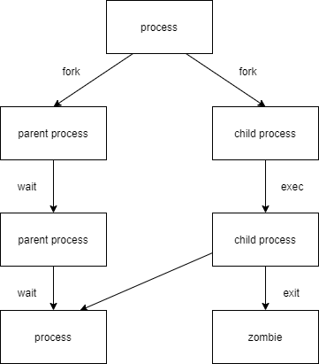
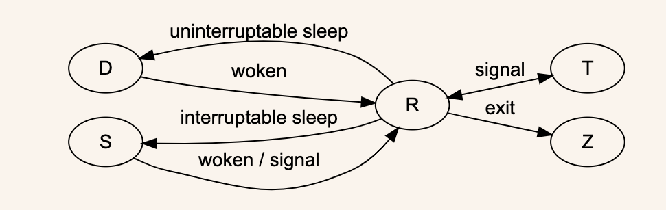

# 进程

计算机程序是可执行的二进制（或其他类型）的数据，只有被读取到内存中并且被系统调用的时候才开始其生命周期，进程就是程序的一次执行，是运行的程序

进程是已启动的可执行程序的运行实例，进程有以下组成部分

* 已分配内存的地址空间
* 安全属性，包括所有权凭据和特权
* 进程代码的一个或多个执行线程
* 进程状态

程序：二进制文件，是静态的

`/bin/date`，`/usr/sbin/httpd`，`/usr/sbin/sshd`，`/usr/local/nginx/sbin/ngix`

进程：是程序运行的过程，动态的，有生命周期及运行状态

## 类型

守护进程：在系统引导过程中启动的进程，跟终端无关的进程

前台进程：跟终端相关，通过终端启动的进程

## 生命周期



父进程复制自己的地址空间(fork)创建一个新的(子)进程结构。每个新进程分配一个唯一的进程ID(PID)，满足跟踪安全性之需。PID和父进程ID(PPID)是子进程环境的元素，任何进程都可以创建子进程，所有进程都是第一个系统进程的后代。

## 状态

进程可以分为下面几种状态：

1. R：可执行状态（`runnable`），表示进程正在被 CPU 执行或者处在 CPU 队列中等待分配 CPU 时间片。
2. S：可中断睡眠状态（`interrupted sleep`），表示进程处于睡眠状态，当特定条件或者信号到达时，就会被唤醒，状态也由 S 变成 R。
3. D：不可中断睡眠状态（`uninterrupted sleep`），跟状态 S 类似，只是进程在接收到信号时不会被唤醒。这类状态的进程一般在等待 I/O 结束。
4. Z：僵尸状态（`zombie`），表示进程已经终止（死透了），但父进程还没有发出 `wait4()` 系统调用去读取它的结束信息。（可以理解为进程死【终止】后 父进程要给它收尸【获取该进程的终止状态】）
5. T：暂停状态（`stopped`），表示进程已经暂停（还没死透），是可以恢复的（比如我们给进程发送 SIGSTOP 或者按 CTRL+Z，就可以将进程置为暂停状态，可以通过 bg/fg 命令，或者发送 SIGCONT 信号恢复。）



## 进程间通信方式

进程之间的通信（Inter-Process Communication, IPC）是指在操作系统中多个进程之间传递数据或信息的机制。

下面是一些常见的通信方式

**1、管道（Pipes）**

管道模型的通信机制有点像软件开发的瀑布模型：即在软件开发的生命周期里，往往是上一个阶段完全做完，才将输出结果交给下一个阶段。


管道可以分成下面两种类型：

- 匿名管道

表示这个类型的管道没有名字，用完了就销毁了。我们在学 Linux 命令的时候经常用到的 `|` 就是一个匿名管道：

```
netstat -ntlp | grep xxx
```

这类管道用于有亲缘关系的进程之间的通信，如父子进程。匿名管道是单向的，数据从一个进程流向另一个进程。

- 命名管道

区别于匿名管道，命名管道可以用于无亲缘关系的进程之间的通信（也就是说可以用于同一主机上的不同进程之间传递数据），而且数据可以双向流动。


**2、消息队列（Message Queues）**

和管道模型那样进程之间通信是一股脑的从一个进程，倒给另一个进程不同，消息队列模型下进程的通信就像咱们平时发邮件一样，你来一封，我回一封。

即消息队列模型提供了一种消息存储机制，可以由一个进程将消息发送到队列中，另一个进程从队列中读取消息。


**3、共享内存（Shared Memory）**

我们知道每个进程都有自己独立的虚拟内存空间，不同的进程的虚拟内存空间映射到不同的物理内存中去。但如果我们拿出一块虚拟地址空间来，映射到相同的物理内存中。这样 A 进程写入的东西，B 进程马上就能看到了，都不需要拷贝来拷贝去，传来传去。


这便是共享内存模型，即允许多个进程访问同一块内存区域，这是最快的一种进程间通信方式。因为数据直接在内存中交换，避免了数据的拷贝。


**4、信号量（Semaphores）**

如果两个进程同时访问一块共享内存，大家都往里面写东西，就很有可能冲突了，所以就需要一种保护机制来使得同一个共享的资源，同时只能被一个进程访问，这个机制就是信号量。

信号量其实是一个计数器，主要用于实现进程间的互斥与同步，而不是用于存储进程间通信数据。


**5、信号（Signals）**

上面提到的都是常规下的进程通信方式，进程间你来我往的正常交流，如果遇到突发状况，需要通知进程某个事件的发生，这时候就需要用到信号了。

Linux 提供了几十种信号，分别代表不同的意义。信号之间依靠它们的值来区分，如下图：


信号可以在任何时候发送给某一进程，进程需要为这个信号配置信号处理函数。当某个信号发生的时候，就默认执行这个函数就可以了。这就相当于咱们运维一个系统应急手册，当遇到什么情况，做什么事情，都事先准备好，出了事情照着做就可以了。


**6、套接字（Sockets）**

上面提到的都是同一主机下进程之间的通信，如果想要跨网络与不同主机上的进程进行通信，那该怎么做呢？这就是 Socket 通信做的事情了（当然，Socket 也能完成同主机上的进程通信）。

套接字支持面向连接的（TCP）和无连接的（UDP）通信。


7、文件（Files）

进程可以通过读写同一个文件来交换数据。这种方式简单但效率较低，适用于对实时性要求不高的场景。

# ps

ps命令用于显示当前进程的状态，类似于 windows 的任务管理器

```shell
ps [选项]
```

## 选项

* **-a**：列出所有的进程
* **-e**：列出所有的进程，等同于`-A`
* **-f**：显示不包含资源使用率的相关信息
* **‐H**：以进程层级格式显示进程相关信息
* **-w**：显示加宽可以显示较多的信息
* **-u**：显示较详细的信息
* **-x**：显示其他使用者的进程

显示信息的格式说明

| **列名** | **说明**           |
| :------- | :----------------- |
| USER     | 进程拥有者         |
| PID      | 进程ID             |
| %CPU     | 占用的 CPU 使用率  |
| %MEM     | 占用的内存使用率   |
| VSZ      | 占用的虚拟内存大小 |
| RSS      | 占用的常驻内存大小 |
| TTY      | 执行的终端编号     |
| STAT     | 该进程的状态*      |
| START    | 进程开始时间       |
| TIME     | CPU使用时间        |
| COMMAND  | 所执行的命令       |

*STAT表示的进程状态有如下几种：

* **D**: 无法中断的休眠状态 ，将一直等待事件的发生或等待某种系统资源
* **R**: 正在执行中
* **S**: 可中断状态
* **T**: 暂停执行
* **Z**: 不存在但暂时无法消除，也叫僵尸进程
  * 每个进程在运行结束后都会处于僵死状态，等待父进程调用进而释放系统资源，处于该状态的进程已经运行结束，但是它的父进程还没有释放其系统资源
  * 孤儿进程：
* **W**: 没有足够的内存可分配
* **<**: 高优先序的进程
* **N**: 低优先序的进程
* **+**：前台进程
* **l**：多线程进程
* **s**：主进程(先导进程)

## 实例

**常用组合：ps aux** 

```bash
u：以用户为中心组织进程状态信息显示
a：与终端相关的进程；
x：与终端无关的进程；
[root@localhost ~]# ps aux | head -n 5
USER        PID %CPU %MEM    VSZ   RSS TTY      STAT START   TIME COMMAND
root          1  0.0  0.3 128144  6656 ?        Ss   5月10   0:01 /usr/lib/systemd/systemd --switched-root --system --deserialize 22
root          2  0.0  0.0      0     0 ?        S    5月10   0:00 [kthreadd]
root          3  0.0  0.0      0     0 ?        S    5月10   0:00 [ksoftirqd/0]
root          5  0.0  0.0      0     0 ?        S<   5月10   0:00 [kworker/0:0H]
```

**常用组合：ps -aux**

```sh
-a: 列出所有的进程
-u: 显示较详细的信息
-x: 显示其他使用者的进程
[root@localhost ~]# ps -aux
USER         PID %CPU %MEM    VSZ   RSS TTY      STAT START   TIME COMMAND
root           1  0.1  0.9 172972 16128 ?        Ss   20:38   0:01 /usr/lib/sys
root           2  0.0  0.0      0     0 ?        S    20:38   0:00 [kthreadd]
root           3  0.0  0.0      0     0 ?        I<   20:38   0:00 [rcu_gp]
root           4  0.0  0.0      0     0 ?        I<   20:38   0:00 [rcu_par_gp]
root           5  0.0  0.0      0     0 ?        I<   20:38   0:00 [slub_flushw
root           6  0.0  0.0      0     0 ?        I<   20:38   0:00 [netns]
```

**ps aux和ps -aux两个命令的区别：**

`ps aux` 是一种 **BSD 风格** 的 `ps` 命令，它不需要破折号（`-`）作为选项的前缀。

- **`a`**：显示所有用户的进程，包括其他用户的进程（不仅限于当前用户）。
- **`u`**：以用户为中心的格式显示进程信息，提供更多详细信息，如用户名、CPU 和内存使用率等。
- **`x`**：显示没有控制终端（TTY）的后台进程。

`ps -aux` 与 `ps aux` 看起来很相似，但它们有不同的含义。

- 这里的 `-` 表示使用的是 **UNIX 标准** 或 **POSIX 标准** 的 `ps` 选项。
- 作为 POSIX 风格，`-a`、`-u`、`-x` 的含义会有所不同，甚至可能与 BSD 风格冲突。

**常用组合：ps -ef**

```bash
-e：显示所有进程
-f：显示完整格式程序信息
[root@localhost ~]# ps -ef |head -n 10
UID         PID   PPID  C STIME TTY          TIME CMD
root          1      0  0 5月10 ?       00:00:01 /usr/lib/systemd/systemd --switched-root --system --deserialize 22
root          2      0  0 5月10 ?       00:00:00 [kthreadd]
root          3      2  0 5月10 ?       00:00:00 [ksoftirqd/0]
root          5      2  0 5月10 ?       00:00:00 [kworker/0:0H]
root          6      2  0 5月10 ?       00:00:00 [kworker/u256:0]
root          7      2  0 5月10 ?       00:00:00 [migration/0]
root          8      2  0 5月10 ?       00:00:00 [rcu_bh]
root          9      2  0 5月10 ?       00:00:01 [rcu_sched]
root         10      2  0 5月10 ?       00:00:00 [lru-add-drain]

```

**常用组合：ps -efH**

```shell
`查看进程以层级格式（类似于pstree命令）`
[root@localhost ~]# ps -efH
root         1     0  0 14:26 ?        00:00:00 /usr/lib/systemd/systemd --switched-root --system --deserialize 22
root       479     1  0 14:26 ?        00:00:00   /usr/lib/systemd/systemd-journald
root       500     1  0 14:26 ?        00:00:00   /usr/sbin/lvmetad -f
root       507     1  0 14:26 ?        00:00:00   /usr/lib/systemd/systemd-udevd
root       615     1  0 14:27 ?        00:00:00   /sbin/auditd
polkitd    638     1  0 14:27 ?        00:00:00   /usr/lib/polkit-1/polkitd --no-debug
dbus       639     1  0 14:27 ?        00:00:00   /usr/bin/dbus-daemon --system --address=systemd: --nofork --nopidfile --systemd-activation
root       646     1  0 14:27 ?        00:00:00   /usr/sbin/NetworkManager --no-daemon
root       649     1  0 14:27 ?        00:00:00   /usr/sbin/irqbalance --foreground
root       653     1  0 14:27 ?        00:00:00   /usr/lib/systemd/systemd-logind
root       655     1  0 14:27 ?        00:00:00   /usr/sbin/crond -n
chrony     661     1  0 14:27 ?        00:00:00   /usr/sbin/chronyd
root       662     1  0 14:27 ?        00:00:00   login -- root
```

**按照CPU使用率排序查看所有进程**

```shell
[root@localhost ~]# ps -aux --sort %cpu     # 递增
[root@localhost ~]# ps -aux --sort -%cpu    # 递减
```

**按照实际内存使用排序查看所有进程**

```shell
[root@localhost ~]# ps -aux --sort rss     # 递增
[root@localhost ~]# ps -aux --sort -rss    # 递减
```

**按照父子进程显示ssh服务的层级关系**

```shell
[root@localhost ~]# ps -auxf |grep sshd
# ps -efH
root       6814  0.0  0.2 112756  4320 ?        Ss   09:06   0:00 /usr/sbin/sshd -D
root       7097  0.0  0.2 158760  5576 ?        Ss   09:06   0:00  \_ sshd: root@pts/0
root       7337  0.1  0.2 158760  5588 ?        Ss   10:21   0:00  \_ sshd: root@pts/1
root       7364  0.0  0.0 112724   988 pts/1    S+   10:24   0:00          \_ grep --color=auto sshd
```

**自定义显示格式**

```shell
[root@localhost ~]# ps -axo user,pid,ppid,%mem,%cpu,command --sort -%cpu
```

**查看指定进程的PID，多种查看的方式**

```shell
[root@localhost ~]# cat /run/sshd.pid 
[root@localhost ~]# ps -aux |grep sshd
[root@localhost ~]# pgrep -l sshd
[root@localhost ~]# pidof sshd
```

**查看进程树**

```shell
[root@localhost ~]# yum install -y psmisc
[root@localhost ~]# pstree
systemd─┬─NetworkManager───2*[{NetworkManager}]
        ├─agetty
        ├─atd
        ├─auditd─┬─sedispatch
        │        └─2*[{auditd}]
        ├─bluetoothd
        ├─chronyd
        ├─crond
        ├─dbus-broker-lau───dbus-broker
        ├─firewalld───{firewalld}
        ├─irqbalance───{irqbalance}
        ├─lsmd
        ├─mcelog
        ├─polkitd───7*[{polkitd}]
        ├─rsyslogd───2*[{rsyslogd}]
        ├─sshd───sshd───sshd───bash───bash───pstree
        ├─systemd───(sd-pam)
        ├─systemd-journal
        ├─systemd-logind
        ├─systemd-udevd
        └─tuned───3*[{tuned}]
```

# top

top命令用于实时显示 process 的动态

## 示例

```shell
[root@localhost ~]# top
```

第1行：系统时间、运行时间、登录终端数、系统负载（三个数值分别为1分钟、5分钟、15分钟内的平 均值，数值越小意味着负载越低）。

第2行：进程总数、运行中的进程数、睡眠中的进程数、停止的进程数、僵死的进程数。

第3行：用户占用资源百分比、系统内核占用资源百分比、改变过优先级的进程资源百分比、空闲的资源百分比等。

第4行：物理内存总量、内存使用量、内存空闲量、作为内核缓存的内存量。（buffer和cache之间的区 别，cache是提高cpu和内存之间的数据交换速度，buffer是io设备和存储设备之间的缓冲区）

第5行：虚拟内存总量、虚拟内存使用量、虚拟内存空闲量、已被提前加载的内存量。

## 选项

* **-d**: 改变显示的更新速度，或是在交互式指令列( interactive command)按 s
* **-c**: 切换显示模式，共有两种模式，一是只显示程序的名称，另一种是显示完整的路径与名称
* **-S**: 累积模式，会将己完成或消失的子行程 ( dead child process ) 的 CPU time 累积起来
* **-s**: 安全模式，将交互式指令取消, 避免潜在的危机
* **-i**: 不显示任何闲置 (idle) 或无用 (zombie) 的行程
* **-n**: 更新的次数，完成后将会退出 top
* **-b**: 显示模式，搭配 "n" 参数一起使用，可以用来将 top 的结果输出到文件内
* **-z：**彩色

## 交互模式快捷键

| 快捷键 | 功能                                                     |
| :----- | :------------------------------------------------------- |
| 空格   | 立即刷新                                                 |
| P      | 根据CPU使用多少排序                                      |
| T      | 根据时间、累计排序                                       |
| q      | 退出top命令                                              |
| m      | 切换显示内存信息                                         |
| t      | 切换显示进程和CPU状态信息                                |
| c      | 切换显示命令名称和完整命令行                             |
| M      | 根据内存的大小排序                                       |
| W      | 将当前设置写入 ~/.toprc  文件中，这是top配置文件推荐方法 |
| N      | 以PID的大小排序                                          |
| z      | 彩色                                                     |

## 实例

* 显示进程信息，每个1秒钟刷新一次

```shell
[root@localhost ~]# top -d 1
```

* 显示完整命令

```shell
[root@localhost ~]# top -c
```

* 更新两次后终止更新显示

```shell
[root@localhost ~]# top -n 2
```

* 显示指定的进程信息

```shell
[root@localhost ~]# top -p 7097
```

- 查看指定用户的进程

```sh
[root@localhost ~]# top -d 1 -u user01
```

- 将2次top信息写入到文件

```sh
[root@localhost ~]# top -d 1 -b -n 2 > top.txt
```

# kill

kill 命令用于删除执行中的程序或工作

kill 可将指定的信号送至程序。预设的信号为 SIGTERM(15)，可将指定程序终止

```shell
kill [-s <信息名称或编号>][程序]　或　kill [-l <信息编号>][程序]
```

## 选项

* **-l <信号编号>**： 若不加<信号编号>选项，则 -l 参数会列出全部的信号名称
* **-s <信号名称或编号>**：指定要送出的信息
* **[程序]**：[程序]可以是程序的PID或是PGID

使用 kill -l 命令列出所有可用信号，最常用的信号如下

| **编号** | **信号名** | **作用**         |
| :------- | :--------- | :--------------- |
| 1        | SIGHUP     | 重新加载配置     |
| 2        | SIGINT     | 通过键盘 `ctrl+c` 打印捕获信息，程序继续运行 |
| 3        | SIGQUIT    | 通过键盘 `ctrl+\` 打印捕获信息，程序优雅退出 |
| 9        | SIGKILL    | 强制终止         |
| 15       | SIGTERM    | 终止(正常结束)   |
| 18       | SIGCONT    | 继续             |
| 19       | SIGSTOP    | 停止             |
| 20       | SIGTSTP    | 暂停`ctrl z`     |

## 实例

* 杀死所有的ping命令，在linux命令中，使用反引号`包含的命令会优先执行，并将执行的结果作为参数提供给命令。

```shell
[root@localhost ~]# kill `pgrep ping`
```

* 强制杀死进程

```shell
[root@localhost ~]# kill -9 `pgrep ping`
```

* 温柔的杀死进程

```bash
[root@localhost ~]# kill -15 `pgrep ping`
```

# pkill

pkill 用于杀死一个进程，与 kill 不同的是它会杀死指定名字的所有进程

```shell
pkill [选项]  name
```

## 选项

* **name**： 进程名
* **-u**：指定用户名
* **-t**：指定终端

## 实例

* 结束所有的sshd进程

```shell
[root@localhost ~]# pkill sshd
```

* 结束用户user1的所有进程

```shell
[root@localhost ~]# pkill -u user1
```

* 终止pts/2上所有进程

```shell
[root@localhost ~]# pkill -t pts/2
```

* 终止pts/2上所有进程，并结束pts/2

```shell
[root@localhost ~]# pkill -9 -t pts/1
```

* 查看远程登录用户，并踢出用户

```shell
[root@localhost ~]# w
 15:02:26 up  5:21,  2 users,  load average: 0.05, 0.03, 0.05
USER     TTY      FROM             LOGIN@   IDLE   JCPU   PCPU WHAT
root     tty1                      14:41   20:34   0.02s  0.02s -bash
root     pts/0    192.168.175.1    14:42    2.00s  0.05s  0.01s w
user1    pts/1   192.168.175.1     14:40   20:34   0.02s  0.02s -bash
[root@localhost ~]# pkill -u user1
```

# 进程优先级 nice

## Linux进程调度及多任务

每个CPU(或CPU核心)在一个时间点上只能处理一个进程，通过时间片技术，Linux实际能够运行的进程 (和线程数)可以超出实际可用的CPU及核心数量。Linux内核进程调度程序将多个进程在CPU核心上快速切换，从而给用户多个进程在同时运行的假象。（并发）

 ### 相对优先级

由于不是每个进程都与其他进程同样重要，可告知进程调度程序为不同的进程使用不同的调度策略。常规系统上运行的大多数进程所使用的的调度策略为SCHED_OTHER(也称为SCHED_NORMAL),但还有其他 一些调度策略用于不同的目的。SCHED_OTHER调度策略运行的进程的相对优先级称为进程的nice值， 可以有40种不同级别的nice值。

在Linux中，决定一个进程的优先级的因素有两个，一个是PR值，一个是NICE值，PR值是由系统内核动态调控。而NICE值由我们用户自己决定。不过，PR值跟NICE值之间也是有一定的关联的。

**NICE值的范围：**-20到19，数值越小，优先级越高

**PR值的范围：**-99到39，其中0-39是与**NICE值**有着一定的对应关系

进程默认启动时nice为0，优先级为20


nice值越高表示优先级越低，例如19，该进程容易将CPU使用量让给其他进程

nice值越低表示优先级越高，例如-20，该进程更倾向于不让出CPU

### 查看进程的nice级别

#### 使用ps查看

```bash
[root@localhost ~]# ps -axo pid,command,nice --sort=nice
[root@localhost ~]# ps -axo pid,command,nice,cls --sort=-nice
```

TS表示该进程使用的调度策略为SCHED_OTHER

#### 使用top查看

NI：实际nice级别

PR：将nice级别显示为映射到更大优先级队列，-20映射到0，+19映射到39

#### 启动具有不同nice级别的进程

启动进程的时候为进程指定nice值

启动进程时，通常会继承父进程的nice级别，默认为0

```sh
[root@localhost ~]# nice -n -20 vim
[root@localhost ~]# ps -axo command,pid,nice |grep vim
```

## PRI

在top命令中可以看到有PR这个数值，PR 和 nice 值，都会影响进程执行的优先级。PR 由 OS 内核动态调整，用户不能调整（PR 值越低，进程执行的优先级越高）。

nice值用户可以自己调整，在用户调整了nice值后系统会通过如下公式来调整新的PR值，从而确定这个进程在系统中的优先级

```shell
PR(新) = PR(旧) + nice
```

PR值是OS动态调整的，但是PR的最终值还是需要由OS分析决定的

#### 更改现有进程的nice级别

调整进程的优先级(Nice Level) （-20高) - - - 0 - - - (19低)

- 使用shell更改nice级别

```bash
[root@localhost ~]# vim
[root@localhost ~]# ps -axo command,pid,nice |grep vim
vim                            1855   0
grep --color=auto vim          1888   0
[root@localhost ~]# renice -20 1855
1855 (process ID) old priority 0, new priority -20
[root@localhost ~]# ps -axo command,pid,nice |grep vim
vim                            1855 -20
grep --color=auto vim          1895   0
```

# jobs

jobs 命令可以用来查看当前终端放入后台的任务

```shell
jobs [-lnprs] [任务声明 ...]
```

## 将任务放入到后台

Linux 命令放入后台的方法有两种：

* 在命令后面加入`空格 &`。使用这种方法放入后台的命令，在后台处于执行状态
* 命令执行过裎中按 Ctrl+Z 快捷键，命令在后台处于暂停状态

### 实例

* 将任务放入后台，然后查看任务
  * "+"号代表最近一个放入后台的工作，也是工作恢复时默认恢复的工作
  * "-"号代表倒数第二个放入后台的工作

```shell
[root@localhost ~]# top &
[root@localhost ~]# vi &
[root@localhost ~]# ping baidu.com > /dev/null &
# 让ping运行，但是不显示结果
[root@localhost ~]# jobs
[1]   已停止               top
[2]-  已停止               vi
[3]+  运行中               ping baidu.com > /dev/null &
```

## 将任务恢复到前台

fg 命令用于把后台工作恢复到前台执行

```shell
fg %工作号
```

注意，在使用此命令时，％ 可以省略，但若将% 工作号全部省略，则此命令会将带有 + 号的工作恢复到前台。另外，使用此命令的过程中， % 可有可无。

### 实例

* 将top恢复到前台
  * 命令虽然是对的，但是top这种需要交互的任务是无法后台的，所以也恢复不了

```shell
[root@localhost ~]# top &
[1] 20584
[root@localhost ~]# jobs
[1]+  已停止               top
[root@localhost ~]# fg 1
```

## 后台任务恢复到后台运行

前面讲过，使用`Ctrl+z`快捷键的方式，可以将前台工作放入后台，但是会处于暂停状态,可以使用bg命令

```shell
bg %工作号
```

这里的 % 同上，可以省略

### 实例

* 将ping命令暂停到后台，然后恢复后台运行

```shell
[root@localhost ~]# ping baidu.com > /dev/null
^Z    # 这边按下了Ctrl+z
[1]+  已停止               ping baidu.com > /dev/null
[root@localhost ~]# jobs
[1]+  已停止               ping baidu.com > /dev/null
[root@localhost ~]# bg %1
[1]+ ping baidu.com > /dev/null &
[root@localhost ~]# jobs
[1]+  运行中               ping baidu.com > /dev/null &
```

# nohup

虽然可以将程序放在后台运行，但是一旦关闭远程连接那么程序就会中断，如果我们想要将程序一直保持在后台运行，那么我们可以有如下三个选择：

* 把需要在后台执行的命令加入`/etc/rc.local`文件，让系统在启动时执行这个后台程序。这种方法的问题是，服务器是不能随便重启的，如果有临时后台任务，就不能执行了
* 使用系统定时任务，让系统在指定的时间执行某个后台命令。这样放入后台的命令与终端无关，是不依赖登录终端的
* 使用 nohup 命令

```shell
nohup 命令 &
```

注意，这里的`&`表示此命令会在终端后台工作；反之，如果没有`&`，则表示此命令会在终端前台工作。

## 实例

* 让一个任务后台运行

```shell
[root@localhost ~]# nohup ping baidu.com &
```

我们退出远程连接，然后重新登录回来，会看到`ping baidu.com`依旧在运行，查看`~/nohup.out`文件可以看到程序执行输出的内容

```shell
[root@localhost ~]# ps aux |grep ping
root       7157  0.0  0.0 149968  1988 ?        S    14:12   0:00 ping baidu.com
[root@localhost ~]# tail -f nohup.out
```

