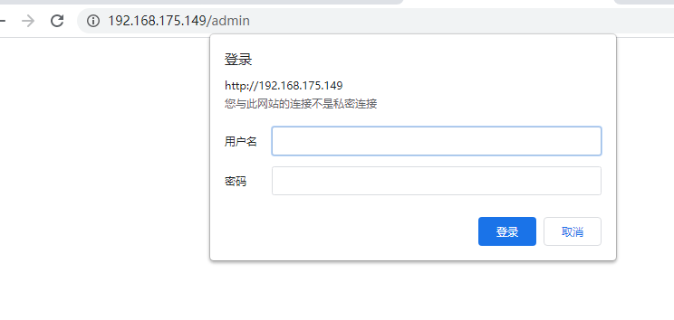
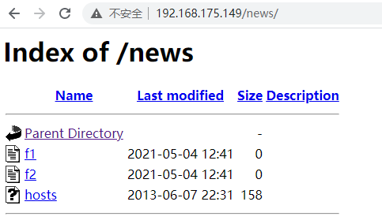
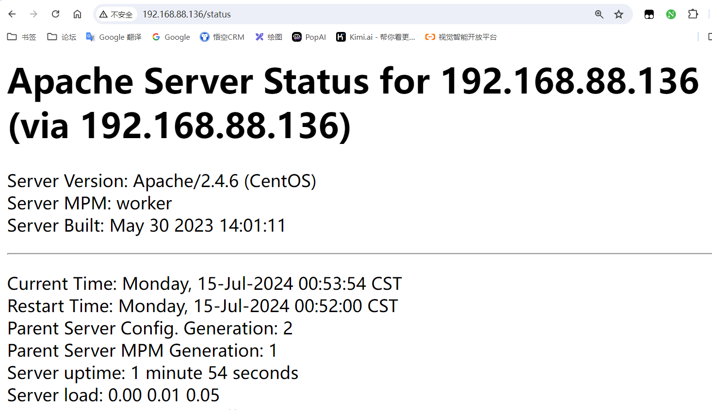
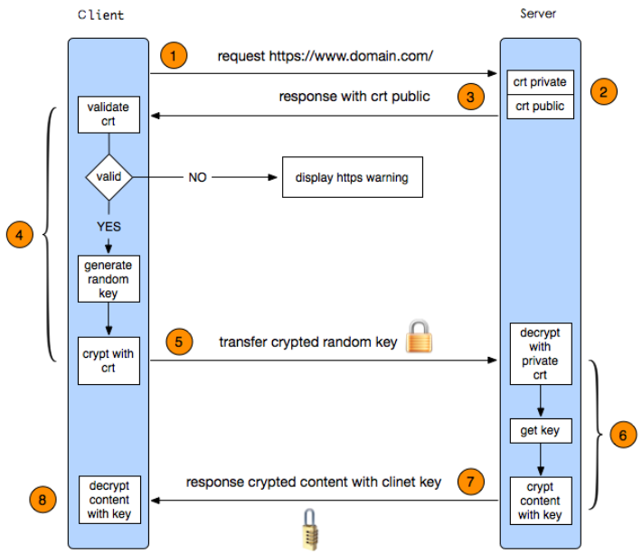

# 常用的网站服务软件

[https://w3techs.com/technologies/overview/web_server](https://w3techs.com/technologies/overview/web_server)


**Apache是什么**

Apache HTTP Server简称为 Apache，是 Apache 软件基金会的一个高性能、功能强大、见状可靠、又灵活的开放源代码的web服务软件，它可以运行在广泛的计算机平台上如 Linux、Windows。因其平台型和很好的安全性而被广泛使用，是互联网最流行的 web 服务软件之一。

**特点**

- 功能强大
- 高度模块化
- 采用MPM多路处理模块
- 配置简单
- 速度快
- 应用广泛
- 性能稳定可靠
- 可做代理服务器或负载均衡来使用
- 双向认证
- 支持第三方模块

**应用场景**

- 使用Apache运行静态HTML网页、图片
- 使用Apache结合PHP、Linux、MySQL可以组成LAMP经典架构
- 使用Apache作代理、负载均衡等

**MPM工作模式**

- prefork：多进程I/O模型，一个主进程，管理多个子进程，一个子进程处理一个请求。
- worker：复用的多进程I/O模型，多进程多线程，一个主进程，管理多个子进程，一个子进程管理多个线程，每个线程处理一个请求。
- event：事件驱动模型，一个主进程，管理多个子进程，一个进程处理多个请求。

# Apache 基础

RockyLinux 软件仓库中存在此软件包，可以直接通过 yum 进行安装

```shell
[root@localhost ~]# yum -y install httpd
[root@localhost ~]# systemctl start httpd && systemctl enable httpd
[root@localhost ~]# httpd -v
Server version: Apache/2.4.62 (Rocky Linux)
Server built:   Jan 29 2025 00:00:00

# 使用 curl 或者浏览器测试网页是否正常
[root@localhost ~]# echo "Hello World!" > /var/www/html/index.html
[root@localhost ~]# curl -I 127.0.0.1
HTTP/1.1 200 OK
```

## httpd命令

httpd 为Apache HTTP服务器程序。

```shell
[root@localhost ~]# httpd -h
Usage: httpd [-D name] [-d Directory] [-f file]
             [-C "directive"] [-c "directive"]
             [-k start|restart|graceful|graceful-stop|stop]
             [-v] [-V] [-h] [-l] [-L] [-t] [-T] [-S] [-X]
```

**常用选项**

| 选项 | 说明 |
| :--- | :--- |
| -c <httpd指令> | 在读取配置文件前，先执行选项中的指令 |
| -C <httpd指令> | 在读取配置文件后，再执行选项中的指令 |
| -d <服务器根目录> | 指定服务器的根目录 |
| -D <设定文件参数> | 指定要传入配置文件的参数 |
| -f <配置文件>| 指定配置文件 |
| -h | 显示帮助 |
| -l | 显示服务器编译时所包含的模块 |
| -L | 显示httpd指令的说明 |
| -S | 显示配置文件中的设定 |
| -t | 测试配置文件的语法是否正确 |
| -v | 显示版本信息 |
| -V | 显示办吧信息和运行环境 |
| -X | 以单一程序的方式来启动服务器 |

## 相关文件

| 文件 | 说明 |
| :--- | :--- |
| /etc/httpd/conf/httpd.conf | Apache主配置文件 |
| /etc/httpd/conf.d/ | 存放虚拟主机配置文件 |
| /etc/httpd/conf.modules.d/ | 存放模块配置文件 |
| /etc/httpd/modules/ | 存放模块文件 |
| /var/log/httpd/ | 存放日志文件 |
| /var/www/html/ | 存放默认的网页文件 |

## 主配置文件

**主配置文件说明**

```shell
[root@localhost ~]# grep -Ev '^$|^#|\s*#' /etc/httpd/conf/httpd.conf
ServerRoot "/etc/httpd"
Listen 80
Include conf.modules.d/*.conf
User apache
Group apache
ServerAdmin root@localhost
<Directory />
    AllowOverride none
    Require all denied
</Directory>
Documentroot "/var/www/html"
<Directory "/var/www">
    AllowOverride None
    Require all granted
</Directory>
<Directory "/var/www/html">
    Options Indexes FollowSymLinks
    AllowOverride None
    Require all granted
</Directory>
<IfModule dir_module>
    DirectoryIndex index.html
</IfModule>
<Files ".ht*">
    Require all denied
</Files>
ErrorLog "logs/error_log"
LogLevel warn
<IfModule log_config_module>
    LogFormat "%h %l %u %t \"%r\" %>s %b \"%{Referer}i\" \"%{User-Agent}i\"" combined
    LogFormat "%h %l %u %t \"%r\" %>s %b" common
    <IfModule logio_module>
      LogFormat "%h %l %u %t \"%r\" %>s %b \"%{Referer}i\" \"%{User-Agent}i\" %I %O" combinedio
    </IfModule>
    CustomLog "logs/access_log" combined
</IfModule>
<IfModule alias_module>
    ScriptAlias /cgi-bin/ "/var/www/cgi-bin/"
</IfModule>
<Directory "/var/www/cgi-bin">
    AllowOverride None
    Options None
    Require all granted
</Directory>
<IfModule mime_module>
    TypesConfig /etc/mime.types
    AddType application/x-compress .Z
    AddType application/x-gzip .gz .tgz
    AddType text/html .shtml
    AddOutputFilter INCLUDES .shtml
</IfModule>
AddDefaultCharset UTF-8
<IfModule mime_magic_module>
    MIMEMagicFile conf/magic
</IfModule>
EnableSendfile on
IncludeOptional conf.d/*.conf
```

**主配置项**

| 主配置项 | 说明|
| :--- | :--- |
| ServerRoot | 配置文件所在目录|
| Listen | 监听端口|
| ServerName | 服务器主机名|
| Include | 包含其他配置文件|
| User | 运行用户|
| Group | 运行用户组|
| ServerAdmin | 管理员邮箱|
| Documentroot | 默认网站根目录|
| Directory | 虚拟主机配置|
| IfModule | 模块配置 |
| ErrorLog | 错误日志|
| LogLevel | 日志级别|
| CustomLog | 自定义日志|
| StartServers | 初始子进程数|
| EnableSendfile | 开启sendfile|
| AddDefaultCharset | 默认字符集|

## 虚拟主机配置文件

```shell
[root@localhost ~]# ls -l /etc/httpd/conf.d/
total 16
-rw-r--r--. 1 root root  400 Apr 29 03:43 README
-rw-r--r--. 1 root root 2916 Apr 29 03:43 autoindex.conf
-rw-r--r--. 1 root root 1252 Apr 29 03:41 userdir.conf
-rw-r--r--. 1 root root  653 Apr 29 03:41 welcome.conf

```

## 模块配置文件

- httpd 有静态功能模块和动态功能模块组成，分别使用 httpd -l 和 httpd -M 查看
- Dynamic Shared Object 加载动态模块配置，不需重启即生效
- 动态模块所在路径：`/usr/lib64/httpd/modules/`
- 模块功能介绍：[http://httpd.apache.org/docs/2.4/zh-cn/mod/](http://httpd.apache.org/docs/2.4/zh-cn/mod/)


```shell
# 模块配置相关说明
[root@localhost ~]# grep -A 11 'Dynamic' /etc/httpd/conf/httpd.conf
# Dynamic Shared Object (DSO) Support
#
# To be able to use the functionality of a module which was built as a DSO you
# have to place corresponding `LoadModule' lines at this location so the
# directives contained in it are actually available _before_ they are used.
# Statically compiled modules (those listed by `httpd -l') do not need
# to be loaded here.
#
# Example:
# LoadModule foo_module modules/mod_foo.so
#
Include conf.modules.d/*.conf

# 动态模块存储位置
[root@localhost ~]# ls -l /etc/httpd/modules
lrwxrwxrwx. 1 root root 29 Apr 29 03:43 /etc/httpd/modules -> ../../usr/lib64/httpd/modules
[root@localhost ~]# ls  -l /etc/httpd/modules/
total 3508
-rwxr-xr-x. 1 root root  15488 Apr 29 03:43 mod_access_compat.so
......

# 动态模块加载相关配置
[root@localhost ~]# ls -l /etc/httpd/conf.modules.d/
total 48
-rw-r--r--. 1 root root 3325 Apr 29 03:41 00-base.conf
......

[root@localhost ~]# grep LoadModule /etc/httpd/conf.modules.d/00-base.conf  | head -n 1
LoadModule access_compat_module modules/mod_access_compat.so

```

## 案例分析1

修改默认网址目录为：`/data/www/html`

## 案例分析2

修改 ServerName 为：`test.mysite.com`；修改 Listen 为：`8090`


# 持久连接

Persistent Connection：连接建立，每个资源获取完成后不会断开连接，而是继续等待其它的请求完成，默认是开启持久连接。当开启持久连接后的断开条件是以超时时间为限制，默认为5s。
- 优势：可以显著提高包含许多图像的 HTML 文档的延迟时间，几乎加快了 50%
- 缺点：对并发访问量大的服务器，持久连接会使部分请求得不到响应而终止

## 案例分析

开启/关闭 Keepalive 进行测试验证
- 观察客户端TCP连接是否复用？
- [扩展] 使用压测工具进行测试观察响应延时？

```shell
# 默认开启进行测试验证
[root@localhost ~]# curl -v http://127.0.0.1  http://127.0.0.1 http://127.0.0.1
[root@localhost ~]# ss -tan | grep 80
TIME-WAIT 0      0               127.0.0.1:39486          127.0.0.1:80

# 关闭后进行测试验证
[root@localhost ~]# echo "Keepalive Off" > /etc/httpd/conf.d/kp.conf
[root@localhost ~]#  ss -tan | grep 80
TIME-WAIT 0      0      [::ffff:127.0.0.1]:80   [::ffff:127.0.0.1]:33352
TIME-WAIT 0      0      [::ffff:127.0.0.1]:80   [::ffff:127.0.0.1]:33342
TIME-WAIT 0      0      [::ffff:127.0.0.1]:80   [::ffff:127.0.0.1]:33330

```

# 虚拟主机

Httpd 支持在一台物理主机上实现多个网站，即多虚拟主机
- 网站的唯一标识，多虚拟主机有三种实现方案
  - IP 相同 + Port 不同
  - IP 不同 + Port 相同
  - FQDN 不同

## 案例分析1

基于 Port 虚拟主机

```shell
# 准备根目录和主页文件
[root@localhost ~]# mkdir -pv /data/website{1,2,3}
[root@localhost ~]# echo "This is NO.1 website!" > /data/website1/index.html
[root@localhost ~]# echo "This is NO.2 website!" > /data/website2/index.html
[root@localhost ~]# echo "This is NO.3 website!" > /data/website3/index.html
# 基于 Port 虚拟主机配置文件
[root@localhost ~]# cat << EOF > /etc/httpd/conf.d/site.conf
listen 8001
listen 8002
listen 8003

# vhost01
<Virtualhost *:8001>
   Documentroot /data/website1/
   <Directory /data/website1>
      Require all granted
   </Directory>
</Virtualhost>

# vhost02
<Virtualhost *:8002>
   Documentroot /data/website2/
   <Directory /data/website2>
      Require all granted
   </Directory>
</Virtualhost>

# vhost03
<Virtualhost *:8003>
   Documentroot /data/website3/
   <Directory /data/website3>
      Require all granted
   </Directory>
</Virtualhost>
EOF

# 重启服务并进行测试验证
[root@localhost ~]# systemctl restart httpd
[root@localhost ~]# curl 192.168.88.10:8001
This is NO.1 website!
[root@localhost ~]# curl 192.168.88.10:8002
This is NO.2 website!
[root@localhost ~]# curl 192.168.88.10:8003
This is NO.3 website!

```

## 案例分析2

基于 IP 虚拟主机

```shell
# 配置临时IP
[root@localhost ~]# ip addr add 172.16.175.111/24 dev ens33 label ens33:1
[root@localhost ~]# ip addr add 172.16.175.112/24 dev ens33 label ens33:2
[root@localhost ~]# ip addr add 172.16.175.113/24 dev ens33 label ens33:3
# 基于 IP 虚拟主机配置文件
[root@localhost ~]# cat << EOF > /etc/httpd/conf.d/site.conf
# vhost01
<Virtualhost 172.16.175.111>
   Documentroot /data/website1/
   <Directory /data/website1>
      Require all granted
   </Directory>
</Virtualhost>

# vhost02
<Virtualhost 172.16.175.112>
   Documentroot /data/website2/
   <Directory /data/website2>
      Require all granted
   </Directory>
</Virtualhost>

# vhost03
<Virtualhost 172.16.175.113>
   Documentroot /data/website3/
   <Directory /data/website3>
      Require all granted
   </Directory>
</Virtualhost>
EOF
# 重启服务并进行测试验证
[root@localhost ~]# curl 172.16.175.111
This is NO.1 website!
[root@localhost ~]# curl 172.16.175.112
This is NO.2 website!
[root@localhost ~]# curl 172.16.175.113
This is NO.3 website!

```

## 案例分析3

基于 FQDN 虚拟主机


```shell
# 基于 FQDN 虚拟主机
[root@localhost ~]# cat << EOF > /etc/httpd/conf.d/site.conf
# vhost01
<Virtualhost 172.16.175.129>
   ServerName website1.eagleslab.org
   Documentroot /data/website1/
   <Directory /data/website1>
      Require all granted
   </Directory>
</Virtualhost>

# vhost02
<Virtualhost 172.16.175.129>
   ServerName website2.eagleslab.org
   Documentroot /data/website2/
   <Directory /data/website2>
      Require all granted
   </Directory>
</Virtualhost>

# vhost03
<Virtualhost 172.16.175.129>
   ServerName website3.eagleslab.org
   Documentroot /data/website3/
   <Directory /data/website3>
      Require all granted
   </Directory>
</Virtualhost>
EOF

# 本地添加解析
[root@localhost ~]# cat <<EOF >> /etc/hosts
172.16.175.129 website1.eagleslab.org
172.16.175.129 website2.eagleslab.org
172.16.175.129 website3.eagleslab.org
EOF

# 重启服务并进行测试验证
[root@localhost ~]# curl website1.eagleslab.org
This is NO.1 website!
[root@localhost ~]# curl website2.eagleslab.org
This is NO.2 website!
[root@localhost ~]# curl website3.eagleslab.org
This is NO.3 website!

```

# 服务日志

httpd 有两种常见日志类型：访问日志和错误日志，错误日志使用标准 syslog 级别，按严重性递增排序。

https://httpd.apache.org/docs/current/mod/core.html#loglevel

## 日志配置

主配置文件日志配置相关定义块

```shell
[root@localhost ~]# grep -A27 '<IfModule log_config_module>' /etc/httpd/conf/httpd.conf
# ErrorLog: The location of the error log file.
# If you do not specify an ErrorLog directive within a <VirtualHost>
# container, error messages relating to that virtual host will be
# logged here.  If you *do* define an error logfile for a <VirtualHost>
# container, that host's errors will be logged there and not here.
#
ErrorLog "logs/error_log"

#
# LogLevel: Control the number of messages logged to the error_log.
# Possible values include: debug, info, notice, warn, error, crit,
# alert, emerg.
#
LogLevel warn

<IfModule log_config_module>
    #
    # The following directives define some format nicknames for use with
    # a CustomLog directive (see below).
    #
    LogFormat "%h %l %u %t \"%r\" %>s %b \"%{Referer}i\" \"%{User-Agent}i\"" combined
    LogFormat "%h %l %u %t \"%r\" %>s %b" common

    <IfModule logio_module>
      # You need to enable mod_logio.c to use %I and %O
      LogFormat "%h %l %u %t \"%r\" %>s %b \"%{Referer}i\" \"%{User-Agent}i\" %I %O" combinedio
    </IfModule>

    #
    # The location and format of the access logfile (Common Logfile Format).
    # If you do not define any access logfiles within a <VirtualHost>
    # container, they will be logged here.  Contrariwise, if you *do*
    # define per-<VirtualHost> access logfiles, transactions will be
    # logged therein and *not* in this file.
    #
    #CustomLog "logs/access_log" common

    #
    # If you prefer a logfile with access, agent, and referer information
    # (Combined Logfile Format) you can use the following directive.
    #
    CustomLog "logs/access_log" combined
</IfModule>

```

ErrorLog：目标文件名
LogLevel：调整记录在错误日志中的消息的详细程度
ErrorLogFormat：错误日志条目的格式规范
LogFormat：设定自定义格式
CustomLog：定义日志文件和格式

**常见自定义格式的变量参考**

https://httpd.apache.org/docs/current/mod/mod_log_config.html#logformat

- %h 客户端IP地址
- %l 远程用户,启用mod_ident才有效，通常为减号“-”
- %u 验证（basic，digest）远程用户,非登录访问时，为一个减号“-”
- %t 服务器收到请求时的时间
- %r First line of request，即表示请求报文的首行；记录了此次请求的“方法”，“URL”以及协议版本
- %>s 对于已在内部重定向的请求，这是原始请求的状态。使用%>s 的最终状态。类型脚本中的exit 数字
- %b 响应报文的大小，单位是字节；不包括响应报文http首部
- %{Referer}i 请求报文中首部“referer”的值；即从哪个页面中的超链接跳转至当前页面。 { }里面内容就是报文中的一个键值对
- %{User-Agent}i 请求报文中首部“User-Agent”的值；即发出请求的应用程序，多数为浏览器型号


## 案例分析1

新增自定义 LogFormat 并在 CustomLog 中引用


# 访问控制

## URI匹配规则

Apache httpd的URL匹配规则主要包括以下几种指令:

1. `<Location>`: 基于URL路径进行匹配。
2. `<LocationMatch>`: 使用正则表达式进行URL路径匹配。
3. `<Directory>`: 基于服务器文件系统的目录路径进行匹配。
4. `<DirectoryMatch>`: 使用正则表达式进行目录路径匹配。
5. `<Files>`: 基于文件名进行匹配。
6. `<FilesMatch>`: 使用正则表达式进行文件名匹配。

**优先级：**

这些指令的优先级从高到低为:

1. `<Files>` 和 `<FilesMatch>`
2. `<Directory>` 和 `<DirectoryMatch>`
3. `<Location>` 和 `<LocationMatch>`

**指令常用选项：**

1. `<Location>` 指令:
   - `path`: 指定需要匹配的 URL 路径。可以使用通配符。
   - `Order`: 控制允许和拒绝操作的顺序。可以是 `Allow,Deny` 或 `Deny,Allow`。
   - `Allow`: 指定允许访问的主机或 IP 地址。
   - `Deny`: 指定拒绝访问的主机或 IP 地址。
   - `Require`: 指定需要通过身份验证才能访问的用户或组。
2. `<LocationMatch>` 指令:
   - `regex`: 指定一个正则表达式来匹配 URL。
   - 其他选项同 `<Location>` 指令。
3. `<Directory>` 指令:
   - `path`: 指定需要匹配的目录路径。可以使用通配符。
   - `Options`: 设置目录的访问选项,如 `FollowSymLinks`、`Indexes` 等。
   - `AllowOverride`: 控制 .htaccess 文件的覆盖范围。
   - 其他选项同 `<Location>` 指令。
4. `<Files>` 指令:
   - `filename`: 指定需要匹配的文件名。可以使用通配符。
   - 其他选项同 `<Location>` 指令。
5. `<FilesMatch>` 指令:
   - `regex`: 指定一个正则表达式来匹配文件名。
   - 其他选项同 `<Files>` 指令

## 配置方法

```shell
#基于目录
<Directory “/path">
...
</Directory>
#基于文件
<File “/path/file”>
...
</File>
#基于文件通配符
<File “/path/*file*”>
...
</File>
#基于正则表达式
<FileMatch “regex”>
...
</FileMatch>
```

## 匹配案例

1. **精确匹配**:

```shell
<Location "/admin">
   AuthType Basic
   AuthName "Admin Area"
   AuthUserFile "/path/to/htpasswd"
   Require valid-user
</Location>
```

在这个例子中,任何访问 `/admin` URL 的请求都会被要求进行基本认证(Basic Authentication)。只有通过验证的用户才能访问这个 URL。

2. **前缀匹配**:

```shell
<Location "/documents">
   Options Indexes FollowSymLinks
   AllowOverride None
   Require all granted
</Location>
```

   在这个例子中,任何访问 `/documents` 的 URL 的请求都会被允许执行目录索引和跟踪符号链接。所有用户都被允许访问这些 URL。

3. **正则表达式匹配**:

```shell
<LocationMatch "\.php$">
   SetHandler application/x-httpd-php
</LocationMatch>
```

   在这个例子中,任何访问以 `.php` 结尾的 URL 的请求都会被 Apache 识别为 PHP 脚本,并使用 PHP 处理器来执行它们。

4. **通配符匹配**:

```shell
<Directory "/var/www/*/images">
   Options Indexes FollowSymLinks
   AllowOverride None
   Require all granted
</Directory>
```

在这个例子中,任何位于 `/var/www/*/images` 目录下的文件都会被允许通过目录索引和符号链接访问,所有用户都被允许访问这些文件

5. **特定文件类型匹配**:

```shell
<Files "*.html">
   SetOutputFilter INCLUDES
   # SetOutputFilter INCLUDES 是 Apache httpd 中一个非常有用的配置指令,它可以启用 Server-Side Includes (SSI) 功能。
</Files>
```

在这个例子中,任何以 `.html` 结尾的文件都会被 Apache 处理为包含服务器端包含指令(Server-Side Includes)的文件。

6. **主机名匹配**:

```bash
<Virtualhost www.example.com:80>
      Documentroot "/var/www/example"
      ServerName www.example.com
</Virtualhost>
```

在这个例子中,任何发送到 `www.example.com:80` 的请求都会被映射到 `/var/www/example` 目录,并由 Apache 配置为 `www.example.com` 的虚拟主机。


## Options 指令

用于控制特定目录下启用的服务器功能特性（如目录列表、符号链接等）

语法：`Options [+|-]option [[+|-]option] ...`
作用域：`<Directory>, <Location>, <Files>, .htaccess`
特性：
- **+/- 前缀**​​：动态添加或移除选项，支持配置继承与合并（无前缀时直接覆盖）
- **优先级**：子目录配置优先于父目录，正则表达式匹配的配置最后生效

**常用选项**

| 选项 | 功能说明  | 适用场景                   |
| :--- | :--- | :--- |
| Indexes | 当目录无默认文件（如 index.html）时，自动生成文件列表 | 开发环境调试，生产慎用 |
| FollowSymLinks | 允许通过符号链接访问目录外资源（在 `<Location>` 中无效）  | 跨目录资源整合 |
| MultiViews            | 内容协商：根据请求头（如语言）自动匹配文件（需 mod_negotiation） | 多语言站点适配             |
| ExecCGI               | 允许执行 CGI 脚本（需 mod_cgi）     | 动态脚本处理（如 Perl/Python）|
| Includes              | 启用服务端包含（SSI）（需 mod_include）                          | 动态页面片段嵌入           |
| IncludesNOEXEC        | 允许 SSI 但禁用 `#exec` 执行命令/CGI                              | 安全限制下的 SSI 功能      |
| SymLinksIfOwnerMatch  | 仅当符号链接与目标文件所有者相同时允许访问（在 `<Location>` 中无效）| 高安全要求的共享环境       |
| All     | 启用除 `MultiViews` 外的所有特性（默认值）                         | 快速启用常用功能           |
| None    | 禁用所有额外特性      | 严格安全策略      |

### 案例分析

使用 `Index` 和 `FollowSymLinks`，当访问无索引文件的目录时显示文件列表，允许符号链接跳转；依次去掉 `FollowSymLinks` 和 `Index` 观察现象。

```shell
# 准备实验环境
[root@localhost ~]# mkdir -pv /data/site04/public
[root@localhost ~]# touch /data/site04/public/{1,2,3}.html
[root@localhost ~]# ln -s /etc/passwd /data/site04/public/passwd.tx
[root@localhost ~]# cat << EOF > /etc/httpd/conf.d/site01.conf
Listen 8001
<Virtualhost 172.16.175.129:8001>
   Documentroot /data/site04
   <Directory /data/site04/public>
      Options Indexes FollowSymLinks
      Require all granted
   </Directory>
</Virtualhost>
EOF
[root@localhost ~]# systemctl restart httpd
# 通过浏览器访问测试验证
```


## AllowOverride 指令

用于控制是否允许在 .htaccess 文件中覆盖主配置文件的设定，通常用于目录级的动态配置，无需重启服务即可生效。作用域限制​为：仅能在 `​​<Directory>` 块​​中生效，在 `<Location>`、`<Files>` 等配置段中无效。


**常用参数**

| 参数值         | 说明  |
| :--- | :--- |
| None          | 完全忽略 .htaccess 文件，服务器不读取其内容（默认推荐，提升性能与安全性）。             |
| All           | 允许 .htaccess 覆盖所有支持的指令（需谨慎启用，可能引发安全风险）。                     |
| AuthConfig    | 允许覆盖认证相关指令（如 AuthName, Require）。                                         |
| FileInfo      | 允许覆盖文件处理指令（如 ErrorDocument, RewriteRule, Header）。                        |
| Indexes       | 允许覆盖目录索引控制指令（如 DirectoryIndex, IndexIgnore）。                           |
| Limit         | 允许覆盖访问控制指令（如 Allow, Deny, Order）。                                        |
| Options[=...] | 允许覆盖目录特性控制指令（如 Options FollowSymLinks，可指定具体允许的选项）。           |

### 案例分析

通过 `AllowOverride` 指令和 `.htaccess` 文件，动态为指定目录设定特性控制指令

```shell
# 准备实验环境
[root@localhost ~]# mkdir -pv /data/site05/public
[root@localhost ~]# touch /data/site05/public/{1,2,3}.html
[root@localhost ~]# cat << EOF > /etc/httpd/conf.d/site02.conf
Listen 8002
<Virtualhost 172.16.175.129:8002>
   Documentroot /data/site05
   <Directory /data/site05/public>
      AllowOverride Options=Indexes
      Require all granted
   </Directory>
</Virtualhost>
EOF
[root@localhost ~]# systemctl restart httpd
# 通过浏览器访问：禁止访问
# 通过 .htaccess 文件覆盖设定
[root@localhost ~]# echo "Options Indexes" > /data/site05/public/.htaccess
# 通过浏览器访问测试验证
```

## 基于IP地址的访问控制

* 针对各种资源，可以基于以下两种方式的访问控制

  * 客户端来源地址
  * 用户账号

* 基于客户端的IP地址的访问控制

  * 无明确授权的目录，默认拒绝

  * 允许所有主机访问：`Require all granted`

  * 拒绝所有主机访问：`Require all denied`

  * 授权指定来源的IP访问：`Require ip <IPADDR>`

  * 拒绝特定的IP访问：`Require not ip <IPADDR>`

  * 授权特定主机访问：`Require host <HOSTNAME>`

  * 拒绝特定主机访问：`Require not host <HOSTNAME>`

    需要注释掉Directory下的 Require all granted。在Directory标签下编辑。

* 黑名单

```shell
[root@localhost dir]# vim /etc/httpd/conf/httpd.conf
<Directory "/data/html">
  <RequireAll>
    Require all granted
    Require not ip 192.168.88.1 #拒绝特定IP
  </RequireAll>
# Require all granted 这一行记得注释掉,要不然里面写的生效不了
</Directory>
```

* 白名单

```shell
<RequireAny>
	Require all denied
	Require ip 172.16.1.1 #允许特定IP
</RequireAny>
```

* 只允许特定的网段访问

```shell
<Directory "/data/html">
<Requireany>
    Require all denied
    Require ip 192.168.88.0/24
</Requireany>
</Directory>
```

* 只允许特定的主机访问

```shell
<Directory "/data/html">
<Requireany>
        Require all denied
        Require ip 192.168.175.10        #只允许特定的主机访问
</Requireany>
</Directory>
```

## 基于用户的访问控制

* 认证质询：WWW-Authenticate，响应码为401，拒绝客户端请求，并说明要求客户端需要提供账号和密码
* 认证：Authorization，客户端用户填入账号和密码后再次发送请求报文；认证通过时，则服务器发送响应的资源
* 认证方式两种
  * basic：明文
  * digest：消息摘要认证,兼容性差
* 安全域：需要用户认证后方能访问的路径；应该通过名称对其进行标识，以便于告知用户认证的原因用户的账号和密码
* 虚拟账号：仅用于访问某服务时用到的认证标识

**配置方法**

* 定义安全域，允许账号文件中的所有用户登录访问：Require valid-user 表示只要在这个文件里面的用户都是有效用户，都可以访问。

```shell
<Directory “/path">
Options None
AllowOverride None
AuthType Basic
AuthName "String“                              #文字提示描述
AuthUserFile "/PATH/HTTPD_USER_PASSWD_FILE"    #指定存放密码文件
Require user username1 username2 ...           #限制特定的人才能访问
</Directory>
```

* 提供账号和密码存储（文本文件） 使用专用命令完成此类文件的创建及用户管理

```shell
htpasswd [options] /PATH/HTTPD_PASSWD_FILE username
```

* 选项
  * **-c：**自动创建文件，仅应该在文件不存在时使用，不然就会覆盖
  * **-p：**明文密码
  * **-d：**CRYPT格式加密，默认
  * **-m：**md5格式加密
  * **-s：**sha格式加密
  * **-D：**删除指定用户

### 方法一：修改主配置文件

* 生成文件并且创建用户

```shell
[root@localhost ~]# htpasswd -c /etc/httpd/conf.d/.httpuser user01
New password: 
Re-type new password: 
Adding password for user user
[root@localhost ~]# htpasswd /etc/httpd/conf.d/.httpuser user02
New password: 
Re-type new password: 
Adding password for user user02
[root@localhost ~]# cat /etc/httpd/conf.d/.httpuser
user01:$apr1$yE3jfs2/$77r76q0l6lTtREczR6uQf1
user02:$apr1$gpNpvZZr$acEh6USVYPR6/WboOMUl91
```

* 在配置文件中引用这个文件

```shell
[root@localhost ~]# mkdir /data/html/admin
[root@localhost ~]# echo "<h1>Hello Linux</h1>" > /data/html/admin/index.html
[root@localhost ~]# vim /etc/httpd/conf.d/test.conf
<Directory /data/html/admin>
    AuthType Basic
    AuthName "FBI warning"
    AuthUserFile "/etc/httpd/conf.d/.httpuser"
    Require user user01 
</Directory>
[root@localhost ~]# systemctl reload httpd
```

* 在访问的时候就需要输入密码



### 方法二：修改.htaccess文件

* 生成文件并且创建用户

```shell
[root@localhost ~]# htpasswd -c /etc/httpd/conf.d/.httpuser user01
New password: 
Re-type new password: 
Adding password for user user
[root@localhost ~]# htpasswd /etc/httpd/conf.d/.httpuser user02
New password: 
Re-type new password: 
Adding password for user user02
[root@localhost ~]# cat /etc/httpd/conf.d/.httpuser 
user01:$apr1$yE3jfs2/$77r76q0l6lTtREczR6uQf1
user02:$apr1$gpNpvZZr$acEh6USVYPR6/WboOMUl91
```

* 设置`AllowOverride`选项为All

```shell
[root@localhost ~]# vim /etc/httpd/conf.d/test.conf
<Directory "/data/html/admin">
    AllowOverride Authconfig
    Require all granted
</Directory>
```

* 写入`.htaccess`文件

```shell
[root@localhost ~]# vim /data/html/admin/.htaccess
AuthType Basic
AuthName "FBI warning"
AuthUserFile "/etc/httpd/conf.d/.httpuser"
Require user user01
[root@localhost ~]# systemctl reload httpd
```

* 最后测试是否成功


## 基于组账号进行认证

* 可以对htpasswd产生的虚拟用户进行分组管理

```shell
<Directory “/path">
AuthType Basic
AuthName "String“
AuthUserFile "/PATH/HTTPD_USER_PASSWD_FILE"
AuthGroupFile "/PATH/HTTPD_GROUP_FILE"
Require group grpname1 grpname2 ...
</Directory>
```

### 案例分析

* 创建用户

```shell
[root@localhost ~]# htpasswd -c /etc/httpd/conf.d/.httpuser user01
New password: 
Re-type new password: 
Adding password for user user
[root@localhost ~]# htpasswd /etc/httpd/conf.d/.httpuser user02
New password: 
Re-type new password: 
Adding password for user user02
[root@localhost ~]# cat /etc/httpd/conf.d/.httpuser 
user01:$apr1$yE3jfs2/$77r76q0l6lTtREczR6uQf1
user02:$apr1$gpNpvZZr$acEh6USVYPR6/WboOMUl91
```

* 创建组

```shell
[root@localhost ~]# vim /etc/httpd/conf.d/.httpgroup
webadmin: user01 user02
```

* 修改httpd配置文件

```shell
[root@localhost ~]# vim /etc/httpd/conf.d/test.conf
<Directory "/data/html/admin">
AuthType Basic
AuthName "FBI warning"
AuthUserFile "/etc/httpd/conf.d/.httpuser"
AuthGroupFile "/etc/httpd/conf.d/.httpgroup"
Require group webadmin
</Directory>
```


# 别名模块

alias_module 别名，可以隐藏真实文件系统路径。这里实现的目的是用 news 文件目录来替代 newsdir/index.html 访问文件路径，从而起到隐藏真实文件系统路径的目的。

- 我们让`dir`目录隐藏，让其可以被`news`路径访问

```shell
[root@localhost ~]# vim /etc/httpd/conf/httpd.conf
<IfModule alias_module>
    ScriptAlias /cgi-bin/ "/var/www/cgi-bin/"
    Alias /news/ /data/html/dir/
    <Directory "/data/html/dir">
    	Require all denied
	</Directory>
</IfModule>
[root@localhost ~]# systemctl reload httpd
```



## 案例分析

通过alias配置，实现访问路径到本地文件系统的映射

1. 新增一个子配置文件，内容如下：

```bash
[root@localhost ~]# vim /etc/httpd/conf.d/pub.conf
<Virtualhost 192.168.88.10:80 >
        ServerName 192.168.88.10
        Documentroot /data
        alias /pub /data/html/pub
</Virtualhost>

<Directory /data>
        AllowOverride none
        Require all granted
</Directory>
# 通过alias模块，使得我们访问/pub的时候，自动帮我们映射到/data/html/pub
```

2. 创建相关目录及访问文件

```bash
[root@localhost ~]# mkdir -p /data/html/pub
[root@localhost ~]# echo "in /data/html/pub" > /data/html/pub/index.html
```

3. 赋予该目录及子目录权限

```bash
[root@localhost ~]# chmod 755 -R /data
```

4. 检查配置并且重启httpd服务

```bash
[root@localhost ~]# httpd -t
[root@localhost ~]# systemctl restart httpd
```

5. 访问测试：

访问：http://192.168.88.136/pub


# httpd服务状态信息显示

当我们需要获取 httpd 服务器在运行过程中的实时状态信息时可以使用该功能

1. 新建子配置文件，并且内容如下：

```bash
[root@localhost ~]# vim /etc/httpd/conf.d/test.conf
<Location "/status">
    <Requireany>
        Require all denied
        Require ip 192.168.88.0/24
		#定义特定的网段能够访问
    </Requireany>
        SetHandler server-status
		#指定状态信息
</Location>
ExtendedStatus On
```

2. 检查配置并且重启httpd服务

```bash
[root@localhost ~]# httpd -t
[root@localhost ~]# systemctl restart httpd
```

3. 访问测试：

   在浏览器中访问http://192.168.88.10/status

   获取 httpd 服务状态信息成功




# 网页压缩技术

* 使用mod_deflate模块压缩页面优化传输速度
* 适用场景
  * 节约带宽，额外消耗CPU；同时，可能有些较老浏览器不支持
  * 压缩适于压缩的资源，例如文本文件
* 确认是否加载浏览器压缩模块

```shell
[root@localhost ~]# httpd -M |grep deflate
 deflate_module (shared)
```

* 压缩指令

```shell
# 可选项
SetOutputFilter DEFLATE
# 指定对哪种MIME类型进行压缩，必须指定项
AddOutputFilterByType DEFLATE text/plain
AddOutputFilterByType DEFLATE text/html
AddOutputFilterByType DEFLATE application/xhtml+xml
AddOutputFilterByType DEFLATE text/xml
AddOutputFilterByType DEFLATE application/xml
AddOutputFilterByType DEFLATE application/x-javascript
AddOutputFilterByType DEFLATE text/javascript
AddOutputFilterByType DEFLATE text/css

# 也可以同时写多个
AddOutputFilterByType DEFLATE text/html text/plain text/xml text/css application/javascript

# 压缩级别 (Highest 9 - Lowest 1) ，默认gzip  默认级别是有库决定
DeflateCompressionLevel 9
# 排除特定旧版本的浏览器，不支持压缩
# Netscape 4.x 只压缩text/html
BrowserMatch ^Mozilla/4 gzip-only-text/html
# Netscape 4.06-08 三个版本 不压缩
BrowserMatch ^Mozilla/4\.0[678] no-gzip
# Internet Explorer标识本身为“Mozilla / 4”，但实际上是能够处理请求的压缩。如果用户代理首部
匹配字符串“MSIE”（“B”为单词边界”），就关闭之前定义的限制
BrowserMatch \bMSI[E] !no-gzip !gzip-only-text/html

SetOutputFilter DEFLATE		# 启用Gzip压缩
```

## 压缩对比实验

```shell
[root@localhost ~]# vim /etc/httpd/conf.d/test.conf
[root@localhost ~]# cat /etc/httpd/conf.d/test.conf 
<Virtualhost *:80>
         Documentroot /data/website1/
         Servername www.aaa.com
         <Directory /data/website1/>
            Require all granted
         </Directory>
         CustomLog "logs/a_access_log" combined
         AddOutputFilterByType DEFLATE text/plain
         AddOutputFilterByType DEFLATE text/html     
         SetOutputFilter DEFLATE
</Virtualhost>

<Virtualhost *:80>
         Documentroot /data/website2/
         Servername www.bbb.com
         <Directory /data/website2/>
            Require all granted
         </Directory>
         CustomLog "logs/a_access_log" combined
         # AddOutputFilterByType DEFLATE text/plain   
         # AddOutputFilterByType DEFLATE text/html   
         # DeflateCompressionLevel 9
</Virtualhost>

# /etc/hosts添加本地解析

# 准备测试文件
[root@localhost ~]# tree /etc > blog.html

# 准备目录
[root@localhost ~]# mkdir -p /data/website1
[root@localhost ~]# mkdir -p /data/website2

# 拷贝测试文件到网站目录
[root@localhost ~]# cp blog.html /data/website1/blog_test.html
[root@localhost ~]# cp blog.html /data/website2/blog_test.html

# 给文件赋予权限
[root@localhost ~]# chmod 644 /data/website1/blog_test.html
[root@localhost ~]# chmod 644 /data/website2/blog_test.html

[root@localhost ~]# ll /data/website1/
total 36
-rw-r--r--. 1 root root 36637 Jan 18 22:45 blog_test.html
[root@localhost ~]# ll /data/website2/
total 36
-rw-r--r--. 1 root root 36637 Jan 18 22:46 blog_test.html
# 重启httpd服务
[root@localhost ~]# systemctl restart httpd
# 默认curl没有压缩，需要加参数 --compressed，输出结果关注 Content-Length 
[root@localhost ~]# curl -I --compressed www.aaa.com/blog_test.html
[root@localhost ~]# curl -I --compressed www.bbb.com/blog_test.html
```

# HTTPS

* SSL是基于IP地址实现,单IP的httpd主机，仅可以使用一个https虚拟主机
* 实现多个虚拟主机站点，apache不能支持，nginx支持
* SSL实现过程
  * 客户端发送可供选择的加密方式，并向服务器请求证书
  * 服务器端发送证书以及选定的加密方式给客户端
  * 客户端取得证书并进行证书验证，如果信任给其发证书的CA
    * 验证证书来源的合法性；用CA的公钥解密证书上数字签名
    * 验证证书的内容的合法性：完整性验证
    * 检查证书的有效期限
    * 检查证书是否被吊销
    * 证书中拥有者的名字，与访问的目标主机要一致
  * 客户端生成临时会话密钥（对称密钥），并使用服务器端的公钥加密此数据发送给服务器，完成密钥交换
  * 服务用此密钥加密用户请求的资源，响应给客户端

## 颁发自建证书

一、通过openssl工具来自己生成一个证书，然后颁发给自己

```shell
# 1. 安装mod_ssl和openssl
[root@localhost ~]# yum install mod_ssl openssl -y

# 2.生成2048位的加密私钥
[root@localhost ~]# openssl genrsa -out server.key 2048

# 3.生成证书签名请求（CSR）
[root@localhost ~]# openssl req -new -key server.key -out server.csr
# 一路回车到底，过程暂时不需要管

# 4.生成类型为X509的自签名证书。有效期设置3650天，即有效期为10年
[root@localhost ~]# openssl x509 -req -days 3650 -in server.csr -signkey server.key -out server.crt

# 5.复制文件到相应的位置
[root@localhost ~]# cp server.crt /etc/pki/tls/certs/
[root@localhost ~]# cp server.key /etc/pki/tls/private/     
[root@localhost ~]# cp server.csr /etc/pki/tls/private/

# 6.修改配置文件，指定我们自己的证书文件路径
[root@localhost ~]# vim /etc/httpd/conf.d/ssl.conf
SSLCertificateFile /etc/pki/tls/certs/server.crt
SSLCertificateKeyFile /etc/pki/tls/private/server.key

# 7.重启httpd
[root@node1 ~]# systemctl restart httpd   
```

二、检查443端口是否开放

```bash
[root@localhost ~]# ss -nlt
State   Recv-Q  Send-Q   Local Address:Port   Peer Address:Port Process
LISTEN  0       128            0.0.0.0:22          0.0.0.0:*
LISTEN  0       511                  *:443               *:*
LISTEN  0       511                  *:80                *:*
LISTEN  0       128               [::]:22             [::]:*
```

三、https访问测试

可以使用curl命令查看证书，可以看到我们的证书是一个自签名证书

```bash
[root@localhost ~]# curl -kv https://127.0.0.1
#k表示支持https
#v表示显示详细的信息
.....
SSL certificate verify result: self-signed certificate (18), continuing anyway.
.....
```

Windows访问测试


## HTTPS请求过程

Web网站的登录页面都是使用https加密传输的，加密数据以保障数据的安全，HTTPS能够加密信息，以免敏感信息被第三方获取,所以很多银行网站或电子邮箱等等安全级别较高的服务都会采用HTTPS协议，HTTPS其实是有两部分组成: HTTP + SSL/ TLS,也就是在HTTP上又加了一层处理加密信息的模块。服务端和客户端的信息传输都会通过TLS进行加密，所以传输的数据都是加密后的数据。



https 实现过程如下：

1. **客户端发起HTTPS请求**

   客户端访问某个web端的https地址，一般都是443端口

2. **服务端的配置**

   采用https协议的服务器必须要有一套证书，可以通过**权威机构**申请，也可以自己制作，目前国内很多⽹站都⾃⼰做的，当你访问⼀个⽹站的时候提示证书不可信任就表示证书是⾃⼰做的，证书就是⼀个公钥和私钥匙，就像⼀把锁和钥匙，正常情况下只有你的钥匙可以打开你的锁，你可以把这个送给别⼈让他锁住⼀个箱⼦，⾥⾯放满了钱或秘密，别⼈不知道⾥⾯放了什么⽽且别⼈也打不开，只有你的钥匙是可以打开的。

   ```
   对称加密与非对称加密区别
   对称加密只有密钥
   非对称加密有公私钥，公钥加密，私钥解密
   ```

3. **传送证书**

   服务端给客户端传递证书，其实就是公钥，⾥⾯包含了很多信息，例如证书得到颁发机构、过期时间等等。

4. **客户端解析证书**

   这部分⼯作是有客户端完成的，⾸先回验证公钥的有效性，⽐如颁发机构、过期时间等等，如果发现异常则会弹出⼀个警告框提示证书可能存在问题，如果证书没有问题就⽣成⼀个随机值，然后⽤证书对该随机值进⾏加密，就像2步骤所说把随机值锁起来，不让别⼈看到。

5. **传送4步骤的加密数据**

   就是将⽤证书加密后的随机值传递给服务器，⽬的就是为了让服务器得到这个随机值，以后客户端和服务端的通信就可以通过这个随机值进⾏加密解密了。

6. **服务端解密信息**

   服务端用私钥解密5步骤加密后的随机值之后，得到了客户端传过来的随机值(私钥)，然后把内容通过该值进⾏对称加密，对称加密就是将信息和私钥通过算法混合在⼀起，这样除非你知道私钥，不然是⽆法获取其内部的内容，而正好客户端和服务端都知道这个私钥，所以只要机密算法够复杂就可以保证数据的安全性。

7. **传输加密后的信息**

   服务端将⽤私钥加密后的数据传递给客户端，在客户端可以被还原出原数据内容

8. **客户端解密信息**

   客户端⽤之前⽣成的私钥获解密服务端传递过来的数据，由于数据⼀直是加密的，因此即使第三⽅获取到数据也⽆法知道其详细内容。

## HTTPS加解密过程

**HTTPS 中使用的加密技术主要包括以下几个步骤:**

1. **密钥协商**:
   - 在 SSL/TLS 握手过程中,客户端和服务器协商出一个对称加密密钥。
   - 这个对称密钥是用于后续数据加密和解密的临时密钥。
2. **对称加密**:
   - 客户端和服务器使用协商好的对称密钥对 HTTP 请求和响应数据进行加密和解密。
   - 对称加密算法通常包括 AES、DES、3DES 等,速度快且计算开销小。
3. **非对称加密**:
   - 在握手过程中,服务器使用自己的私钥对称密钥进行加密,发送给客户端。
   - 客户端使用服务器的公钥解密获得对称密钥。
   - 非对称加密算法通常包括 RSA、ECC 等,安全性高但计算开销大。
4. **摘要算法**:
   - 客户端和服务器使用摘要算法(如 SHA-256)计算数据的数字签名。
   - 数字签名用于验证数据的完整性,确保数据在传输过程中未被篡改。
5. **证书验证**:
   - 客户端使用预先内置的受信任根证书颁发机构(CA)公钥,验证服务器证书的合法性。
   - 这确保连接的服务器是真实的,而不是中间人攻击者伪造的。


# URL重定向

* URL重定向，即将httpd 请求的URL转发至另一个的URL
* 重定向指令

```shell
# httpd.conf 文件中的配置
Redirect [status] /old-url /new-url
```

* status状态
  * permanent： 返回永久重定向状态码 301
  * temp：返回临时重定向状态码302. 此为默认值

**文档演示：**

1. 假设您有一个旧网站 `www.example.com`，需要将其重定向到新网站 `www.newexample.com`。可以在 Apache 的配置文件中添加以下内容来实现这个重定向:

```bash
<Virtualhost *:80>
      ServerName www.example.com
      Redirect permanent / https://www.newexample.com/
</Virtualhost>

<Virtualhost *:443>
      ServerName www.example.com
      Redirect permanent / https://www.newexample.com/
</Virtualhost>
```

这个配置会对两种情况进行重定向:

1. 当用户访问 `http://www.example.com` 时,会被永久重定向(301 Moved Permanently)到 `https://www.newexample.com/`。
2. 当用户访问 `https://www.example.com` 时,也会被永久重定向到 `https://www.newexample.com/`。

可以根据需要调整重定向的 HTTP 状态码和目标 URL 路径。常见的重定向状态码有:

- `301 Moved Permanently`: 永久重定向
- `302 Found`: 临时重定向
- `307 Temporary Redirect`: 临时重定向(保留请求方法)

除了使用 `Redirect` 指令,也可以使用 `RedirectMatch` 指令来基于正则表达式进行更复杂的重定向规则。例如:

```bash
RedirectMatch 301 ^/old-page\.html$ https://www.newexample.com/new-page
```

这将把 `/old-page.html` 重定向到 `https://www.newexample.com/new-page`

# MPM多路处理模块

httpd 支持三种MPM工作模式：prefork, worker, event

- MPM工作模式
  - prefork：多进程I/O模型，一个主进程，管理多个子进程，一个子进程处理一个请求。
  - worker：复用的多进程I/O模型，多进程多线程，一个主进程，管理多个子进程，一个子进程管理多个线程，每个 线程处理一个请求。
  - event：事件驱动模型，一个主进程，管理多个子进程，每个子进程创建多个线程，一个线程处理多个请求。
- 查看RockyLinux 9中默认的mpm，是event

```shell
[root@localhost ~]# cat /etc/httpd/conf.modules.d/00-mpm.conf |grep mpm
#LoadModule mpm_prefork_module modules/mod_mpm_prefork.so
#LoadModule mpm_worker_module modules/mod_mpm_worker.so
LoadModule mpm_event_module modules/mod_mpm_event.so
```

- 查看进程

```shell
[root@localhost ~]# ps aux | grep httpd
root       7116  0.0  0.2 224072  5016 ?        Ss   10:39   0:00 /usr/sbin/httpd -DFOREGROUND
apache     7124  0.0  0.1 224072  2960 ?        S    10:39   0:00 /usr/sbin/httpd -DFOREGROUND
......
[root@localhost ~]# pstree -p 7116
httpd(7116)─┬─httpd(7124)
            ├─httpd(7125)
            ├─httpd(7126)
            ├─httpd(7127)
            └─httpd(7128)
```

- 修改MPM工作模式为`mod_mpm_worker.so`

```shell
[root@localhost ~]# cat /etc/httpd/conf.modules.d/00-mpm.conf |grep mpm
#LoadModule mpm_prefork_module modules/mod_mpm_prefork.so
LoadModule mpm_worker_module modules/mod_mpm_worker.so
#LoadModule mpm_event_module modules/mod_mpm_event.so
[root@localhost ~]# systemctl restart httpd
[root@localhost ~]# ps aux |grep httpd
root       7231  0.2  0.2 224276  5224 ?        Ss   10:52   0:00 /usr/sbin/httpd -DFOREGROUND
apache     7232  0.0  0.1 224024  2928 ?        S    10:52   0:00 /usr/sbin/httpd -DFOREGROUND
apache     7233  0.0  0.3 576640  7560 ?        Sl   10:52   0:00 /usr/sbin/httpd -DFOREGROUND
apache     7234  0.0  0.3 511104  7564 ?        Sl   10:52   0:00 /usr/sbin/httpd -DFOREGROUND
apache     7235  0.0  0.3 576640  7568 ?        Sl   10:52   0:00 /usr/sbin/httpd -DFOREGROUND
root       7318  0.0  0.0 112724   984 pts/0    S+   10:52   0:00 grep --color=auto httpd
[root@localhost ~]# pstree -p 7231
httpd(7231)─┬─httpd(7232)
            ├─httpd(7233)─┬─{httpd}(7241)
            │             ├─{httpd}(7259)
            │             ├─{httpd}(7261)
            │             ├─{httpd}(7263)
            │             ├─{httpd}(7265)
            │             ├─{httpd}(7267)
```

## prefork模式


Prefork MPM，这种模式采用的是预派生子进程方式，用单独的子进程来处理请求，子进程间互相独立，互不影响，大大的提高了稳定性，但每个进程都会占用内存，所以消耗系统资源过高。

Prefork MPM 工作原理：控制进程Master首先会生成“StartServers”个进程，“StartServers”可以在Apache主配置文件里配置，然后为了满足“MinSpareServers”设置的最小空闲进程个数，会建立一个空闲进程，等待一秒钟，继续创建两个空闲进程，再等待一秒钟，继续创建四个空闲进程，以此类推，会不断的递归增长创建进程，最大同时创建32个空闲进程，直到满足“MinSpareServers”设置的空闲进程个数为止。Apache的预派生模式不必在请求到来的时候创建进程，这样会减小系统开销以增加性能，不过Prefork MPM是基于多进程的模式工作的，每个进程都会占用内存，这样资源消耗也较高。

- 将apache切换到prefork的模式下，可以通过`httpd -V`来查看

```shell
[root@localhost ~]# httpd -V
Server version: Apache/2.4.6 (CentOS)
Server built:   Nov 16 2020 16:18:20
Server's Module Magic Number: 20120211:24
Server loaded:  APR 1.4.8, APR-UTIL 1.5.2
Compiled using: APR 1.4.8, APR-UTIL 1.5.2
Architecture:   64-bit
Server MPM:     prefork
  threaded:     no
    forked:     yes (variable process count)
```

- 通过调整配置文件，可以修改prefork的参数

```shell
[root@localhost ~]# vim /etc/httpd/conf.d/mpm.conf
StartServers 5              #开始访问进程
MinSpareServers 5           #最小空闲进程
MaxSpareServers 10           #无人访问时，留下空闲的进程
ServerLimit 256               #最多进程数,最大值 20000
MaxRequestWorkers 256         #最大的并发连接数，默认256
MaxConnectionsPerChild 4000    
#子进程最多能处理的请求数量。在处理MaxRequestsPerChild 个请求之后,子进程将会被父进程终止，这时候子进程占用的内存就会释放(为0时永远不释放）
MaxRequestsPerChild 4000
#从 httpd.2.3.9开始被MaxConnectionsPerChild代替
[root@localhost ~]# systemctl restart httpd
```

- 查看进程数

```shell
[root@localhost ~]# pstree -p 7606
httpd(7606)─┬─httpd(7607)
            ├─httpd(7608)
            ├─httpd(7609)
            ├─httpd(7610)
            └─httpd(7611)
```

- 修改prefork参数

```shell
[root@localhost ~]# vim /etc/httpd/conf.d/mpm.conf
StartServers 10
MaxSpareServers 15
MinSpareServers 10
MaxRequestWorkers 256
MaxRequestsPerChild 4000
[root@localhost ~]# systemctl restart httpd
```

- 查看是否生效

```shell
[root@localhost ~]# pstree -p 7628
httpd(7628)─┬─httpd(7629)
            ├─httpd(7630)
            ├─httpd(7631)
            ├─httpd(7632)
            ├─httpd(7633)
            ├─httpd(7634)
            ├─httpd(7635)
            ├─httpd(7636)
            ├─httpd(7637)
            └─httpd(7638)
```

- 使用ab进行压力测试

```shell
[root@localhost ~]# ab -c 1000 -n 1000000 http://127.0.0.1/
# -c	即concurrency，用于指定的并发数
# -n	即requests，用于指定压力测试总共的执行次数
```

- 测试过程中，可以看到最大进程数

```shell
[root@localhost ~]# ps aux |grep httpd |wc -l
258
```

- 结束ab的压力测试，等待一段时间，可以看到进程数慢慢减少

```shell
[root@localhost ~]# ps aux |grep httpd |wc -l
12
```

## worker模式


Worker MPM是Apche 2.0版本中全新的支持多进程多线程混合模型的MPM，由于使用线程来处理HTTP请求，所以效率非常高，而对系统的开销也相对较低，Worker MPM也是基于多进程的，但是每个进程会生成多个线程，由线程来处理请求，这样可以保证多线程可以获得进程的稳定性；

Worker MPM工作原理： 控制进程Master在最初会建立“StartServers”个进程，然后每个进程会创建“ThreadPerChild”个线程，多线程共享该进程内的资源，同时每个线程独立的处理HTTP请求，为了不在请求到来的时候创建线程，Worker MPM也可以设置最大最小空闲线程，Worker MPM模式下同时处理的请求=ThreadPerChild*进程数，也就是MaxClients，如果服务负载较高，当前进程数不满足需求，Master控制进程会fork新的进程，最大进程数不能超过ServerLimit数，如果需要，可以调整这些对应的参数，比如，如果要调整StartServers的数量，则也要调整 ServerLimit的值

- 修改mpm文件为官方提供的默认数值，然后切换模式到worker模式

```shell
[root@localhost ~]# vim /etc/httpd/conf.d/mpm.conf
ServerLimit         16
StartServers         2
MaxRequestWorkers  150
MinSpareThreads     25
MaxSpareThreads     75
ThreadsPerChild     25
[root@localhost ~]# cat /etc/httpd/conf.modules.d/00-mpm.conf |grep mpm
#LoadModule mpm_prefork_module modules/mod_mpm_prefork.so
LoadModule mpm_worker_module modules/mod_mpm_worker.so
#LoadModule mpm_event_module modules/mod_mpm_event.so
[root@localhost ~]# systemctl restart httpd
[root@localhost ~]# httpd -V
Server version: Apache/2.4.6 (CentOS)
Server built:   Nov 16 2020 16:18:20
Server's Module Magic Number: 20120211:24
Server loaded:  APR 1.4.8, APR-UTIL 1.5.2
Compiled using: APR 1.4.8, APR-UTIL 1.5.2
Architecture:   64-bit
Server MPM:     worker
  threaded:     yes (fixed thread count)
    forked:     yes (variable process count)
```

* 查看压力测试前后的进程数，查看线程数

```shell
[root@localhost ~]# ps aux |grep httpd |wc -l
5
[root@localhost ~]# pstree -p 8615 | wc -l
53
[root@localhost ~]# ab -c 1000 -n 1000000 http://127.0.0.1/
[root@localhost ~]# ps aux |grep httpd |wc -l
9
[root@localhost ~]# pstree -p 8393 | wc -l
157
```

## event模式


这个是 Apache中最新的模式，在现在版本里的已经是稳定可用的模式。它和 worker模式很像，最大的区别在于，它解决了 keep-alive 场景下 ，长期被占用的线程的资源浪费问题（某些线程因为被keep-alive，挂在那里等待，中间几乎没有请求过来，一直等到超时）。

event MPM中，会有一个专门的线程来管理这些 keep-alive 类型的线程，当有真实请求过来的时候，将请求传递给服务线程，执行完毕后，又允许它释放。这样，一个线程就能处理几个请求了，实现了异步非阻塞。

event MPM在遇到某些不兼容的模块时，会失效，将会回退到worker模式，一个工作线程处理一个请求。官方自带的模块，全部是支持event MPM的。


# LAMP架构部署

LAMP就是由Linux+Apache+MySQL+PHP组合起来的架构

并且Apache默认情况下就内置了PHP解析模块，所以无需CGI即可解析PHP代码

**请求示意图：**


## 安装Apache

```bash
[root@localhost ~]# yum install -y httpd

# 启动httpd
[root@localhost ~]# systemctl enable --now httpd

# 关闭防火墙和SElinux
[root@localhost ~]# systemctl stop firewalld
[root@localhost ~]# setenforce 0
```

**访问测试：**`http://IP`


## 安装php环境

1. 安装php8.0全家桶

```bash
[root@localhost ~]# yum install -y php*

# 启动php-fpm
[root@localhost ~]# systemctl enable --now php-fpm
[root@localhost ~]# systemctl status php-fpm
● php-fpm.service - The PHP FastCGI Process Manager
     Loaded: loaded (/usr/lib/systemd/system/php-fpm.service; enabled; preset: disabled)
     Active: active (running) since Sat 2025-01-18 21:54:09 CST; 7s ago
   Main PID: 34564 (php-fpm)
     Status: "Ready to handle connections"
      Tasks: 6 (limit: 10888)
     Memory: 22.6M
        CPU: 119ms
     CGroup: /system.slice/php-fpm.service
             ├─34564 "php-fpm: master process (/etc/php-fpm.conf)"
             ├─34565 "php-fpm: pool www"
             ├─34566 "php-fpm: pool www"
             ├─34567 "php-fpm: pool www"
             ├─34568 "php-fpm: pool www"
             └─34569 "php-fpm: pool www"

Jan 18 21:54:09 localhost.localdomain systemd[1]: Starting The PHP FastCGI Process Manage>
Jan 18 21:54:09 localhost.localdomain systemd[1]: Started The PHP FastCGI Process Manager.
```

2. 重启httpd服务以加载php相关模块

```bash
[root@localhost ~]# systemctl restart httpd
```

## 安装Mysql数据库

```bash
# 安装mariadb数据库软件
[root@localhost ~]# yum install -y mariadb-server mariadb

# 启动数据库并且设置开机自启动
[root@localhost ~]# systemctl enable --now mariadb

# 设置mariadb的密码
[root@localhost ~]# mysqladmin password '123456'

# 验证数据库是否工作正常
[root@localhost ~]# mysql -uroot -p123456 -e "show databases;"
+--------------------+
| Database           |
+--------------------+
| information_schema |
| mysql              |
| performance_schema |
+--------------------+
```

## PHP探针测试

在默认的网站根目录下创建`info.php`

```bash
[root@localhost ~]# vim /var/www/html/info.php
<?php
	phpinfo();
?>
```

写一个简单的php代码，可以使用phpinfo函数查看php的信息，从而检测是否成功解析php代码

编写好以后，我们访问：`http://IP/info.php`测试


这里如果可以看到上述页面，说明我们的php代码成功被解析了

## 数据库连接测试

编写php代码，用php来连接数据库测试

```bash
[root@localhost ~]# vim /var/www/html/mysql.php
<?php
    $servername = "localhost";
    $username = "root";
    $password = "123456";

    // 创建连接
    $conn = mysqli_connect($servername, $username, $password);

    // 检测连接
    if (!$conn) {
         die("Connection failed: " . mysqli_connect_error());
    }
    echo "连接MySQL...成功！";
?>
```

编写好以后，我们访问：`http://IP/mysql.php`测试:


## 安装phpmyadmin

由于我们还没有学习mysql如何管理，我们可以部署phpmyadmin工具，该工具可以让我们可视化管理我们的数据库

```bash
# 移动到网站根目录
[root@localhost ~]# cd /var/www/html

# 下载phpmyadmin源码
[root@localhost ~]# wget https://files.phpmyadmin.net/phpMyAdmin/5.1.1/phpMyAdmin-5.1.1-all-languages.zip

# 解压软件包，并且重命名
[root@localhost ~]# unzip phpMyAdmin-5.1.1-all-languages.zip
[root@localhost ~]# mv phpMyAdmin-5.1.1-all-languages phpmyadmin
```

访问`http://IP/phpmyadmin`进行测试


用户名和密码为我们刚才初始化数据库时设置的root和123456，登陆后，会进入图形化管理界面


# 部署typecho个人博客

## 源码获取

下载typecho博客系统源码到`/var/www/html/typecho`

```bash
[root@localhost ~]# cd /var/www/html

# 创建typecho目录
[root@localhost ~]# mkdir typecho
[root@localhost ~]# cd typecho

[root@localhost ~]# wget https://github.com/typecho/typecho/releases/latest/download/typecho.zip

# 解压源码
[root@localhost ~]# unzip typecho.zip
```

## 创建数据库

点击数据库


输入数据库名之后，就可以点击创建


## 安装博客系统

下面就可以开始进入网站安装的部分了，访问博客系统页面

`http://IP/typecho`


提示安装目录下面的/usr/uploads没有权限，那么我们手动赋予该目录w权限

```bash
[root@localhost typecho]# chmod a+w usr/uploads/
```

填写数据库信息，密码为部署mariadb时设置的123456


遇到提示无法自动创建配置文件config.inc.php。我们手动在网站的根目录下创建该文件，并且将内容复制进去

```bash
[root@localhost typecho]# vim config.inc.php
```

之后完善如下网站信息后，点击继续安装


到此，我们的typecho个人博客系统就部署完成了


## 切换主题

默认的主题如下，界面比较的简洁，我们可以给这个网站替换主题，也可以借此加深熟悉我们对Linux命令行的熟练程度


第三方主题商店：https://www.typechx.com/

我们尝试更换这个主题


选择模板下载


然后在打开的github仓库中下载ZIP压缩包


将下载好的主题压缩包上传到博客主题的目录`/var/www/html/typecho/usr/themes`


然后解压主题包，并且将名称改为简单一点的

```bash
[root@localhost themes]# unzip Typecho-Butterfly-main.zip
[root@localhost themes]# ls
Typecho-Butterfly-main  Typecho-Butterfly-main.zip  default
[root@localhost themes]# mv Typecho-Butterfly-main butterfly
[root@localhost themes]# rm -rf Typecho-Butterfly-main.zip
```

然后登录到博客后台，在设置里更换主题


然后回到博客首页刷新一下，就可以看到新的主题已经应用了~


会有一些图片资源的丢失，稍微了解一点前端知识，就可以将其完善好了。不懂前端的同学，可以去找一些简单一点的主题。


