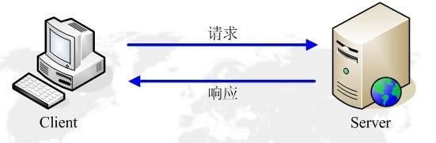
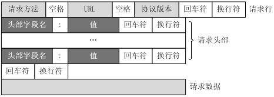
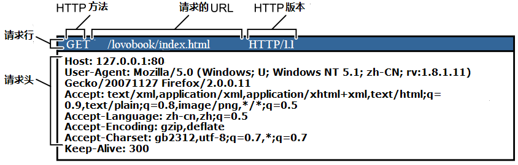
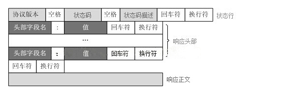
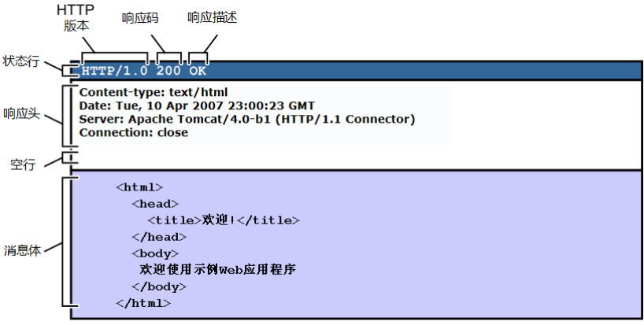
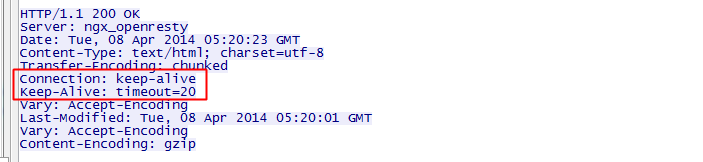

# HTTP 协议介绍

HTTP（HyperText Transfer Protocol，超文本传输协议）是用于在客户端（通常是浏览器）和服务器之间传输超文本（如HTML）的应用层协议。它是无状态的、面向请求-响应的协议，基于TCP/IP传输。

HTTP有不同版本号，不同版本号区别如下

- HTTP0.9：仅支持 GET 方法，仅能访问 HTML 格式的资源
- HTTP1.0：增加 POST 和 HEAD 方法，MIME 支持多种数据格式，开始支持 Cache，支持 tcp 短连接
- HTTP1.1：支持持久连接（长连接），一个 TCP 连接允许多个请求，新增 PUT、PATCH、DELETE 等
- HTTP2.0：性能大幅提升，新的二进制格式，多路复用，header 压缩，服务端推送

# HTTP 工作原理

HTTP的工作过程可以总结为以下几个步骤：

1. **建立连接：** 客户端（如浏览器）与服务器之间通过TCP三次握手建立连接。
2. **发送请求：** 客户端向服务器(Apache、Nginx、IIS服务器)发送HTTP请求报文，请求资源或操作。
3. **服务器处理请求：** HTTP服务器接收到请求后，处理请求并生成响应。
4. **返回响应：** 服务器将响应报文返回给客户端。
5. **断开连接：** 通常在响应完成后关闭TCP连接（HTTP/1.0默认短连接，HTTP/1.1支持长连接）。

# URL 与 URI

## URI（Uniform Resource Identifier）

URI 是统一资源标识符，用于标识互联网上的资源。URI 分为两种

- **URL（Uniform Resource Locator）：** 统一资源定位符，用于描述资源的地址。

- **URN（Uniform Resource Name）：** 统一资源名称，用于标识资源的名称，不依赖物理位置

## URL（Uniform Resource Locator

HTTP 使用统一资源标识符（Uniform Resource Identifiers, URI）来传输数据和建立连接。URL 是一种特殊类型的URI，包含了用于查找某个资源的足够的信息

URL 全称是 UniformResourceLocator, 中文叫统一资源定位符,是互联网上用来标识某一处资源的地址。以下面这个URL为例，介绍下普通URL的各部分组成：

```shell
http://iproute.cn:80/news/search?keyword=123&enc=utf8#name=321
```

从上面的URL可以看出，一个完整的URL包括以下几部分：

1. **协议部分：** 该URL的协议部分为 `http：`，这代表网页使用的是HTTP 协议。在 Internet 中可以使用多种协议，如 HTTP，FTP 等等本例中使用的是 HTTP 协议。在 `http:` 后面的 `//` 为分隔符
2. **域名(主机)部分：** 该 URL 的域名部分为 `iproute.cn`。一个URL 中，也可以使用 IP 地址作为域名使用
3. **端口部分：** 跟在域名后面的是端口，域名和端口之间使用 `:` 作为分隔符。端口不是一个 URL 必须的部分，如果省略端口部分，将采用默认端口
4. **虚拟目录部分：** 从域名后的第一个 `/` 开始到最后一个 `/` 为止，是虚拟目录部分。虚拟目录也不是一个 URL 必须的部分。本例中的虚拟目录是 `/news/`
5. **文件名部分：** 从域名后的最后一个 `/` 开始到 `?` 为止，是文件名部分，如果没有 `?` ,则是从域名后的最后一个 `/` 开始到 `#` 为止，是文件部分，如果没有 `?` 和 `#`，那么从域名后的最后一个 `/` 开始到结束，都是文件名部分。本例中的文件名是 `search` 。文件名部分也不是一个 URL 必须的部分，如果省略该部分，则使用默认的文件名
6. **参数部分：** 从 `？` 开始到 `#` 为止之间的部分为参数部分，又称搜索部分、查询部分。本例中的参数部分为 `keyword=123&enc=utf8`。参数可以允许有多个参数，参数与参数之间用 `&` 作为分隔符
7. **锚部分：** 从 `#` 开始到最后，都是锚部分。本例中的锚部分是`name`。锚部分也不是一个 URL 必须的部分

# HTTP 注意事项

1. HTTP 是无连接：无连接的含义是限制每次连接只处理一个请求。服务器处理完客户的请求，并收到客户的应答后，即断开连接。采用这种方式可以节省传输时间。
2. HTTP 是媒体独立的：这意味着，只要客户端和服务器知道如何处理的数据内容，任何类型的数据都可以通过 HTTP 发送。客户端以及服务器指定使用适合的 MIME-type 内容类型。
3. HTTP 是无状态：HTTP协议是无状态协议。无状态是指协议对于事务处理没有记忆能力。缺少状态意味着如果后续处理需要前面的信息，则它必须重传，这样可能导致每次连接传送的数据量增大。另一方面，在服务器不需要先前信息时它的应答就较快。

# HTTP 消息结构

- HTTP 是基于客户端/服务端（C/S）的架构模型，通过一个可靠的链接来交换信息，是一个无状态的请求/响应协议。
- HTTP 客户端是一个应用程序（Web 浏览器或其他任何客户端），通过连接到服务器达到向服务器发送一个或多个 HTTP 的请求的目的。
- HTTP 服务端是一个应用程序（通常是一个 Web 服务，如 Apache Web服务器或IIS服务器等），通过接收客户端的请求并向客户端发送 HTTP 响应数据。
- HTTP 使用统一资源标识符（Uniform Resource Identifiers, URI）来传输数据和建立连接。
- HTTP 响应也由四个部分组成，分别是：状态行、消息报头、空行和响应正文。



## HTTP 请求报文

客户端发送一个 HTTP 请求到服务器的请求消息包括以下格式：





## POST 和 GET 请求方法区别

- 提交的过程
  - GET 提交，请求的数据会附在URL之后（就是把数据放置在 HTTP 协议头中），以?分割URL和传输数据，多个参数用&连接
  - POST 提交：把提交的数据放置在是HTTP包的包体中
- 传输数据的大小
  - 首先声明：HTTP协议没有对传输的数据大小进行限制，HTTP 协议规范也没有对URL长度进行限制
  - GET 提交，特定浏览器和服务器对URL长度有限制
  - POST 提交，由于不是通过URL传值，理论上数据不受限
- 安全性
  - POST 的安全性要比 GET 的安全性高
  - 登录页面有可能被浏览器缓存，而缓存的是 URL
  - 其他人查看浏览器的历史纪录，那么别人就可以拿到你的账号和密码
  - 使用 GET 提交数据还可能会造成 Cross-site request forgery 攻击


## 常见请求报文头部属性

- Accpet
  - 告诉服务端，客户端接收什么类型的响应
- Referer
  - 表示这是请求是从哪个URL进来的，比如想在网上购物,但是不知道选择哪家电商平台，你就去问百度，说哪家电商的东西便宜啊，然后一堆东西弹出在你面前，第一给就是某宝，当你从这里进入某宝的时候，这个请求报文的Referer 就是 `http://www.baidu.com`
- Cache-Control
  - 对缓存进行控制,如一个请求希望响应的内容在客户端缓存一年，或不被缓可以通过这个报文头设置
- Accept-Encoding
  - 这个属性是用来告诉服务器能接受什么编码格式，包括字符编码，压缩格式
- Host
  - 指定要请求的资源所在的主机和端口
- User-Agent
  - 告诉服务器，客户端使用的操作系统、浏览器版本和名称


## HTTP 响应报文

服务的相应信息格式如下：





## 常见响应报文头部属性

- Cache-Control
  - 响应输出到客户端后,服务端通过该属性告诉客户端该怎么控制响应内容的缓存
- ETag
  - 表示客户端请求资源的版本,如果该资源发生了变化,那么这个属性也会跟着变
- Location
  - 在重定向中或者创建新资源时使用
- Set-Cookie
  - 服务端可以设置客户端的 cookie
  - 
# HTTP 状态码

- 状态代码有三位数字组成，第一个数字定义了响应的类别，共分五种类别:
  - 1xx：指示信息--表示请求已接收，继续处理
  - 2xx：成功--表示请求已被成功接收、理解、接受
  - 3xx：重定向--要完成请求必须进行更进一步的操作
  - 4xx：客户端错误--请求有语法错误或请求无法实现
  - 5xx：服务器端错误--服务器未能实现合法的请求
- 常见状态码

```xml
200 OK                        //客户端请求成功
400 Bad Request               //客户端请求有语法错误，不能被服务器所理解
401 Unauthorized              //请求未经授权，这个状态代码必须和WWW-Authenticate报头域一起使用 
403 Forbidden                 //服务器收到请求，但是拒绝提供服务
404 Not Found                 //请求资源不存在，eg：输入了错误的URL
500 Internal Server Error     //服务器发生不可预期的错误
503 Server Unavailable        //服务器当前不能处理客户端的请求，一段时间后可能恢复正常
```


# HTTP 请求方法

根据 HTTP 标准，HTTP 请求可以使用多种请求方法。

HTTP1.0 定义了三种请求方法： GET, POST 和 HEAD方法。

HTTP1.1 新增了五种请求方法：OPTIONS, PUT, DELETE, TRACE 和 CONNECT 方法。

- GET：请求指定的页面信息，并返回实体主体。
- HEAD：类似于 get 请求，只不过返回的响应中没有具体的内容，用于获取报头
- POST：向指定资源提交数据进行处理请求（例如提交表单或者上传文件）。数据被包含在请求体中。POST请求可能会导致新的资源的建立和/或已有资源的修改。
- PUT：从客户端向服务器传送的数据取代指定的文档的内容。
- DELETE：请求服务器删除指定的页面。
- CONNECT：HTTP/1.1协议中预留给能够将连接改为管道方式的代理服务器。
- OPTIONS：允许客户端查看服务器的性能。
- TRACE：回显服务器收到的请求，主要用于测试或诊断。


# 长连接与短连接

HTTP1.1 规定了默认保持长连接（HTTP persistent connection ，也有翻译为持久连接），数据传输完成了保持TCP连接不断开（不发RST包、不四次握手），等待在同域名下继续用这个通道传输数据；相反的就是短连接。

在实际使用中，HTTP 头部有了 Keep-Alive 这个值并不代表一定会使用长连接，客户端和服务器端都可以无视这个值，也就是不按标准来。毕竟 TCP 是一个双向连接的协议，双方都可以决定是不是主动断开。

客户端的长连接不可能无限期的拿着，会有一个超时时间，服务器有时候会告诉客户端超时时间。下图中的 Keep-Alive: timeout=20，表示这个TCP通道可以保持20秒



# 课后作业

[扩展]了解更多请求/响应报文头属性
[扩展]了解更多响应状态码

