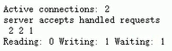
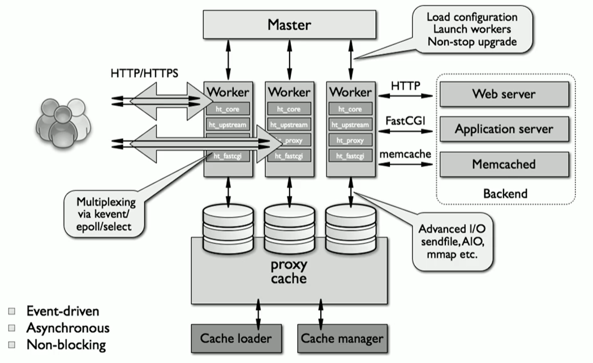
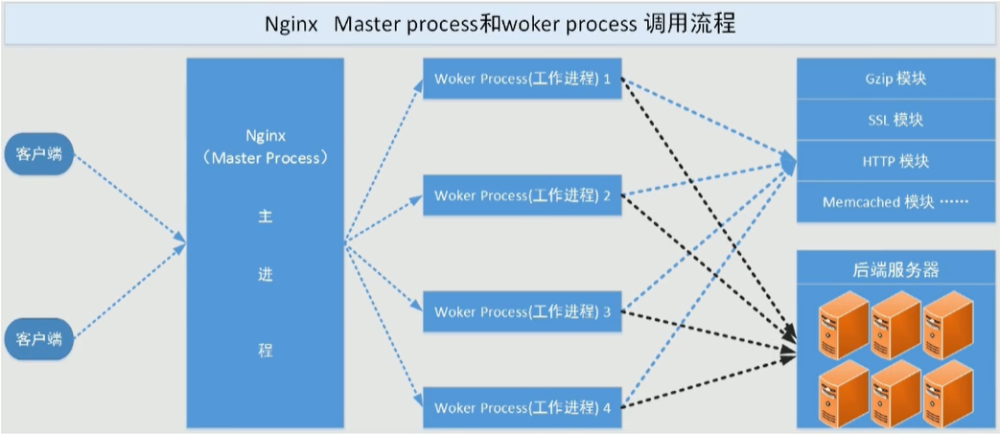
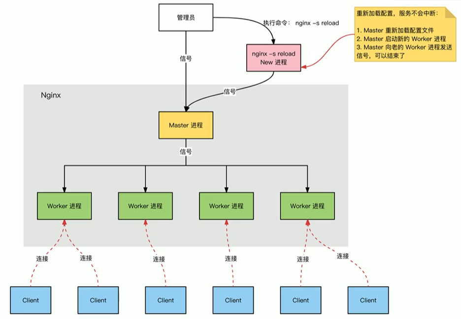
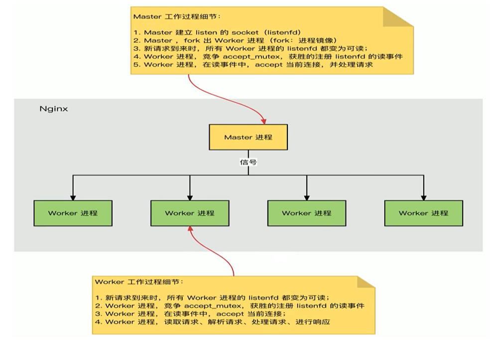
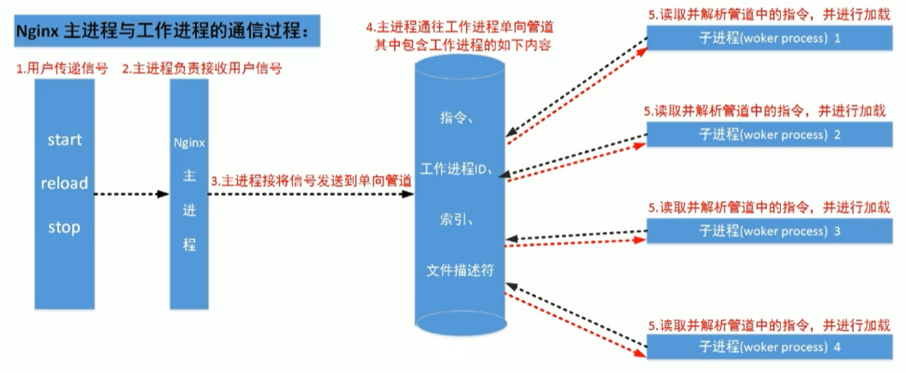
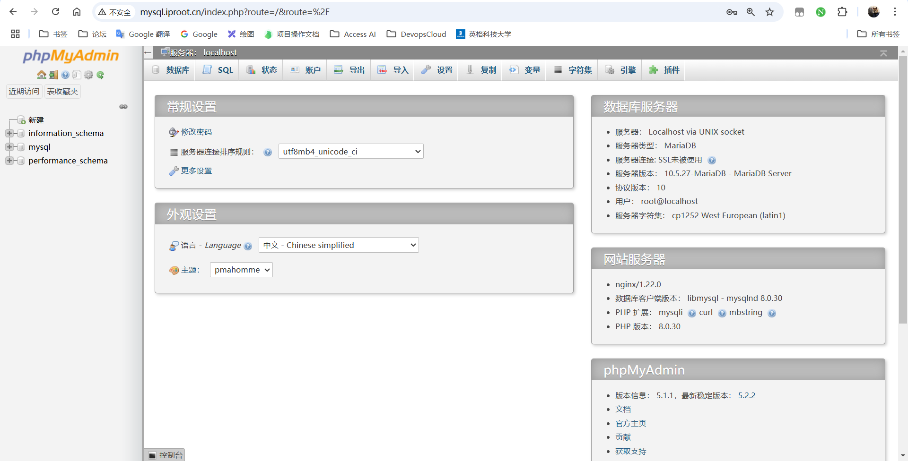
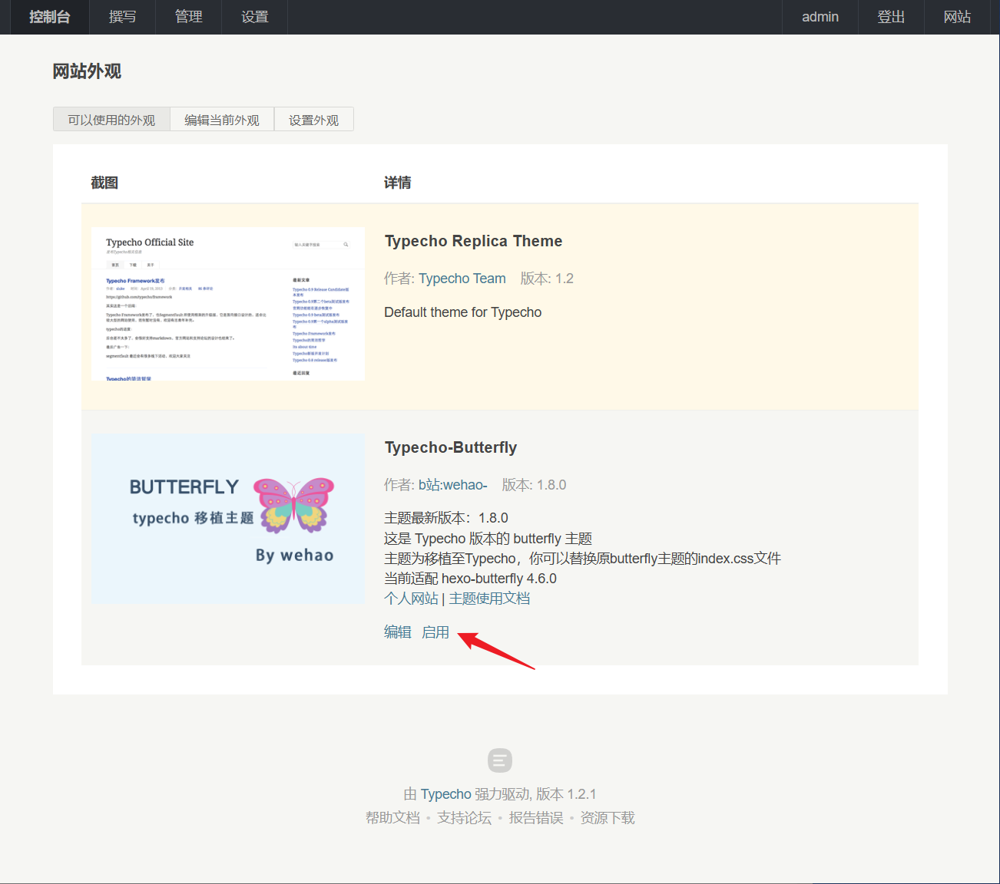
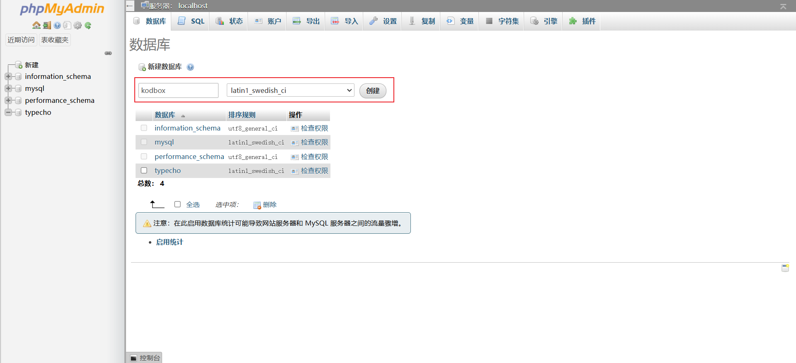
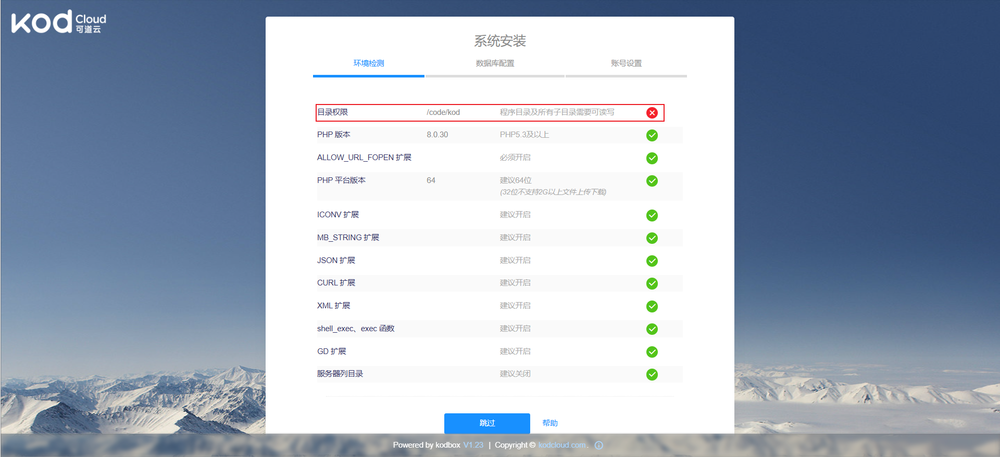

# Nginx 介绍

Nginx：engine X ，2002年开始开发，2004年开源，2019年3⽉11⽇，Nginx公司被F5 Networks以6.7亿美元收购。

Nginx 则是免费的、开源的、⾼性能的HTTP和反向代理服务器、邮件代理服务器、以及TCP/UDP代理服务器 解决[C10K问题](https://www.ideawu.net/blog/archives/740.html)（10K Connections）

**Nginx官网：** http://nginx.org/

**Nginx 商业版为 Nginx Plus：** https://www.nginx.com/products/nginx/

**Nginx ⼆次发行版：**

- Tengine：由淘宝⽹发起的Web服务器项⽬。它在Nginx的基础上，针对⼤访问量⽹站的需求，添加了很多⾼级功能和特性。Tengine的性能和稳定性已经在⼤型的⽹站如淘宝⽹，天猫商城等得到了很好的检验。它的最终⽬标是打造⼀个⾼效、稳定、安全、易⽤的Web平台，从2011年12⽉开始，Tengine成为⼀个开源项⽬，官⽹ http://tengine.taobao.org/
- OpenResty：基于 Nginx 与 Lua 语⾔的⾼性能 Web 平台， 章亦春团队开发，官⽹ http://openresty.org/cn/

## 功能

- 静态的web资源服务器 html，image，js，css，txt 等静态资源
- 结合 FastCGI/uWSGI/SCGI 等协议反向代理动态资源请求
- http/https 协议的反向代理
- imap4/pop3 协议的反向代理
- tcp/udp 协议的反向代理

## 基本特征

- 模块化设计，较好的扩展性
- ⾼可靠性高性能高于 apache
- ⽀持热部署：不停机更新配置⽂件，升级版本，更换⽇志⽂件
- 低内存消耗：10000个 keep-alive 连接模式下的⾮活动连接，仅需2.5M内存
- 事件驱动epoll，异步非阻塞IO，内存映射等等特性


# Nginx 基础

## 安装部署

Nginx 版本分为 Mainline version（主要开发版本）、Stable version (当前最新稳定版)、Legacy versions (旧的稳定版)

**官方下载地址：** http://nginx.org/en/download.html

对于 Nginx 的安装，我们常用的方法为在线安装和源码包编译安装

**其中：**
- yum 下载的相关文件都是放在默认的位置，简单高效
- 编译安装可以自定义版本和功能，更适合业务的定制化

**YUM 安装**

```shell
# 安装
[root@localhost ~]# yum provides nginx
[root@localhost ~]# yum install nginx -y
# 启动
[root@localhost ~]# systemctl start nginx && systemctl enable nginx
# 关闭防火墙和SELINUX
# 测试
[root@localhost ~]# curl -I 127.0.0.1
HTTP/1.1 200 OK
Server: nginx/1.20.1

```

**编译安装**

```shell
# 准备编译环境
[root@localhost ~]# yum -y install gcc pcre-devel openssl-devel zlib-devel
# 如果需要编译安装，为避免冲突需要将yum部署的nginx版本先卸载掉！
# 准备源码包
[root@localhost ~]# wget http://nginx.org/download/nginx-1.22.0.tar.gz -P /usr/local/src/
[root@localhost ~]# cd /usr/local/src && tar xzvf nginx-1.22.0.tar.gz
# 编译
[root@localhost ~]# useradd -r -s /sbin/nologin nginx
[root@localhost nginx-1.22.0]# ./configure --prefix=/apps/nginx \
  --user=nginx \
  --group=nginx \
  --with-http_ssl_module \
  --with-http_v2_module \
  --with-http_realip_module \
  --with-http_stub_status_module \
  --with-http_gzip_static_module \
  --with-pcre \
  --with-stream \
  --with-stream_ssl_module \
  --with-stream_realip_module \
  --with-file-aio
[root@localhost nginx-1.22.0]# make -j 2 && make install
# 善后工作
[root@localhost nginx-1.22.0]# chown -R nginx.nginx /apps/nginx
[root@localhost nginx-1.22.0]# ln -s /apps/nginx/sbin/nginx /usr/sbin/
[root@localhost nginx-1.22.0]# nginx -v
# systemd管理
[root@localhost ~]# cat << EOF > /usr/lib/systemd/system/nginx.service
[Unit]
Description=The nginx HTTP and reverse proxy server
Documentation=http://nginx.org/en/docs/
After=network.target remote-fs.target nss-lookup.target
Wants=network-online.target
 
[Service]
Type=forking
PIDFile=/apps/nginx/run/nginx.pid
ExecStart=/apps/nginx/sbin/nginx -c /apps/nginx/conf/nginx.conf
ExecReload=/bin/kill -s HUP $MAINPID
ExecStop=/bin/kill -s TERM $MAINPID
 
[Install]
WantedBy=multi-user.target
EOF
# 更新nginx.pid存储位置
[root@localhost ~]# mkdir /apps/nginx/run/
[root@localhost ~]# vim /apps/nginx/conf/nginx.conf
pid        /apps/nginx/run/nginx.pid;
# 启动
[root@localhost ~]# systemctl start nginx && systemctl enable nginx 
# 关闭防火墙和SELINUX
[root@localhost ~]# curl -I 127.0.0.1
HTTP/1.1 200 OK
Server: nginx/1.22.0

```

## nginx 命令

nginx 为 Nginx 服务软件的命令

```shell
[root@localhost ~]# nginx -h
nginx version: nginx/1.20.1
Usage: nginx [-?hvVtTq] [-s signal] [-p prefix]
             [-e filename] [-c filename] [-g directives]
```

**常用选项**

| 选项 | 说明 |
| :--- | :--- |
| -v | 输出版本 |
| -V | 编译相关选项 |
| -t | 测试验证配置文件的正确性 |
| -s <signal> | 发送信号指令给主进程 |

## 相关文件

| 文件 | 说明 |
| :--- | :--- |
| /etc/nginx/nginx.conf | 主配置文件 |
| /var/log/nginx/ | 日志文件目录 |
| /usr/share/nginx/html/ | 默认站点根目录 |
| /usr/lib/systemd/system/nginx.service | Systemd服务文件 |
| /var/run/nginx.pid | 主进程ID文件 |
| /usr/share/nginx/modules | 动态加载模块目录 |
| /etc/nginx/conf.d/ | 子配置文件目录 |

## 主配置文件

```shell
[root@localhost ~]# grep -Ev '^$|^#|\s*#' /etc/nginx/nginx.conf
# 全局配置块
## 运行用户
user nginx;
## 工作进程数
worker_processes auto;
## 错误日志
error_log /var/log/nginx/error.log;
## pid文件存放位置
pid /run/nginx.pid;
## 动态加载模块配置
include /usr/share/nginx/modules/*.conf;
# events配置块
events {
    # 设置单个工作进程最大并发连接数
    worker_connections 1024;
}
# http配置块
http {
    ## 日志格式定义
    log_format  main  '$remote_addr - $remote_user [$time_local] "$request" '
                      '$status $body_bytes_sent "$http_referer" '
                      '"$http_user_agent" "$http_x_forwarded_for"';
    ## 访问日志
    access_log  /var/log/nginx/access.log  main;
    ## 启用 sendfile() - 利用操作系统内核的零拷贝技术：即数据拷贝无需切换至用户空间
    sendfile            on;
    ## 启用 TCP_NOPUSH - 优化网络包传输：即数据包填满时发送
    tcp_nopush          on;
    ## 启用  TCP_NODELAY - 减少延迟：即基于keepalive连接，尽快发送小数据包
    tcp_nodelay         on;
    ## keepalive 超时时间
    keepalive_timeout   65;
    ## 设置用于存储MIME类型映射的哈希表最大大小
    types_hash_max_size 4096;
    ## 定义文件扩展名与MIME类型的映射
    include             /etc/nginx/mime.types;
    ## 定义响应包默认MIME类型
    default_type        application/octet-stream;
    ## 加载子配置文件
    include /etc/nginx/conf.d/*.conf;
    # server配置块
    server {
        ## 监听ipv4和ipv6 80端口
        listen       80;
        listen       [::]:80;
        ## 定义虚拟主机的名称-域名
        server_name  _;
        ## 根目录
        root         /usr/share/nginx/html;
        ## 加载默认站点子配置文件
        include /etc/nginx/default.d/*.conf;
        ## 定义错误页
        error_page 404 /404.html;
        # location配置块
        location = /404.html {
        }
        error_page 500 502 503 504 /50x.html;
        location = /50x.html {
        }
    }
}

# 默认配置文件不包括下面两个块
# mail协议相关配置段
mail {
  ...
}
# stream服务器相关配置段
stream {
  ...
}

```

## 相关模块

**常见模块类型**

- **核心模块**：是 Nginx 服务器正常运行必不可少的模块，提供错误日志记录、配置文件解析、事件驱动机制、进程管理等核心功能
- **标准 HTTP 模块**： 提供 HTTP 协议解析相关的功能，比如：端口配置、网页编码设置、HTTP 响应头设置 等等
- **可选 HTTP 模块**： 主要用于扩展标准的 HTTP 功能，让 Nginx 能处理一些特殊的服务， 比如：Flash 多媒体传输、解析GeolP 请求、网络传输压缩、安全协议 SSL 支持等
- **邮件服务模块**： 主要用于支持 Nginx 的邮件服务，包括对 POP3 协议、IMAP 协议和 SMTP 协议的支持
- **Stream 服务模块**： 实现反向代理功能包括TCP协议代理
- **第三方模块**： 是为了扩展 Nginx 服务器应用，完成开发者自定义功能，比如: Json 支持、 Lua 支持等

**部分第三方模块官方文档：** http://nginx.org/en/docs/

```shell
# 编译时内置模块
[root@localhost ~]#  nginx -V 2>&1 | tr ' ' '\n' | grep module
# 动态加载模块
/usr/lib64/nginx/modules
```

## 案例分析

- 修改默认网址目录为：`/data/www/html` && 修改 ServerName 为：`test.mysite.com`；修改 Listen 为：`8090`
- 自定义文件扩展名为 `.text` 的响应包中MIME类型为 `text/my_text`
- 响应报文 Server 首部不显示 nginx 版本：防止他人根据某个版本的漏洞进行攻击

```shell
# 待补充
```

# 虚拟主机

基于不同的IP、不同的端口以及不同的域名实现不同的虚拟主机，依赖于核心模块 ngx_http_ core_module 实现

## 案例分析

- 定义 PC 站点，根目录为 `/data/nginx/site01`，直接通过 `x.x.x.x:8001`
- 定义 Mobile 站点，根目录为 `/data/nginx/site02`，通过自定义域名访问
- 定义 Test 站点，根目录为 `/data/nginx/site03`, 仅能通过本地 `127.0.0.1:8003` 访问
- 定义 Test 站点，访问 `127.0.0.1:8003/status`，根目录为 `/data/nginx`

```shell
[root@localhost ~]# mkdir -pv /data/nginx/site0{1..3}/
[root@localhost ~]# mkdir -pv /data/nginx/status
[root@localhost ~]# echo "Running 3 websites" > /data/nginx/status/index.html
[root@localhost ~]# echo "Hello PC Website!" > /data/nginx/site01/index.html
[root@localhost ~]# echo "Hello Moblie Website!" > /data/nginx/site02/index.html
[root@localhost ~]# echo "Hello Local Test Website!" > /data/nginx/site03/index.html
[root@localhost ~]# cat << EOF > /etc/nginx/conf.d/vhost.conf
# PC
server {
    listen  8001;
    location  / {
        root  /data/nginx/site01;
    }
}
# Mobile
server {
    listen 80;
    server_name m.test.com;
    location / {
        root /data/nginx/site02;
    }
}
# Test
server {
    listen 127.0.0.1:8003;
    location / {
        root /data/nginx/site03;
    }
    location /status {
        root /data/nginx;  
    }
}
EOF
# 检查配置文件并重新加载
[root@localhost ~]# nginx -t
nginx: the configuration file /etc/nginx/nginx.conf syntax is ok
nginx: configuration file /etc/nginx/nginx.conf test is successful
[root@localhost ~]# nginx -s reload
# 测试验证
[root@localhost ~]# curl 172.16.175.129:8001
Hello PC Website!
[root@localhost ~]# curl -H 'Hostname: p.test.com' 172.16.175.129
Hello Moblie Website!
[root@localhost ~]# curl 172.16.175.129:8003
curl: (7) Failed to connect to 172.16.175.129 port 8003: Connection refused
# 定义 location 时：文件的绝对路径等于 root+location
[root@localhost ~]# curl -L 127.0.0.1:8003/status
Running 3 websites
```

# Location 

Nginx 的 location 指令是配置请求路由的核心机制，其匹配规则基于 ​**​URI**​​ 和​**​修饰符​**​，优先级由匹配类型和顺序共同决定。

## 匹配类型与语法

```shell
location [ = | ~ | ~* | ^~ ] uri { ... }
```

| 修饰符 | 匹配类型 | 语法示例 | 说明    |
| :--- | :--- | :--- | :--- |
| =        | 精确匹配 | location = /path | 仅当 URI 完全等于 /path 时匹配，优先级最高 |
| ^~       | 前缀匹配 | location ^~ /images/ | 匹配以 /images/ 开头的 URI，停止后续正则检查  |
| ~        | 正则匹配 | location ~ \.php$ | 区分大小写，正则表达式匹配，按配置文件顺序匹配 |
| ~*       | 正则匹配 | location ~* \.(jpg,png)$ | 不区分大小写，正则表达式匹配，按配置文件顺序匹配          |
| 无修饰符   | 前缀匹配 | location /static/ | 匹配以 /static/ 开头的 URI，需继续正则检查  |
| /        | 通用匹配 | location / | 匹配所有请求，优先级最低 |

**优先级**：`= ^~ ~/~* 无修饰符 /`

## 案例分析

**官方案例**

```shell
location = / {
    [ configuration A ]
}
location / {
    [ configuration B ]
}
location /documents/ {
    [ configuration C ]
}
location ^~ /images/ {
    [ configuration D ]
}
location ~* \.(gif|jpg|jpeg)$ {
    [ configuration E ]
}
# \: 转义字符
# 实际访问路径：root + 请求的路径
```

**测试验证**

- The "`/`" request will match configuration A
- the "`/index.html`" request will match configuration B
- the "`/documents/document.html`" request will match configuration C
- the "`/images/1.gif`" request will match configuration D
- the "`/documents/1.jpg`" request will match configuration E


# 访问控制

Nginx 的访问控制是保障服务器安全的核心机制，通过多种方式精细化管控请求入口

## 基于 IP 

**典型场景**

```shell
# 黑名单：默认允许，拒绝特定IP
location /admin {
    deny 192.168.1.100;  # 拒绝单个 IP
    deny 10.0.0.0/8;     # 拒绝网段
    allow all;           # 允许其他 IP
}

# 白名单：默认拒绝，允许可信IP
location /api {
    allow 192.168.1.0/24;  # 允许网段
    allow 172.16.1.1;      # 允许单个 IP
    deny all;              # 拒绝其他
}

```

## 基于 HTTP 认证

**典型场景**

```shell
# 生成密码文件
## 首次创建
htpasswd -c /etc/nginx/.htpasswd admin
## 追加用户
htpasswd -c /etc/nginx/.htpasswd root

# 后台管理
location /admin {
    auth_basic "Tip: input password!";                 # 认证提示语
    auth_basic_user_file /etc/nginx/.htpasswd;   # 密码文件路径
}

```

## 案例分析

仅能够通过 admin 用户本地访问后台管理，其他所有IP和用户均不允许

```shell
# 准备实验环境
[root@localhost ~]# htpasswd -c /etc/nginx/.htpasswd admin
New password:
Re-type new password:
Adding password for user admin
[root@localhost ~]# mkdir -pv /data/nginx/site04/admin
[root@localhost ~]# echo "site04" > /data/nginx/site04/admin/index.html
[root@localhost ~]# cat << EOF > /etc/nginx/conf.d/site04.conf
server {
    listen  8004;
    # 精细化控制：基于请求属性
    if ($http_user_agent ~* bot) {
        return 403;
    }
    location  /admin {
        root  /data/nginx/site04;
        auth_basic "Tip: input password!";
        auth_basic_user_file /etc/nginx/.htpasswd;
        allow 127.0.0.1;
        deny all;
    }
}
EOF
[root@localhost ~]# nginx -t
nginx: the configuration file /etc/nginx/nginx.conf syntax is ok
nginx: configuration file /etc/nginx/nginx.conf test is successful
[root@localhost ~]# nginx -s reload
# 测试验证
client01 ~ % curl -I 172.16.175.129:8004/admin
HTTP/1.1 403 Forbidden
[root@localhost ~]# curl -u admin:123 http://127.0.0.1:8004/admin/
site04
[root@localhost ~]# curl -I -u root:123 http://127.0.0.1:8004/admin/
HTTP/1.1 401 Unauthorized
## 模拟 bot 访问
[root@localhost ~]# curl -I -u root:123 -H 'User-agent: bot' http://127.0.0.1:8004/admin/
HTTP/1.1 403 Forbidden
```

# 日志相关

## 访问日志

记录客户端请求信息（IP、请求方法、状态码、响应大小等）

**相关配置指令**

```shell
Syntax:    access_log path [format [buffer=size] [gzip[=level]] [flush=time] [if=condition]];
           access_log off;
Default:   access_log logs/access.log combined;
Context:   http, server, location, if in location, limit_except


Syntax:    log_format name [escape=default|json|none] string ...;
Default:   log_format combined "...";
Context:   http

```

**官方案例**

```shell
# 定义日志格式
log_format compression '$remote_addr - $remote_user [$time_local] '
                       '"$request" $status $bytes_sent '
                       '"$http_referer" "$http_user_agent" "$gzip_ratio"';
# 定义访问日志
access_log /spool/logs/nginx-access.log compression buffer=32k;
```


## 错误日志

记录服务器错误、警告及调试信息

**相关配置指令**

```shell
Syntax:    error_log file [level];
Default:   error_log logs/error.log error;
Context:   main, http, mail, stream, server, location

# 日志级别：debug info notice warn error crit alert emerg

```

**案例分析**：参考主配置文件中日志相关配置

# 常用变量

## 内置变量

常用内置变量

```shell
$remote_addr;
# 存放了客户端的地址，注意是客户端的公网IP
$proxy_add_x_forwarded_for;
# 此变量表示将客户端IP追加请求报文中X-Forwarded-For首部字段，多个IP之间用逗号分隔，如果请求中没有X-Forwarder-For，就使用$remote_addr
$args;
# 变量中存放了URL中的参数
$document_root;
# 保存了针对当前资源的系统根目录
$document_uri;
# 保存了当前请求中不包含参数的URI,注意是不包含请求的指令，比如/img/logo.png
$host;
# 存放了请求的host名称
limit_rate 10240;
echo $limit_rate;
# 如果nginx服务器使用limit_rate配置了显示网络速率，则会显示，如果没有设置，则显示0
$remote_port;
# 客户端请求Nginx服务器时随机打开的端口，这是每个客户端自己的端口
$remote_user;
# 已经经过Auth Basic Module验证的用户名
$request_body_file;
# 做反向代理时发给后端服务器的本地资源的名称
$request_method;
# 请求资源的方式，GET/PUT等等
$request_filename;
# 当前请求的资源文件的磁盘路径，由root或alias指令与URL请求生成的文件绝对路径
# /apps/nginx/html/www/index.html
$request_uri;
# 包含请求参数的原始URI,不包含主机名，相当于:$document_uri?$args
$scheme;
# 请求的协议，例如：http,https,ftp等等
$server_protocol;
# 保存了客户端请求资源使用的协议版本，例如：HTTP/1.0,HTTP/1.1,HTTP/2.0等等
$server_addr;
# 保存了服务器的IP地址
$server_name;
# 请求的服务器的主机名
$server_port;
# 请求的服务器的端口号
$http_<name>
# name为任意请求报文首部字段，表示记录请求报文的首部字段
$http_user_agent;
# 客户端浏览器的详细信息
$http_cookie;
# 客户端的cookie信息
$cookie_<name>
# name为任意请求报文首部字段cookie的key名
```

## 自定义变量

假如需要自定义变量名和值，使用指令set $variable value;

语法格式：

```shell
Syntax:set $varible value;
Default: -
Context: server, location, if
```

范例：

```shell
[root@localhost ~]# vim /apps/nginx/conf.d/www.conf
set $name zs;
echo $name;
set $my_port $server_port;
echo $my_port;
echo "$server_name:$server_port";
```

# 网页压缩技术

网页压缩技术主要通过 ngx_http_gzip_module 模块​​实现，它能显著减少传输数据量，提升网站加载速度和用户体验

```shell
# 启用或禁用 gzip 压缩，默认关闭
gzip on | off;
# 压缩比由低到高1到9，默认为1
gzip_comp_level level;
# 禁用 IE6 gzip 功能
gzip_disable "MSIE [1-6]\.";
# gzip 压缩的最小文件，小于设置值的文件将不会压缩
gzip_min_length 1k;
# 启用压缩功能时，协议的最小版本，默认 HTTP/1.1
gzip_http_version 1.0 | 1.1;
# 指定 Nginx 服务需要向服务器申请的缓存空间的个数和大小，平台不同，默认：32 4k或者 16 8k
gzip_buffers number size;
# 指明仅对哪些类型的资源执行压缩操作，默认为 gzip_types text/html，不用显示指定，否则出错
gzip_types mime-type ...;
# 如果启用压缩，是否在相应报文首部插入 "vary: Accept-Encoding"，一般建议打开
gzip_vary on | off

```

**案例分析**：参考 Apache 对应案例的测试验证思路

# Nginx 第三方模块

第三方模块是对nginx的功能扩展，第三方模块需要在编译安装Nginx的时候使用参数--add-module=PATH指定路径添加，有的模块是由公司的开发人员针对业务需求定制开发的，有的模块是开源爱好者开发好之后上传到github进行开源的模块，nginx支持第三方模块需要从源码重新编译支持.

开源 **echo模块**：https://github.com/openresty/echo-nginx-module

```shell
[root@localhost nginx-1.22.0]# vim /apps/nginx/conf.d/echo.conf
server {
    listen 80;
    server_name echo.test.com;

    location /main {
        index index.html;
        default_type text/html;
        echo "hello world,main-->";
        echo $remote_addr;
        echo_reset_timer;
        # 将计时器开始时间重置为当前时间

        echo_location /sub1;
        echo_location /sub2;
        echo "took $echo_timer_elapsed sec for total.";
}
    location /sub1 {
        echo_sleep 2;
        echo hello;
}
    location /sub2 {
        echo_sleep 1;
        echo world;
}
}


# 重新编译nginx，以前的配置文件不会丢失
[root@localhost ~]# cd /usr/local/src
[root@localhost src]# wget https://github.com/openresty/echo-nginx-module/archive/refs/heads/master.zip
[root@localhost src]# unzip echo-nginx-module-master.zip
[root@localhost src]# mv echo-nginx-module-master echo-nginx-module
[root@localhost src]# cd nginx-1.22.0
[root@localhost nginx-1.22.0]# ./configure --prefix=/apps/nginx \
--user=nginx \
--group=nginx \
--with-http_ssl_module \
--with-http_v2_module \
--with-http_realip_module \
--with-http_stub_status_module \
--with-http_gzip_static_module \
--with-pcre \
--with-stream \
--with-stream_ssl_module \
--with-stream_realip_module \
--add-module=/usr/local/src/echo-nginx-module
[root@localhost nginx-1.22.0]# make -j 2 && make install


# 进行访问测试
[root@localhost ~]# echo "192.168.88.10 echo.test.com" >> /etc/hosts
[root@localhost ~]# curl echo.test.com/main
hello world,main-->
192.168.88.140
hello
world
took 3.008 sec for total.

```

# 其他配置项

## Alias

**alias：** 定义路径别名，会把访问的路径重新定义到其指定的路径，文档映射的另一种机制，仅能用于location上下文，此指令使用较少

**案例：**

```shell
[root@localhost conf]# vim /apps/nginx/conf.d/test.conf
server {
  listen 80;
  server_name a.test.com;

  location /about/ {
  # 使用alias的时候uri后面加了斜杠，下面的路径也必须加，不然403错误
    alias /apps/nginx/html/about/;
    # 当访问about的时候，会显示alias定义的/apps/nginx/html/about/里面的内容
  }
}

# 重启Nginx并访问测试
[root@localhost ~]# systemctl reload nginx
[root@localhost ~]# curl a.test.com/about/
about
```


## 自定义错误页面

定义错误页，以指定的响应状态码进行响应,可用位置: http, server, location, if in location

```shell
erro_page code ... [=[response]] uri;
```

**官方示例：**

```shell
[root@localhost static3]# vim /apps/nginx/conf/nginx.conf
server {
listen 80;
server_name www.example.com;
error_page 500 502 503 504 /error.html;
location = /error.html {
  root html;
}
```

**范例：**

```shell
[root@localhost static3]# vim /apps/nginx/conf.d/test.conf
server {
    listen 80;
    server_name a.test.com;
    auth_basic "login password";
    auth_basic_user_file /apps/nginx/conf/.htpasswd;
    error_page 404 /40x.html;
    location = /1.jpg {
        index index.html;
        root /apps/nginx/static1;
    }
    location /40x.html{
    	root /apps/nginx/html;
    }
}
[root@localhost html]# echo "<h1>404 not found</h1>" > /apps/nginx/html/40x.html 
```

**范例：**

```shell
error_page 404 /index.html;
# 如果404，就跳转到主页
```


## 长连接配置

```shell
[root@localhost html]# vim /apps/nginx/conf/nginx.conf

keepalive_timeout timeout [header_timeout];
# 设定保持连接超时时长，0表示禁止长连接，默认为75s,通常配置在http字段作为站点全局配置
keepalive_requests number;
# 在一次长连接上所允许请求的资源的最大数量，默认为100次，建议适当调大，比如：500
```

范例：

```shell
[root@localhost html]# vim /apps/nginx/conf/nginx.conf
http {
...
keepalive_requests 3;
keepalive_timeout 65 60;
# 开启长连接后，返回客户端的会话保持时间为60s，单次长连接累计请求达到指定次数请求或65秒就会被断开，后面的60为发送给客户端应答报文头部中显示的超时时间设置为60s，如不设置客户端将不显示超时时间。
keep-Alive:timeout=60;
# 浏览器收到的服务器返回的报文
# 如果设置为keepalive_timeout 0表示关闭会话保持功能，将如下显示：
Connection:close  # 浏览器收到的服务器返回的报文
# 使用命令测试
[root@localhost html]# telnet a.test.com 80
Trying 192.168.88.10...
Connected to a.test.com.
Escape character is '^]'.
GET / HTTP/1.1
HOST: a.test.com
```

## 作为下载服务器

ngx_http_autoindex_module模块处理以斜杠字符"/"结尾的请求，并生成目录列表可以做为下载服务配置使用

官方文档：https://nginx.org/en/docs/http/ngx_http_autoindex_module.html

相关指令：

```shell
autoindex on|off;
# 自动文件索引功能，默认off
autoindex_exact_size on|off;
# 计算文件确切大小(单位bytes),off显示大概大小(单位K、M),默认on
autoindex_localtime on|off;
# 显示本机时间而非GMT(格林威治)时间,默认off
autoindex_format html|xml|json|jsonp;
# 显示索引的页面分割，默认html
limit_rate rate;
# 限制响应客户端传输速率(除GET和HEAD以外的所有方法),单位B/s,既bytes/second,默认值0，表示无限制，此指令由ngx_http_core_module提供
```

范例：实现下载站点

```shell
[root@localhost ~]# mkdir -p /apps/nginx/html/www/download
[root@localhost ~]# cd /apps/nginx/html/www/download
[root@localhost download]# touch f1
[root@localhost download]# touch f2
[root@localhost ~]# vim /apps/nginx/conf.d/www.conf
server {
    listen 80;
    server_name file.test.com;
    location /download {
        autoindex on;    
        # 自动索引功能,开启才会展示出文件列表
        autoindex_exact_size off;    
        # 关闭详细文件大小统计，让文件大小显示MB，GB单位，默认为b
        autoindex_localtime on;    
        # on表示显示本机时间
        limit_rate 1024k;      
        # 限速，默认不限速
        root /apps/nginx/html/www;
    }
}


# 修改windwos里面的hosts
192.168.88.140 file.test.com
测试http://file.test.com/download/
```

## 作为上传服务器

```shell
client_max_body_size 1m;
# 设置允许客户端上传单个文件的最大值，默认值为1m,上传文件超过此值会出现413错误
client_body_buffer_size size;
# 用户接受每个客户端请求报文的body部分的缓冲区大小;默认16k;超出此大小时，其将被暂存到磁盘上client_body_temp_path指定所定义的位置
client_body_temp_path path [level1 [level 2 [level 3]]];
# 设定存储客户端请求报文的body部分的临时存储路径及子目录结构和数量，目录名为16进制的数字，使用hash之后的值从后往前截取1位、2位、2位作为目录名
# 1级目录占1位16进制，即2^4=16个目录 0-f
# 2级默认占2位16进制，即2^8=256个目录 00-ff
# 3级目录占2位16进制，即2^8=256个目录
#因为如果所有上传的文件都放在一个文件夹下，不仅很容易文件名冲突，并且容易导致一个文件夹特别大。所以有必要创建子目录这里的level1,2,3如果有值就代表存在一级，二级，三级子目录。目录名是由数字进行命名的，所以这里的具体的值就是代表目录名的数字位数，比如如果如下设置
#client_body_temp_path  /spool/nginx/client_temp 3 2;
#可能创建的文件路径为
#/spool/nginx/client_temp/702/45/00000123457
[root@localhost ~]# md5sum f1
d41d8cd98f00b204e9800998ecf8427e  f1
[root@localhost ~]# md5sum f2
b026324c6904b2a9cb4b88d6d61c81d1  f2
```

**配置示例：**但是上传操作不太好展示，因为需要从前端通过POST和GET来提交上传的内容

```bash
server {
        listen       80;
        server_name  upload.test.com;

        location /upload {
            # 上传目录
            root /apps/nginx/upload;
            # 允许上传的文件大小
            client_max_body_size 2m;
            # 处理上传请求
            location ~ ^/upload/(?P<file>.*) {
                limit_rate 1m;
                limit_rate_after 10m;
                client_body_temp_path /tmp/nginx_upload;
                client_body_in_file_only clean;

                # 保存上传的文件
                alias /apps/nginx/upload/$file;
            }
        }
    }

```

## Nginx 状态页

基于nginx模块ngx_http_stub_status_ module实现，在编译安装nginx的时候需要添加编译参数--with-http_stub_status_module,否则配置完成之后监测会是提示语法错误

注意:状态页显示的是整个服务器的状态，而非虚拟主机的状态

```shell
[root@localhost ~]# vim /apps/nginx/conf.d/www.conf
server {
    listen 80;
    server_name status.test.com;

    location /status {
        stub_status on;
        # 开启nginx状态页显示
        allow 192.168.88.0/24;
        deny all;
    }
}

[root@localhost ~]# vim /etc/hosts
192.168.88.140 status.test.com
[root@localhost download]# curl http://status.test.com/status
Active connections: 1
server accepts handled requests
 1 1 1
Reading: 0 Writing: 1 Waiting: 0
```



- Active connections: 2 表示Nginx正在处理的活动连接数2个。
- server 2 表示Nginx启动到现在共处理了2个连接
- accepts 2 表示Nginx启动到现在共成功创建2次握手
- handled requests 1 表示总共处理了 1 次请求
- Reading:Nginx 读取到客户端的 Header 信息数，数值越大，说明排队越长，性能不足
- Writing:Nginx 返回给客户端 Header 信息数，数值越大，说明访问量越大
- Waiting:Nginx 已经处理完正在等候下一次请求指令的驻留链接（开启keep-alive的情况下，这个值等于Active-(Reading+Writing)）


## 其他

- 对哪种浏览器禁用长连接

```shell
keepalive_disable none | browser ...;
```

- 限制客户端使用除了指定的请求方法之外的其他方法

```shell
limit_except method ... { ... }；  # 仅用于location
method: GET, HEAD, POST, PUT, DELETE, MKCOL, COPY, MOVE, OPTIONS, PROPFIND, PROPPATCH, LOCK, UNLOCK, PATCH
[root@localhost conf.d]# vim /apps/nginx/conf.d/www.conf
location /download {
    root /apps/nginx/html/www;
    autoindex on;
    autoindex_exact_size off;
    autoindex_localtime on;
    limit_except POST {          #相当于只允许底下允许列表里的使用除了post外的其他方法
    allow 192.168.112.1;         #只有浏览器可以使用除了post外的其他方法(get delete)，其他人只能用post
    deny all;
}
}
[root@localhost conf.d]# systemctl restart nginx


# 观察现象
curl file.test.com/download
curl file.test.com/download -X POST -d "hello"
两次报错不一致，一个403一个404

cd /apps/nginx/html/www
touch f1
touch f2
vim /apps/nginx/conf.d/www.conf

将 root /apps/nginx/html/www;改成    alias /apps/nginx/html/www;
浏览器测试 http://file.test.com/download/，能否访问到get请求
```

- 是否启用asynchronous file I/O(AIO)功能，需要编译开启`--with-file-aio`
- 在读取文件的时候使用异步可以提高效率

```shell
aio on | off;
```

```shell
[root@localhost nginx-1.22.0]# cd /usr/local/src/nginx-1.22.0 
[root@localhost nginx-1.22.0]# ./configure --prefix=/apps/nginx \
--user=nginx \
--group=nginx \
--with-http_ssl_module \
--with-http_v2_module \
--with-http_realip_module \
--with-http_stub_status_module \
--with-http_gzip_static_module \
--with-pcre \
--with-stream \
--with-stream_ssl_module \
--with-stream_realip_module \
--with-file-aio
[root@localhost nginx-1.22.0]# make -j 2 && make install
[root@localhost nginx-1.22.0]# nginx -V
nginx version: slsnginx/1.22.0
built by gcc 4.8.5 20150623 (Red Hat 4.8.5-44) (GCC)
built with OpenSSL 1.0.2k-fips  26 Jan 2017
TLS SNI support enabled
configure arguments: --prefix=/apps/nginx --user=nginx --group=nginx --with-http_ssl_module --with-http_v2_module --with-http_realip_module --with-http_stub_status_module --with-http_gzip_static_module --with-pcre --with-stream --with-stream_ssl_module --with-stream_realip_module --with-file-aio
#支持file-aio了
[root@localhost nginx-1.22.0]# vim /apps/nginx/conf.d/www.conf
server {
  listen 80;
  server_name file.test.com;
  aio on;
...
}
```

- directio是在写文件到磁盘的时候大小大于size的时候，直接写磁盘，而非写缓存

```shell
directio size | off;
```

- Nginx支持对磁盘中的文件进行缓存

```shell
open_file_cache on;    # 是否缓存打开过的文件信息
open_file_cache max=N [inactive=time];
#nginx可以缓存以下三种信息：
#1. 文件元数据，文件的描述符，文件大小和最近一次的修改时间
#2. 打开的目录结构
#3. 没有找到的或者没有权限访问的文件相关信息
max=N;    # 可缓存的缓存项上限数量；达到上限后会使用LRU(Least recently used,最近最少使用)算法实现管理
inactive=time;    # 缓存项的非活动时长，在此处指定的时长内未被命中的或命中的次数少于open_file_cache_min_uses指令所指定的次数的缓存项即为非活动项，将被删除
open_file_cache_valid time;  #缓存项有效性的检查验证频率，默认值为60s
open_file_cache_errors on | off；   #是否缓存查找时发生错误的文件一类的信息，默认值为off
open_file_cache_min_uses number;   # open_file_cache指令的inactive参数指定的时长内，至少被命中此处指定的次数方可被归类为活动项，默认值为1
```

范例：

```shell
open_file_cache max=10000 inactive=60s;
open_file_cache_vaild 60s;
open_file_cache_min_uses 5;
open_file_cache_errors off;
```


# HTTPS 功能

Web网站的登录页面都是使用https加密传输的，加密数据以保障数据的安全，HTTPS能够加密信息，以免敏感信息被第三方获取,所以很多银行网站或电子邮箱等等安全级别较高的服务都会采用HTTPS协议，HTTPS其实是有两部分组成: HTTP + SSL/ TLS,也就是在HTTP上又加了一层处理加密信息的模块。服务端和客户端的信息传输都会通过TLS进行加密，所以传输的数据都是加密后的数据。


## 配置参数

nginx的https功能基于模块ngx_http_ssl_module实现，因此如果是编译安装的nginx要使用参数ngx_http_ssl_module开启ssI功能，但是作为nginx的核心功能，yum安装的nginx默认就是开启的，编译安装的nginx需要指定编译参数--with-http_ssl_module开启

官方文档：https://nginx.org/en/docs/http/ngx_http_ssl_module.html

配置参数如下：

```shell
ssl on | off;
listen 443 ssl;
# 为指定的虚拟主机配置是否启用ssl功能，此功能在1.15.0废弃，使用listen [ssl]替代。
ssl_certificate /path/to/file;
# 当前虚拟主机使用使用的公钥文件，一般是crt文件
ssl_certificate_key /path/to/file;
# 当前虚拟主机使用的私钥文件，一般是key文件
ssl_protocols [SSLv2] [SSLv3] [TLSv1] [TLSv1.1] [TLSv1.2];
# 支持ssl协议版本，早期为ssl现在是TSL，默认为后三个
ssl_session_cache off | none | [builtin[:size]] [shared:name:size];
# 配置ssl缓存
	off： 
	# 关闭缓存
	none: 
	# 通知客户端支持ssl session cache，但实际不支持
	builtin[:size]：
	# 使用OpenSSL内建缓存，为每worker进程私有
	[shared:name:size]：
	# 在各worker之间使用一个共享的缓存，需要定义一个缓存名称和缓存空间大小，一兆可以存储4000个会话信息，多个虚拟主机可以使用相同的缓存名称。
ssl_session_timeout time;
# 客户端连接可以复用ssl session cache中缓存的有效时长，默认5m
```

## 自签名证书

- 生成ca证书

```shell
[root@localhost ~]# cd /apps/nginx
[root@localhost nginx]# mkdir certs && cd certs
[root@localhost certs]# openssl req -newkey rsa:4096 -nodes -sha256 -keyout ca.key -x509 -days 3650 -out ca.crt
```

- 生成证书请求文件

```shell
[root@localhost certs]# openssl req -newkey rsa:4096 -nodes -sha256 -keyout iproute.cn.key -out iproute.cn.csr
```

- 签发证书

```shell
[root@localhost certs]# openssl x509 -req -days 36500 -in iproute.cn.csr -CA ca.crt -CAkey ca.key -CAcreateserial -out iproute.cn.crt
[root@localhost certs]# cat iproute.cn.crt ca.crt > iproute.crt
```

- 验证证书内容

```shell
[root@localhost certs]# openssl x509 -in iproute.cn.crt -noout -text
```

## 证书配置

```shell
[root@localhost certs]# vim /apps/nginx/conf.d/ssl.conf
server {
    listen 80;
    listen 443 ssl;
    ssl_certificate /apps/nginx/certs/iproute.crt;
    ssl_certificate_key /apps/nginx/certs/iproute.cn.key;
    ssl_session_cache shared:sslcache:20m;
    ssl_session_timeout 10m;
    root /apps/nginx/html;
}
```

## 测试验证


# Nginx 架构和进程

## Nginx 架构

Nginx 采用了 master-worker 架构，由 master 进程负责通信和调度，worker 进程响应具体的请求



## Nginx 进程模型

Nginx 的进程模型是其高性能和高并发的核心，采用​​多进程架构​​（默认模式），主要由 ​​Master 进程​​和多个 ​​Worker 进程​​组成，结合​**​异步非阻塞 I/O 模型​**​实现高效请求处理



**Master 进程:**

- 对外接口：接收外部的操作(信号)
- 对内转发：根据外部的操作的不同，通过信号管理 worker
- 监控：监控 worker 进程的运行状态，worker 进程异常终止后，自动重启 worker 进程
- 配置加载：读取 Nginx 配置文件并验证其有效性和正确性
- 管理连接：建立、绑定和关闭 socket 连接
- 按照配置生成、管理和结束工作进程
- 接受外界指令，比如重启、升级及退出服务器等指令
- 不中断服务，实现平滑升级，重启服务并应用新的配置
- 开启日志文件，获取文件描述符
- 不中断服务，实现平滑升级，升级失败进行回滚处理

**Worker 进程:**

- 所有 Worker 进程都是平等的，接受处理客户的请求
- 实际处理：网络请求，由 Worker 进程处理
- Worker进程数量：在nginx.conf 中配置，一般设置为核心数，充分利用 CPU 资源，同时，避免进程数量过多，避免进程竞争 CPU 资源，增加上下文切换的损耗。
- 将请求依次送入各个功能模块进行处理
- I/O调用，获取响应数据
- 与后端服务器通信，接收后端服务器的处理结果
- 缓存数据，访问缓存索引，查询和调用缓存数据
- 发送请求结果，响应客户的请求
- 接收主程序指令，比如重启、升级和退出等

**工作细节**





## Nginx 进程间通信

**图示如下**



**信号**：Master 进程通过信号控制 Worker 进程的生命周期及配置更新，典型场景：SIGHUP（重新加载配置文件）、SIGTERM（优雅关闭 Worker 进程）、SIGUSR1（重新打开日志文件）
**管道**：Master 进程与 Worker 进程之间单向传递指令，Master 进程传递 Worker ID、指令、索引、文件描述符等等，Worker 进程监听管道事件并执行具体事项
**共享内存**：Worker 进程间共享数据，典型场景：限流计数、缓存状态等等

## HTTP 请求处理流程

**图示如下**


# 性能优化


## CPU性能相关

```bash
user    nginx nginx;    #启动Nginx工作进程的用户和组
worker_processes [number | auto];   #启动Nginx工作进程的数量，一般设为和CPU核心数相同
worker_cpu_affinity 0001 0010 0100 1000;  # 将Nginx工作进程绑定到指定的CPU核心，默认Nginx是不进行进程绑定的，绑定并不是意味着当前nginx进程独占一核心CPU，但是可以保障此进程不会运行在其他核心上，这就极大减少了nginx的工作进程在不同的cpu核心上的来回跳转，减少了cpu对进程的资源分配与回收以及内存管理等，因此可以有效的提升nginx服务器的性能。
CPU MASK：0001    0号CPU
          0010    1号CPU
          0100    2号CPU
          1000    3号CPU
[root@localhost ~]# watch -n.5 'ps axo pid,cmd,psr |grep nginx'
# 查看nginx进程对应的CPU
  6834 nginx: master process /apps   2
 47621 nginx: worker process         0
 47622 nginx: worker process         1
 47623 nginx: worker process         2
 47624 nginx: worker process         3
[root@localhost ~]# while true;do ab -c 1000 -n 2000 http://127.0.0.1/;done
# 压力测试 要先yum -y install httpd-tools
```

**案例分析**

修改 nginx worker_processes 数量

1. 查看 cpu 核心数

2. 修改nginx.conf，在全局配置中增加对cpu的控制字段
```bash
[root@localhost nginx-1.22.0]# vim /apps/nginx/conf/nginx.conf
#user  nobody;
worker_processes  4;
worker_cpu_affinity 0001 0010 0100 1000;

# 这里配置的时候，注意自己虚拟机上cpu的数量，不要超过自己虚拟机cpu核心数

#重载配置
[root@localhost nginx-1.22.0]# nginx -t
[root@localhost nginx-1.22.0]# systemctl restart nginx
```

3. 查看nginx进程所使用对应的cpu

```bash
[root@localhost nginx-1.22.0]# watch -n.5 'ps axo pid,cmd,psr |grep nginx'
# 查看nginx进程对应的CPU
  6834 nginx: master process /apps   2
 47621 nginx: worker process         0
 47622 nginx: worker process         1
 47623 nginx: worker process         2
 47624 nginx: worker process         3
```

## 工作优先级与文件并发数

```shell
worker_priority 0;   #工作进程优先级(-20~19)
worker_rlimit_nofile 65536;     #所有worker进程能打开的文件数量上线，包括：Nginx的所有连接(例如与代理服务器的连接等)，而不仅仅是与客户端的连接，另一个考虑因素是实际的并发连接数不能超过系统级别的最大打开文件数的限制，最好与ulimit -n的值保持一致
[root@localhost ~]# vim /etc/security/limits.conf
*        soft    nofile    102400
*        hard    nofile    102400


# 案例-修改优先级
root@localhost nginx-1.22.0]# vim /apps/nginx/conf/nginx.conf
worker_priority -20;

#重载配置
[root@localhost nginx-1.22.0]# nginx -t
[root@localhost nginx-1.22.0]# systemctl restart nginx

# 查看优先级
[root@localhost ~]# watch -n.5 'ps axo pid,cmd,psr,nice |grep nginx'
Every 0.5s: ps axo pid,cmd,psr,nice |grep nginx                   Mon Jul 15 08:11:44 2024

 22950 nginx: master process /apps   1   0
 22951 nginx: worker process         0 -20
 22952 nginx: worker process         1 -20
 22953 nginx: worker process         2 -20
 22954 nginx: worker process         3 -20
 23004 grep nginx                    3   0
```

## 其他优化配置

```shell
daemon off;    # 前台运行nginx服务，用于测试、docker等环境
master_process off|on;    # 是否开启Nginx的master-worker工作模式，仅用于开发调试场景，默认为on
events {
  worker_connections 65536;    # 设置单个工作进程的最大并发连接数
  use epoll;    # 使用epoll事件驱动，Nginx支持众多的事件驱动，比如：select、poll、epoll,只能设置在events模块中
  accept_mutex on;  # on为同一时刻一个请求轮流由work进程处理，而防止被同时唤醒所有worker，避免多个睡眠进程被唤醒的设置，默认为off,新请求会唤醒所有worker进程，此过程也被称为"惊群",因此nginx刚安装完以后要进行适当的优化，建议设置为on
  multi_accept on;  # on时Nginx服务器的每个工作进程可以同时接受多个新的网络连接，此指令默认为off，即默认为一个工作进程只能一次接受一个新的网络连接，打开后几个同时接受多个，建议设置为on
}
```

- 默认配置并不支持高并发，在压力测试下会报错

```shell
[root@localhost ~]# yum install -y httpd-tools
[root@localhost ~]# while true;do ab -c 1000 -n 10000 http://127.0.0.1/;sleep 0.5;done

[root@localhost ~]# tail /apps/nginx/logs/error.log
2021/05/24 12:35:53 [crit] 6828#0: *10996 open() "/apps/nginx/html/index.html" failed (24: Too many open files), client: 127.0.0.1, server: localhost, request: "GET / HTTP/1.0", host: "127.0.0.1"
2021/05/24 12:35:53 [crit] 6828#0: *10996 open() "/apps/nginx/html/50x.html" failed (24: Too many open files), client: 127.0.0.1, server: localhost, request: "GET / HTTP/1.0", host: "127.0.0.1"

[root@localhost ~]# vim /etc/security/limits.conf
*        -       nproc     100000
[root@localhost ~]# vim /apps/nginx/conf/nginx.conf
worker_rlimit_nofile 65536;
events {
    worker_connections  10240;
}
[root@localhost ~]# systemctl restart nginx
```


# LNMP 架构概述

LNMP是一套技术的组合，L=Linux、N=Nginx、M=MySQL、P=PHP

## 如何工作

- 首先 nginx 服务是不能处理动态请求，那么当用户发起动态请求时，nginx 无法处理
- 当用户发起 http 请求，请求会被 nginx 处理，如果是静态资源请求 nginx 则直接返回，如果是动态请求 nginx 则通过 fastcgi 协议转交给后端的 PHP 程序处理


## 工作流程


1. 用户通过 http 协议发起请求，请求会先抵达 LNM P架构中的nginx
2. nginx 会根据用户的请求进行location规则匹配
3. location 如果匹配到请求是静态，则由 nginx 读取本地直接返回
4. location 如果匹配到请求是动态，则由 nginx 将请求转发给 fastcgi 协议
5. fastcgi 收到请求交给 php-fpm 管理进程，php-fpm 管理进程接收到后会调用具体的工作进程 wrapper
6. wrapper 进程会调用 PHP 程序进行解析，如果只是解析代码，php 直接返回
7. 如果有查询数据库操作，则由 php 连接数据库（用户 密码 ip）发起查询的操作

## 部署安装


```shell
# 安装 nginx：如果编译安装可以跳过
[root@localhost ~]# yum install nginx -y
# 安装 php 全家桶
[root@localhost ~]# yum install php* -y
# 更新 php-fmp listen 配置项
[root@localhost ~]# vim /etc/php-fpm.d/www.conf
......
;listen = /run/php-fpm/www.sock
listen = 9000
......
[root@localhost ~]# systemctl enable --now php-fpm
# 安装 marinedb 数据库
[root@localhost ~]# yum install -y mariadb-server mariadb
[root@localhost ~]# systemctl enable --now mariadb
# 设置数据库 root 用户密码
[root@localhost ~]# mysqladmin password '123456'
[root@localhost ~]# mysql -uroot -p123456 -e "show databases;"
+--------------------+
| Database           |
+--------------------+
| information_schema |
| mysql              |
| performance_schema |
+--------------------+
# 准备测试页面
[root@localhost ~]# mkdir -pv /data/nginx/lnmp
[root@localhost ~]# cat << EOF > /data/nginx/lnmp/index.php
<?php
    phpinfo();
?>
EOF
# 测试 index.php 运行正确
[root@localhost ~]# php /data/nginx/lnmp/index.php 
# 添加 nginx vhost 配置文件：将 php 请求转给 php-fpm 处理
[root@localhost ~]# cat << EOF > /etc/nginx/conf.d/php.conf
server {
    listen 80;
    server_name php.iproot.cn;
    root /data/nginx/lnmp;

    location / {
        index index.php index.html;
        }
    location ~ \.php$ {
        fastcgi_pass 127.0.0.1:9000;
        fastcgi_param SCRIPT_FILENAME $document_root$fastcgi_script_name;
        include fastcgi_params;
        }
}
EOF
[root@localhost ~]# nginx -s reload
# 测试验证
[root@localhost ~]# curl -I -H 'Hostname: php.iproute.cn' 172.16.175.129
HTTP/1.1 200 OK
Server: nginx/1.20.1

```

## 相关配置

**设置 fastcgi 服务器地址**

```shell
Syntax: fastcgi_pass address;
Default:-
Context:location,if in location
# 语法示例：可以指定为域名或IP地址以及端口
fastcgi_pass location:9000;
fastcgi_pass unix:/tmp/fastcgi.socket;
```

**设置 fastcgi 默认首页文件**

```shell
Syntax: fastcgi_index name;
Default:-
Context:http,server,location
```

**设置 fastcgi_param 传递变量**

```shell
Syntax: fastcgi_param parameter value [if_not_empty];
Default:-
Context:http,server,location
#语法示例
fastcgi_index index.php;
fastcgi_param SCRIPT_FILENAME /code$fastcgi_script_name;
```

# 数据库管理应用

为了方便的使用数据库，我们可以安装数据库图形化管理工具 phpmyadmin

## 安装部署

```shell
# 为数据库管理工具创建虚拟主机
[root@localhost ~]# vim /apps/nginx/conf.d/mysql.conf
server {
    listen 80;
    server_name mysql.iproot.cn;
    root /code/phpmyadmin;

    location / {
        index index.php index.html;
    }

    location ~ \.php$ {
        fastcgi_pass 127.0.0.1:9000;
        fastcgi_param SCRIPT_FILENAME $document_root$fastcgi_script_name;
        include fastcgi_params;
    }
}
[root@localhost ~]# nginx -t
# 下载phpmyadmin源码
[root@localhost ~]# cd /code/
[root@localhost code]# wget https://files.phpmyadmin.net/phpMyAdmin/5.1.1/phpMyAdmin-5.1.1-all-languages.zip
# 解压软件包，并且重命名
[root@localhost phpmyadmin]# unzip phpMyAdmin-5.1.1-all-languages.zip
[root@localhost phpmyadmin]# mv phpMyAdmin-5.1.1-all-languages phpmyadmin
# 添加session文件夹权限
[root@localhost phpmyadmin]# chown nginx.nginx /var/lib/php/session
```

下面浏览器访问 phpmyadmin 页面，同样记得更改 windows下的 hosts 文件


输入数据库用户名 `root` 和密码 `123456` 就可以进入图形化数据库管理页面了




# 博客系统

## 部署虚拟主机

```bash
# 为博客创建虚拟主机
[root@localhost ~]# vim /apps/nginx/conf.d/typecho.conf
server {
    listen 80;
    server_name blog.iproot.cn;
    root /code/typecho;
    index index.php index.html;

    location ~ .*\.php(\/.*)*$ {
        fastcgi_pass   127.0.0.1:9000;
        fastcgi_index  index.php;
        fastcgi_param  SCRIPT_FILENAME $document_root$fastcgi_script_name;
        include fastcgi_params;
    }
}

# 检查nginx配置文件，并且重启
[root@localhost ~]# nginx -t
[root@localhost ~]# systemctl restart nginx

# 创建typecho目录
[root@localhost ~]# mkdir /code/typecho
[root@localhost ~]# cd /code/typecho

[root@localhost ~]# wget https://github.com/typecho/typecho/releases/latest/download/typecho.zip

# 解压源码
[root@localhost ~]# unzip typecho.zip
```

## 创建数据库

点击数据库，输入数据库名之后，就可以点击创建


## 安装博客系统

下面就可以开始进入网站安装的部分了，访问博客系统页面


赋予网站根目录下usr/uploads目录权限

```shell
[root@localhost typecho]# chmod a+w usr/uploads/
```

继续下一步，填写数据库密码和网站后台管理员密码


点击开始安装之后，会出现了如下页面，这个是因为php的用户是nginx用户，而/code/typecho文件夹是root用户的，所以这个网站根本没有权限保存数据相关的配置到文件夹中


方法一：直接将typecho文件夹赋予nginx权限

方法二：手动去帮助网站创建网站没有权限的配置文件，下面将会演示方法二

直接在/code/typecho下创建`config.inc.php`文件，然后将网页提示内容写入这个文件中

```shell
[root@localhost typecho]# vim /code/typecho/config.inc.php
复制网页上的内容进去
```

配置文件创建完成之后，可以点击`创建完毕，继续安装>>`

下面是安装成功的页面


## 切换主题

默认的主题如下，界面比较的简洁，我们可以给这个网站替换主题，也可以借此加深熟悉我们对Linux命令行的熟练程度


第三方主题商店：https://www.typechx.com/

我们尝试更换这个主题


选择模板下载


然后在打开的github仓库中下载ZIP压缩包


将下载好的主题压缩包上传到博客主题的目录`/code/typecho/usr/themes`


然后解压主题包，并且将名称改为简单一点的

```bash
[root@localhost themes]# unzip Typecho-Butterfly-main.zip
[root@localhost themes]# ls
Typecho-Butterfly-main  Typecho-Butterfly-main.zip  default
[root@localhost themes]# mv Typecho-Butterfly-main butterfly
[root@localhost themes]# rm -rf Typecho-Butterfly-main.zip
```

然后登录到博客后台，在设置里更换主题



然后回到博客首页刷新一下，就可以看到新的主题已经应用了~


会有一些图片资源的丢失，稍微了解一点前端知识，就可以将其完善好了。不懂前端的同学，可以去找一些简单一点的主题。


# 网盘服务

## 部署虚拟主机

```bash
# 为网盘创建虚拟主机
[root@localhost themes]# vim /apps/nginx/conf.d/kod.conf
server {
        listen 80;
        server_name kod.iproot.cn;
        root /code/kod;
        index index.php index.html;

        location ~ .*\.php(\/.*)*$ {
                root /code/kod;
                fastcgi_pass   127.0.0.1:9000;
                fastcgi_index  index.php;
                fastcgi_param  SCRIPT_FILENAME $document_root$fastcgi_script_name;
                include fastcgi_params;
        }
}

# 检查nginx配置文件，并且重启
[root@localhost ~]# nginx -t
[root@localhost ~]# systemctl restart nginx

# 下载源代码然后解压重命名
[root@localhost ~]# mkdir /code/kod
[root@localhost ~]# cd /code/kod
[root@localhost kod]# wget https://static.kodcloud.com/update/download/kodbox.1.23.zip

# 解压源码
[root@localhost kod]# unzip kodbox.1.23.zip
```

## 创建数据库



## 安装网盘系统

浏览器访问此站点，我们发现目录权限，这个比较重要



```bash
# 设置权限
[root@localhost kod]# chown -R nginx.nginx /code/kod
```

添加完成之后，刷新页面，可以看到所有条件都已经符合，就可以直接点击下一步了


填写数据库密码和数据库名


设置系统密码


完成网站安装


下面根据自己的喜好，进行简单的设置就可以正常使用啦！


# 友情提示

如何各位同学不是搭建在自己虚拟机上的，是去租用阿里云或者腾讯云，直接搭建，并且购买域名，就可以让自己的网站在互联网上永远在线
