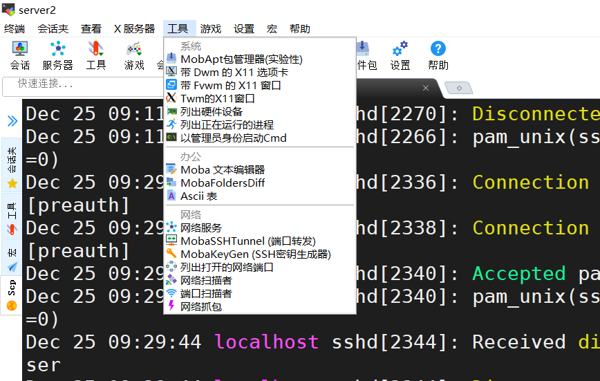
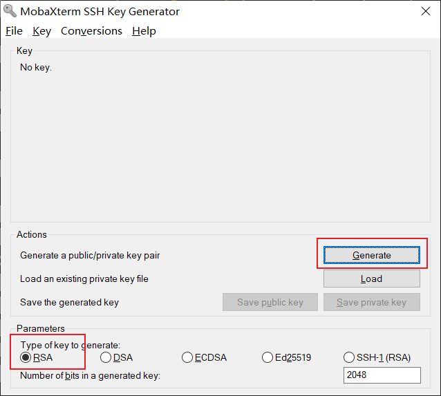
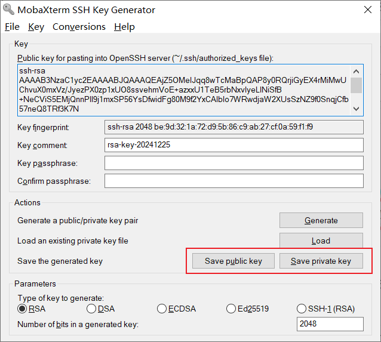
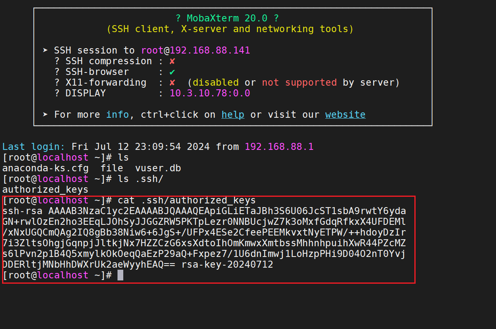
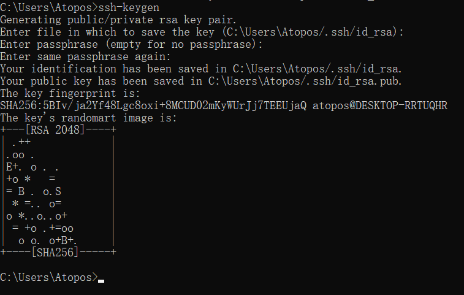
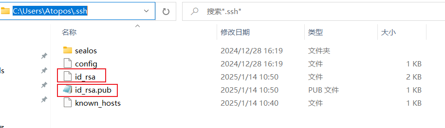

# SSH协议/OpenSSH服务

SSH（Secure Shell）协议是一种网络协议，用于加密方式远程登录到服务器。它提供了一种安全的方法来传输数据，防止数据在传输过程中被窃听或篡改。SSH 协议不仅用于远程登录，还可用于远程执行命令、文件传输（SFTP）、端口转发等。

OpenSSH 是 SSH 协议的一个开源实现工具，由 OpenBSD 项目开发和维护。它是大多数 Unix和类 Unix 操作系统中默认的 SSH 实现，包括 Linux、macOS 和 FreeBSD 等等

OpenSSH 提供了服务端程序(openssh-server)和客户端工具(openssh-client)

* Mac 和 Linux 中默认已安装 ssh 客户端，可直接在终端中使用 ssh 命令
* Windows 需手动安装 ssh 客户端，较常用的 Windows SSH 客户端有 XShell和 MobaXterm

**SSH 能够提供两种安全验证的方法：**

* 基于**口令**的验证—用账户和密码来验证登录
* 基于**密钥**的验证—需要在本地生成密钥对，然后把密钥对中的公钥上传至服务器，并与服务器中的公钥进行比较；该方式相较来说更安全

# SSH 客户端使用

OpenSSH 服务提供我们 SSH 工具，该工具采用 SSH 协议来连接到远程主机上

## SSH 常用操作

通过 SSH 协议登录远程主机

```shell
# 以 root 用户登录远程主机（192.168.88.20）
[root@localhost ~]# ssh root@192.168.88.20
root@192.168.88.20's password:
Last login: Tue Dec 24 15:42:36 2024 from 192.168.88.1
```

指定连接远程主机的端口号

```shell
# -P 参数指定远程主机的端口号
[root@localhost ~]# ssh root@192.168.88.20 -p22
# 
root@192.168.88.20's password:
Last login: Tue Dec 24 15:43:18 2024 from 192.168.88.10
```

不登陆到远程主机中，仅仅执行某个命令并返回结果

```shell
[root@localhost ~]# ssh root@192.168.88.20 cat /etc/hosts
root@192.168.88.20's password:
127.0.0.1   localhost localhost.localdomain localhost4 localhost4.localdomain4
::1         localhost localhost.localdomain localhost6 localhost6.localdomain6
```

## SCP 远程文件传输

除了连接到远程主机之外，我们也可以用附带的小工具 SCP 来进行远程文件下载和本地文件上传至远程主机


```shell
# 将远程主机上的文件下载至本地
本地 % scp  root@172.16.175.129:/etc/passwd ./
root@172.16.175.129's password:
passwd                                                                                       100%  945     1.2MB/s   00:00

# 将本地文件上传至远程主机
本地 % scp cmatrix-1.2a.tar.gz root@172.16.175.129:/tmp/
root@172.16.175.129's password:
cmatrix-1.2a.tar.gz                                                                          100%   73KB  20.2MB/s   00:00
```

# 服务端配置文件

sshd 服务的配置信息保存在 `/etc/ssh/sshd_config` 文件中。运维人员一般会把保存着最主要配置信息的文件称为主配置文件，而配置文件中有许多以井号开头的注释行，要想让这些配置参数生效，需要在修改参数后再去掉前面的 `#` 

**常见配置项**

| 配置项                             | 说明                               |
| :--- | :--- |
| Port 22                           | 默认的sshd服务端口                  |
| ListenAddress 0.0.0.0             | 设定sshd服务器监听的IP地址          |
| Protocol 2                        | SSH协议的版本号                     |
| HostKey /etc/ssh/ssh_host_key     | SSH协议版本为1时，DES私钥存放的位置 |
| HostKey /etc/ssh/ssh_host_rsa_key | SSH协议版本为2时，RSA私钥存放的位置 |
| HostKey /etc/ssh/ssh_host_dsa_key | SSH协议版本为2时，DSA私钥存放的位置 |
| PermitRootLogin yes               | 设定是否允许root管理员直接登录      |
| StrictModes yes                   | 当远程用户的私钥改变时直接拒绝连接  |
| MaxAuthTries 6                    | 最大密码尝试次数                    |
| MaxSessions 10                    | 最大终端数                          |
| PasswordAuthentication yes        | 是否允许密码验证                    |
| PubkeyAuthentication yes          | 是否允许使用公钥进行身份验证        |

# 安全密钥验证

上面讲到，ssh 远程连接，除了使用密码的方式登录，还可以使用密钥对进行登录。相比于密码等于而言，密钥登录会更加的安全

如果使用公钥和私钥进行加解密，那么我们称之为是一种非对称加密的方式进行加密，那同样的还有对称加密，同一个密钥加解密

非对称加密是一种加密方式，它涉及到两个密钥：一个公钥和一个私钥。公钥可以公开给任何人，而私钥则必须保密，只有密钥的拥有者才知道。这种加密方式的特点是使用公钥加密的数据只能通过对应的私钥来解密，反之亦然，使用私钥加密的数据只能通过对应的公钥来解密。

## 非对称加密

1. **密钥生成**：首先生成一对密钥，一个公钥和一个私钥。这两个密钥是数学上相关的，但即使知道其中一个，也很难计算出另一个。
2. **加密**：发送方使用接收方的公钥来加密信息。这个过程是可逆的，但只有拥有正确私钥的人才能解密。
3. **解密**：接收方使用自己的私钥来解密信息。这个过程确保了只有拥有私钥的接收方才能阅读信息。

我们可以想象一下，你有一个非常特别的邮箱，这个邮箱有一个特点：它有两个锁。一个锁是公开的，任何人都可以往里投信，但只有你知道如何打开它（私钥）。另一个锁是私有的，只有你知道它在哪里，而且只有你拥有打开它的钥匙（公钥）。

- **公钥（锁）**：你把这个特别的锁（公钥）放在一个公共的地方，比如你的家门口。任何人都可以给你写信，他们只需要用这个锁把你的信锁起来，然后投进你的邮箱。因为只有你知道如何打开这个锁，所以你的信件在运输过程中是安全的。
- **私钥（钥匙）**：你把打开这个锁的钥匙（私钥）藏在家里一个安全的地方。当信件到达时，你可以用你的私钥打开锁，取出信件阅读。
- **安全性**：即使有人试图复制这个锁（公钥），他们也无法制造出能打开它的钥匙（私钥），因为这两个是数学上相关的，但计算其中一个从另一个是几乎不可能的。

## SSH密钥对口令验证

在客户端主机中生成**密钥对**

```shell
[root@localhost ~]# ssh-keygen
# 为简化操作请一路向北

# 查看/root/.ssh目录中，是否存在id_rsa(私钥)和id_rsa.pub(公钥)
[root@localhost ~]# ls -al /root/.ssh/
total 16
drwx------. 2 root root   80 Dec 25 09:24 .
dr-xr-x---. 3 root root  159 Dec 24 15:58 ..
-rw-------. 1 root root 2610 Dec 25 09:24 id_rsa
-rw-r--r--. 1 root root  580 Dec 25 09:24 id_rsa.pub
-rw-------. 1 root root  837 Dec 24 15:43 known_hosts
-rw-r--r--. 1 root root   95 Dec 24 15:43 known_hosts.old
```

把客户端主机中生成的公钥文件传送至远程主机

```shell
# 使用 ssh-copy-id 这个工具，可以将公钥内容发送给目标主机
[root@localhost ~]# ssh-copy-id 192.168.88.20
# 为简化操作请一路向北，输入一次密码即可

# 检查服务端，是否成功接收到公钥：authorized_keys 文件中是否有相关记录
[root@localhost ~]# cat .ssh/authorized_keys

```

对远程主机进行设置，使其只允许密钥验证，拒绝传统的口令验证方式

```shell
# 编辑 /etc/ssh/sshd_config 文件，更改的配置项如下
PasswordAuthentication no
PubkeyAuthentication yes
# 重启 sshd 服务
[root@localhost ~]# systemctl restart sshd
```

客户端免密登录到远程主机

```shell
[root@localhost ~]# ssh root@192.168.88.20
```

# mobaxterm 生成密钥登录

通过mobaxterm我们也可以生成密钥对，从而通过密钥对进行登录

在工具选项中找到ssh密钥生成器



选择生成的密钥对类型以及点击Generator生成



生成密钥对并且保存公钥和私钥

生成的时候，要鼠标不断移动，该工具会根据鼠标移动的坐标，来生成随机的密钥




服务端 `.ssh` 目录下新建文件`authorized_keys`，将上面生成的密钥粘进去



如果连接失败，原因是由于我们通过 mobaxterm 生成的密钥文件权限不满足要求，并且在 windows 上修改权限的话非常麻烦。所以我们可以考虑通过在 cmd 命令行中使用 ssh-keygen 工具来生成密钥文件。



可以看到生成的公钥和私钥



打开公钥文件，复制其中的内容，在 Linux 中的 /root.ssh/authorized_keys 文件中粘贴

然后继续通过 cmd 连接测试：


也可以尝试使用 Mobaxterm 工具，选择私钥进行连接。但是 Mobaxterm 连接的时候也可能会遇到报错的问题。这个是受不同工具的影响。如果通过 cmd 能够连接成功的话。就说明我们的密钥和配置是正常的。

