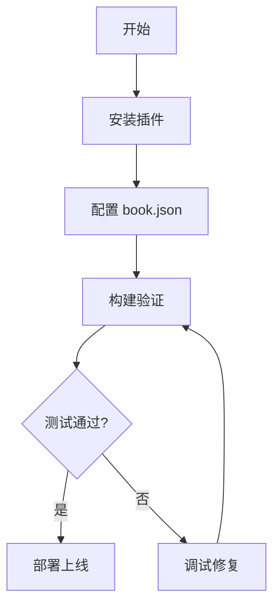

# 插件功能测试

本文档用于测试 HonKit 插件功能，包括搜索、告警框和页面内目录。

---

## 页面内目录插件 (intopic-toc)

右侧应显示本文的目录，包含以下章节：

- 页面内目录插件示例
- 灵活告警插件示例 (flexible-alerts)
- 搜索功能测试说明

---

## 灵活告警插件示例 (flexible-alerts)

> [!NOTE]
> 这是一个提示 (Note)
> 用于展示一般性提示信息，通常是蓝色的。

> [!TIP]
> 这是一个技巧 (Tip)
> 用于提供有用的建议或技巧，通常是绿色的。

> [!WARNING]
> 这是一个警告 (Warning)
> 用于提示需要注意事项，通常是黄色的。

> [!DANGER]
> 这是一个危险 (Danger)
> 用于提示严重问题或风险，通常是红色的。

> [!INFO]
> 这是一个信息 (Info)
> 用于提供补充说明信息。

> [!SUCCESS]
> 这是一个成功 (Success)
> 用于展示成功状态或结果。

---

## 搜索功能测试说明

本文档可以用于测试搜索功能：

1. 在搜索框中输入 "插件" 应能找到本文
2. 搜索 "告警" 应能找到告警相关内容
3. 搜索 "目录" 应能找到目录相关内容

---

## Mermaid 流程图测试

---

## 章节嵌套测试

### 子章节 1

测试页面目录的层级显示功能。

#### 三级标题 1

更深层级的标题。

#### 三级标题 2

另一个三级标题。

### 子章节 2

第二个主章节。

#### 三级标题 3

内容...

---

## 总结

如果看到：
- ✅ 右侧有目录导航，支持滚动高亮
- ✅ 各种颜色的告警框正确显示
- ✅ Mermaid 流程图正常渲染

则插件配置成功！
