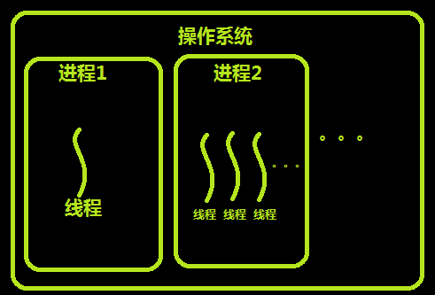
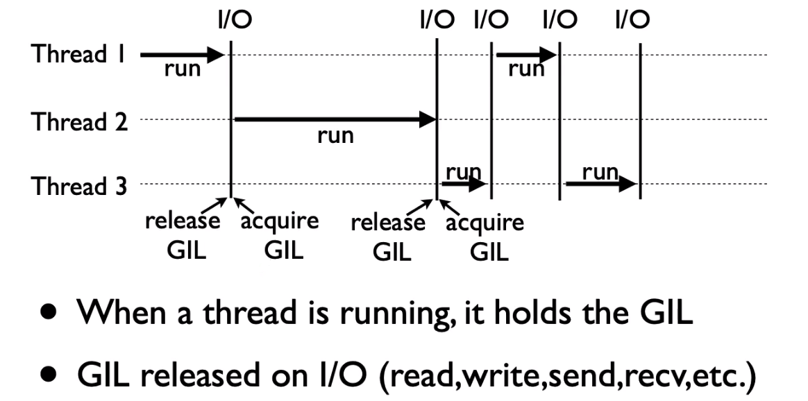

# 操作系统线程理论

## 进程

进程只能在一个时间干一件事，如果想同时干两件事或多件事，进程就无能为力了。

进程在执行的过程中如果阻塞，例如等待输入，整个进程就会挂起，即使进程中有些工作不依赖于输入的数据，也将无法执行。

## 线程

60年代，在 OS 中能拥有资源和独立运行的基本单位是进程，然而随着计算机技术的发展，进程出现了很多弊端：

1. 进程是资源拥有者，创建、撤消与切换存在较大的时空开销，因此需要引入轻型进程。
2. 对称多处理机（SMP）出现，可以满足多个运行单位，而多个进程并行开销过大。

因此在 80 年代，出现了能独立运行的基本单位：线程（Threads）。进程是资源分配的最小单位，线程是CPU调度的最小单位，每一个进程中至少有一个线程。　

## 进程和线程的关系

 

线程与进程的区别可以归纳为以下4点：

1. 地址空间和其它资源共享（如打开文件）：进程间相互独立，同一进程的各线程间共享。某进程内的线程在其它进程不可见。
2. 通信：进程间通信IPC，线程间可以直接读写进程数据段（如全局变量）来进行通信，需要进程同步和互斥手段的辅助，以保证数据的一致性。
3. 调度和切换：线程上下文切换比进程上下文切换要快得多。
4. 多线程操作系统中，进程不是一个可执行的实体。

## 使用线程的实际场景

开启一个打字处理软件进程，该进程肯定需要办不止一件事情，比如监听键盘输入，处理文字，定时自动将文字保存到硬盘，这三个任务操作的都是同一块数据，因而不能用多进程。只能在一个进程里并发地开启三个线程，如果是单线程，那就只能是，键盘输入时，不能处理文字和自动保存，自动保存时又不能输入和处理文字。

## 内存中的线程

 

线程通常是有益的，但是带来了不小程序设计难度，线程的问题是：

1. 父进程有多个线程，那么开启的子线程是否需要同样多的线程
2. 在同一个进程中，如果一个线程关闭了文件，而另外一个线程正准备往该文件内写内容呢？

因此，在多线程的代码中，需要更多的心思来设计程序的逻辑、保护程序的数据。

# python 线程使用

## 全局解释器锁 GIL

Python 代码的执行由 Python 解释器主循环控制。Python 在设计之初就考虑到要在主循环中，同时只有一个线程在执行。虽然 Python 解释器中可以“运行”多个线程，但在任意时刻只有一个线程在解释器中运行。对 Python 解释器的访问由全局解释器锁(GIL)来控制，正是这个锁能保证同一时刻只有一个线程在运行。

在多线程环境中，Python 解释器按以下方式执行：



1. 设置 GIL
2. 切换到一个线程去运行
3. 运行指定数量的字节码指令或者线程主动让出控制(可以调用 time.sleep(0))
4. 把线程设置为睡眠状态
5. 解锁 GIL
6. 再次重复以上所有步骤。

## 创建线程

**直接创建线程对象**：

```python
from threading import Thread
import time

def task(name, delay):
    print(f"{name} 开始执行")
    time.sleep(delay)
    print(f"{name} 执行完毕")


if __name__ == "__main__":
    # 通过 Thread 类实例化，指定目标函数（target）和参数（args/kwargs） 
    t1 = Thread(target=task, args=("线程A", 2))
    t1.start()      # 启动线程
    t1.join()  # 等待线程结束
```

**继承 Thread 类**：

```python
from threading import Thread
import time


# 通过子类化 Thread 并重写 run() 方法
class MyThread(Thread):
    def __init__(self, name):
        super().__init__()
        self.name = name

    def run(self):
        print(f"{self.name} 运行中...")
        time.sleep(1)


if __name__ == "__main__":
    t1 = MyThread("自定义线程")
    t1.start()

```

## 多线程

**示例代码**：多线程运行
```python
import threading
import time
import os


def task(name, delay):
    print(f"当前线程 ID (Python标识符): {threading.get_ident()}")
    print(f"线程对象标识符: {threading.current_thread().ident}")

    print(f"{name}-{os.getpid()} 开始执行")
    time.sleep(delay)
    print(f"{name}-{os.getpid()} 执行完毕")


if __name__ == "__main__":
    threads = [threading.Thread(target=task, args=(f"线程{i}", 2)) for i in range(10)]
    for t in threads:
        t.start()
    for t in threads:
        t.join()
    print("主线程/主进程pid", os.getpid())
    
```

## 常用方法

| 方法 | 含义 |
| :------ | :------- |
| `Thread.isAlive()` | Thread 类中的对象方法：返回线程是否活动的 |
| `Thread.getName()` | 返回线程名 |
| `Thread.setName()` | 设置线程名 |
| `threading.currentThread()` | 返回当前的线程变量 |
| `threading.enumerate()` | 返回一个包含正在运行的线程的列表 |
| `threading.activeCount()` | 返回正在运行的线程数量 |

**示例代码**： 

```python
from threading import Thread
import threading
from multiprocessing import Process
import os


def work():
    import time

    time.sleep(3)
    print(threading.current_thread().getName())


if __name__ == "__main__":
    t = Thread(target=work)
    t.start()
    print(t.is_alive())
    print(threading.current_thread().getName())
    print(threading.current_thread())
    print(threading.enumerate())
    print(threading.active_count())
    t.join()
    print("主线程/主进程")
    print(t.is_alive())

```

## 守护线程

在 Python 中，守护线程（Daemon Thread） 是一种特殊的线程，它的生命周期与主线程（或程序的主进程）绑定。当所有非守护线程（即普通线程）结束时，无论守护线程是否完成任务，它都会被强制终止。这种机制常用于执行后台支持任务（如日志记录、心跳检测等），无需等待其完成。

**核心特性**：

- **依赖主线程存活**：主线程结束时，守护线程立即终止（即使任务未完成）。
- **后台服务**：通常用于非关键性任务，即使意外终止也不会影响程序逻辑。
- **资源释放风险**：守护线程被终止时，可能不会正常释放资源（如文件句柄、网络连接），需谨慎使用。

**示例代码**：

```python
import threading
import time


def background_task():
    while True:
        print("守护线程运行中...")
        time.sleep(1)


# 创建线程并设置为守护线程
daemon_thread = threading.Thread(target=background_task)
daemon_thread.daemon = True
daemon_thread.start()

# 主线程执行其他操作
time.sleep(3)
print("主线程结束，守护线程将被终止")

```

# 线程同步机制

## 互斥锁

保证同一时刻只有一个线程能访问共享资源，防止数据竞争。

**代码示例**：

```python
import threading
import time


def increment():
    global shared_counter
    with lock:  # 自动获取和释放锁：lock.acquire() 和 lock.release()
        tmp = shared_counter + 1
        time.sleep(0.1)
        shared_counter = tmp

if __name__ == "__main__":
    shared_counter = 0
    lock = threading.Lock()
    # 启动多个线程修改共享变量
    threads = [threading.Thread(target=increment) for _ in range(100)]
    for t in threads:
        t.start()
    for t in threads:
        t.join()
    print(shared_counter)  # 输出 100（无竞争）

```

## 死锁与可重入锁


**死锁**：两个或两个以上的进程或线程在执行过程中，因争夺资源而造成的一种互相等待的现象，若无外力作用，它们都将无法推进下去。此时称系统处于死锁状态或系统产生了死锁，这些永远在互相等待的进程称为**死锁进程**

**示例代码**：

```python
from threading import Lock as Lock
import time

mutexA = Lock()
mutexA.acquire()
mutexA.acquire()  # 上面已经拿过一次key了，这边就拿不到了,程序被阻塞到这里
print(123)
mutexA.release()
mutexA.release()

```

**可重入锁**：`threading.RLock` 允许同一线程多次获取锁（避免死锁）。RLock 内部维护着一个 Lock和一个 counter 变量，counter 记录了 acquire 的次数，从而使得资源可以被多次 acquire。直到一个线程所有的 acquire 都被 release，其他的线程才能获得资源。

```python
from threading import RLock as Lock
import time

mutexA=Lock()
mutexA.acquire()
mutexA.acquire()
print(123)
mutexA.release()
mutexA.release()
```

## 同步锁

- 协调线程间的执行顺序（如生产者-消费者模型）。
- 控制并发数量（如限制同时访问数据库的连接数）。
  
### 信号量

控制同时访问资源的线程数量：适用于限制并发数

```python
import threading

semaphore = threading.Semaphore(3)  # 最多允许3个线程同时运行


def task():
    with semaphore:
        print(f"{threading.current_thread().name} 正在工作")
        # 模拟耗时操作
        threading.Event().wait(3)


# 启动10个线程，但最多3个并发执行
threads = [threading.Thread(target=task) for _ in range(10)]
for t in threads:
    t.start()
for t in threads:
    t.join()


```

### 条件变量

实现线程间通知机制：适用于生产者-消费者模型

```python
import threading

queue = []
condition = threading.Condition()


def producer():
    with condition:
        queue.append("EaglesLab")
        condition.notify()  # 通知等待的消费者


def consumer():
    with condition:
        while not queue:
            condition.wait()  # 等待生产者通知
        data = queue.pop()
        print(f"消费数据: {data}")


# 启动生产者和消费者线程
threading.Thread(target=producer).start()
threading.Thread(target=consumer).start()

```

### 事件

简单线程间状态通知：事件常用于跨线程的状态同步。

```python
import threading

event = threading.Event()


def waiter():
    print("等待事件触发...")
    event.wait()  # 阻塞直到事件被设置
    print("事件已触发！")


def setter():
    threading.Event().wait(2)
    event.set()  # 设置事件


threading.Thread(target=waiter).start()
threading.Thread(target=setter).start()

```

# 线程池

线程池通过预创建并复用一组线程，减少频繁创建/销毁线程的开销，适用于 **​​I/O 密集型任务**​​（如网络请求、文件读写）

- ​​优点​​：资源复用、负载均衡、简化线程管理。
- ​​适用场景​​：批量下载、Web 服务器请求处理、数据库并发查询。

## 基本操作

通过 `concurrent.futures.ThreadPoolExecutor` 实现

```python
from concurrent.futures import ThreadPoolExecutor


def task(n):
    return n * n


# 创建线程池（推荐使用 with 上下文管理）
with ThreadPoolExecutor(max_workers=5) as executor:
    # 提交任务方式1：submit 逐个提交
    future = executor.submit(task, 5)
    print(future.result())  # 输出 25

    # 提交任务方式2：map 批量提交
    results = executor.map(task, [1, 2, 3])
    print(list(results))

```

## 注意事项

- **线程数量**​​：建议设为 CPU 核心数 × 2（I/O 密集型）
- ​​**异常处理**​​：通过 `try-except` 捕获 `future.result()` 的异常
- **资源释放​**​：使用 `shutdown()` 或上下文管理器自动关闭线程池

## 同步机制结合

当多个线程访问共享资源（如全局变量、文件）时，需通过同步机制避免资源竞争和数据不一致。

**代码示例**：

```python
from concurrent.futures import ThreadPoolExecutor
from threading import Lock


def task():
    global counter
    with lock:  # 使用锁保护共享变量
        counter += 1


if __name__ == "__main__":
    counter = 0
    lock = Lock()
    with ThreadPoolExecutor(max_workers=5) as executor:
        futures = [executor.submit(task) for _ in range(100)]
        for future in futures:
            future.result()
    print(f"最终计数：{counter}")

```

# 课后作业

- [必须] 动手完成本章节案例
- [扩展] 阅读官方文档相关章节
- [扩展] 用多线程实现进程章节的爬虫案例