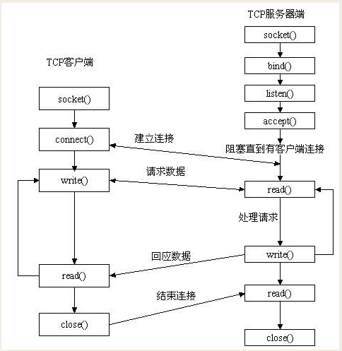
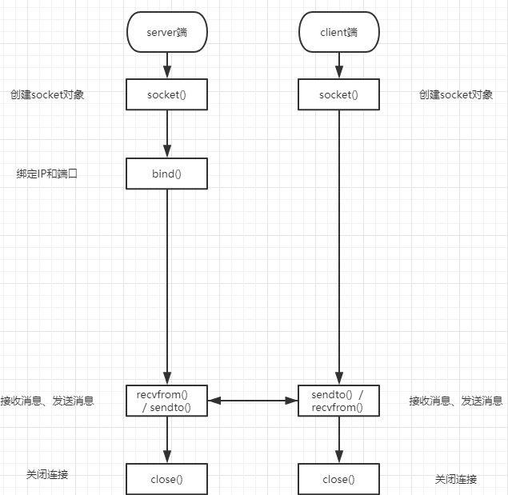
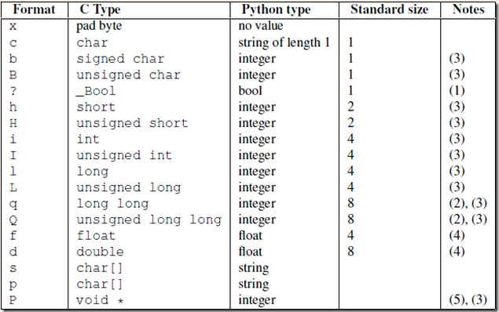

# 核心概念

- Socket（套接字）：网络通信的端点，支持不同主机间的进程通信。
- 协议类型：
  - TCP：
  - UDP：
- 地址族：...

# TCP 协议工作流程



## 服务端

**实现步骤：**

1. 创建 Socket 对象：`socket.socket(socket.AF_INET, socket.SOCK_STREAM)`
2. 绑定地址与端口​​：`bind(('0.0.0.0', 12345))`（0.0.0.0 表示监听所有 IP）
3. ​​监听连接​​：`listen(5)` （参数为最大等待连接）
4. 接收连接​​：`accept()` 返回客户端 Socket 和地址
5. 数据交换​​：`send()` 和 `recv()` 方法收发数据
6. 关闭连接​​：`close()` 释放资源


## 客户端

**实现步骤：**

1. ​创建 Socket 对象：`socket.socket(socket.AF_INET, socket.SOCK_STREAM)`
2. ​连接服务器​​：`connect(('127.0.0.1', 12345))`
3. 数据交换​​：同服务器端 `send()` 和 `recv()`

## 示例代码

```python
# server.py 代码
import socket

server = socket.socket(socket.AF_INET, socket.SOCK_STREAM)

server.bind(("127.0.0.1", 8080))

server.listen(5)

conn, client_addr = server.accept()
print(conn, client_addr, sep="\n")

from_client_data = conn.recv(1024)
print(from_client_data.decode("utf-8"))

conn.send(from_client_data.upper())

conn.close()

server.close()


# client.py 代码
import socket

client = socket.socket(socket.AF_INET, socket.SOCK_STREAM)

client.connect(("127.0.0.1", 8080))

client.send("hello".encode("utf-8"))

from_server_data = client.recv(1024)

print(from_server_data)

client.close()

```

# UDP 协议工作流程



## 服务端

**实现步骤：**

1. 创建 Socket 对象：`socket.socket(socket.AF_INET, socket.SOCK_DGRAM)`
2. 绑定地址与端口​​：`bind(('0.0.0.0', 12345))`
3. 数据交换​​：`sendto()` 和 `recvfrom()` 方法收发数据

## 客户端

**实现步骤：**

1. 创建 Socket 对象：`socket.socket(socket.AF_INET, socket.SOCK_DGRAM)`
2. 数据交换​​：同服务器端 `sendto()` 和 `recvfrom()` 

## 示例代码

```python
# server.py
import socket

server = socket.socket(socket.AF_INET, socket.SOCK_DGRAM)

server.bind(("127.0.0.1", 8000))

from_client_data, addr = server.recvfrom(1024)
print(from_client_data, addr, sep="\n")

server.sendto(from_client_data.upper(), addr)

server.close()

# client.py
import socket

client = socket.socket(socket.AF_INET, socket.SOCK_DGRAM)

client.sendto("hello".encode("utf-8"), ("127.0.0.1", 8000))

from_server_data, addr = client.recvfrom(1024)
print(from_server_data, addr, sep="\n")

client.close()

```

# 相关方法

服务端套接字函数

| 函数   | 含义                    |
| :---------- | :-------------------------------------------- |
| `s.bind()`   | 绑定(主机,端口号)到套接字                    |
| `s.listen()` | 开始 TCP 监听                                  |
| `s.accept()` | 被动接受 TCP 客户的连接,(阻塞式)等待连接的到来 |

客户端套接字函数

| 函数    | 含义                                 |
| :-------------- | :------------------------------------------------------- |
| `s.connect()`    | 主动初始化 TCP 服务器连接                                 |
| `s.connect_ex()` | `connect()`函数的扩展版本,出错时返回出错码,而不是抛出异常 |

公共用途的套接字函数

| 函数  | 含义                                                  |
| :--------------- | :------------------------------------------------------------ |
| `s.recv()`        | 接收TCP数据                                                  |
| `s.send()`       | 发送TCP数据(send在待发送数据量大于己端缓存区剩余空间时,数据丢失,不会发完) |
| `s.sendall()`     | 发送完整的TCP数据(本质就是循环调用send,sendall在待发送数据量大于己端缓存区剩余空间时,数据不丢失,循环调用send直到发完) |
| `s.recvfrom()`   | 接收UDP数据                                                  |
| `s.sendto()`     | 发送UDP数据                                                  |
| `s.getpeername()` | 连接到当前套接字的远端的地址                                 |
| `s.getsockname()` | 当前套接字的地址                                             |
| `s.getsockopt()`  | 返回指定套接字的参数                                         |
| `s.setsockopt()`  | 设置指定套接字的参数                                         |
| `s.close()`       | 关闭套接字                                                   |

面向锁的套接字方法

| 函数 | 含义 |
| :--------------- | :---------------------------- |
| `s.setblocking()` | 设置套接字的阻塞与非阻塞模式 |
| `s.settimeout()`  | 设置阻塞套接字操作的超时时间 |
| `s.gettimeout()`  | 得到阻塞套接字操作的超时时间 |

面向文件的套接字的函数

| 函数  | 含义           |
| :------------ | :---------------------------- |
| `s.fileno()`   | 套接字的文件描述符           |
| `s.makefile()` | 创建一个与该套接字相关的文件 |

# 粘包问题

## 原因

**TCP 协议特性**
- 流式传输​​：TCP 将数据视为连续字节流，不会自动分割数据包，导致接收端无法区分消息边界
- ​缓冲区机制​​：发送端和接收端均存在缓冲区，发送端可能将多个小数据包合并发送，接收端可能将多次接收的数据合并处理
- Nagle算法优化​​：TCP 为提高传输效率，会合并多个小数据包（例如间隔短且数据量小）后发送

**​​代码逻辑缺陷**
- 连续发送​​：在未明确分隔消息的情况下连续调用 `send()`，导致数据在缓冲区中合并
- 接收不完整​​：接收端 `recv()` 方法未动态调整缓冲区大小，导致部分数据残留

## 示例代码

### Demo1

通过 **​​连续发送小数据包**​​ 和 ​​**接收缓冲区合并**​​ 的场景模拟粘包现象：

```python

# 服务端代码（连续发送两次数据）​
import socket

server = socket.socket(socket.AF_INET, socket.SOCK_STREAM)
server.bind(('0.0.0.0', 8888))
server.listen(5)

print("服务端已启动，等待客户端连接...")

conn, addr = server.accept()
print(f"客户端 {addr} 已连接")

try:
    # 连续发送两次数据（未处理粘包）
    conn.send(b'Hello')  # 第一次发送
    conn.send(b'World')  # 第二次发送（可能合并到缓冲区）
except KeyboardInterrupt:
    print("服务端主动终止")
finally:
    conn.close()
    server.close()

# 客户端代码（一次性接收数据）​

import socket

client = socket.socket(socket.AF_INET, socket.SOCK_STREAM)
client.connect(('127.0.0.1', 8888))

try:
    # 一次性接收数据（可能合并两次发送的内容）
    data = client.recv(1024)
    print(f"接收到的数据: {data.decode()}")  # 预期输出可能是 'HelloWorld'
except ConnectionResetError:
    print("服务端已关闭连接")
finally:
    client.close()

```

**现象解释**
1. ​​Nagle 算法​：发送端连续调用 `send()` 发送小数据包，可能将两次发送合并为一个包。
2. 缓冲区机制：接收端 `recv(1024)` 的缓冲区较大，一次性读取了所有待接收数据


### Demo2

通过 ​**​大缓冲区发送 + 小缓冲区接收**​​ 的场景模拟接收不完整问题：

```python
# 服务端代码（发送 10KB 大数据包）​
import socket

server = socket.socket(socket.AF_INET, socket.SOCK_STREAM)
server.bind(('0.0.0.0', 8888))
server.listen(5)

print("服务端已启动，等待客户端连接...")
conn, addr = server.accept()

try:
    # 发送 10KB 数据（超过常规接收缓冲区）
    big_data = b'A' * 1024 * 10  # 10KB
    conn.sendall(big_data)
    print(f"已发送 {len(big_data)} 字节数据")
except KeyboardInterrupt:
    print("服务端主动终止")
finally:
    conn.close()
    server.close()

# 客户端代码（仅接收 4KB 数据）
import socket

client = socket.socket(socket.AF_INET, socket.SOCK_STREAM)
client.connect(('127.0.0.1', 8888))

try:
    # 设置接收缓冲区为 4KB，且仅接收一次
    partial_data = client.recv(4096)  # 只接收一次
    print(f"实际接收长度: {len(partial_data)} 字节")  # 输出 4096，残留 6KB 未接收
except ConnectionResetError:
    print("服务端已关闭连接")
finally:
    client.close()

```

**现象解释**
1. TCP 流式特性​​：TCP 将数据视为连续字节流，无边界标识
2. ​​缓冲区限制​​：`recv()` 方法一次性读取的字节数受参数限制，未循环接收导致残留

## 解决方案

固定包头法：发送端在数据前附加一个固定长度的包头，标明数据长度，接收端根据包头解析完整数据。

### struct 模块

把一个类型，如数字，转成固定长度的 bytes

 

**常见用法**

```python
import struct

# 将一个数字转化成等长度的bytes类型。
ret = struct.pack('i', 18334)
print(ret, len(ret))

# 通过unpack反解回来 返回一个元组回来
ret1 = struct.unpack('i',ret)[0]
print(ret1)
```

### Demo1

```python
# 服务端代码（连续发送两次数据）​
import socket
import struct

server = socket.socket(socket.AF_INET, socket.SOCK_STREAM)
server.bind(('0.0.0.0', 8888))
server.listen(5)

print("服务端已启动，等待客户端连接...")

conn, addr = server.accept()
print(f"客户端 {addr} 已连接")

try:
    data = b'Hello'
    header = struct.pack("!I", len(data))
    conn.send(header + data)  # 第一次发送
    data = b'World'
    header = struct.pack("!I", len(data))    
    conn.send(header + data)  # 第二次发送
except KeyboardInterrupt:
    print("服务端主动终止")
finally:
    conn.close()
    server.close()

# 客户端代码
import socket
import struct

client = socket.socket(socket.AF_INET, socket.SOCK_STREAM)
client.connect(('127.0.0.1', 8888))

try:
    # 接收固定长度包头
    header = client.recv(4)
    data_size = struct.unpack("!I", header)[0]
    received_data = client.recv(data_size)
    print(f"实际接收长度: {len(received_data)} 字节")
    print(received_data)
except ConnectionResetError:
    print("服务端已关闭连接")
finally:
    client.close()

```

### Demo2

```python
# 服务端代码（发送 10KB 大数据包）​
import socket
import struct

server = socket.socket(socket.AF_INET, socket.SOCK_STREAM)
server.bind(('0.0.0.0', 8888))
server.listen(5)

print("服务端已启动，等待客户端连接...")
conn, addr = server.accept()

try:
    # 发送 10KB 数据
    big_data = b'A' * 1024 * 10  # 10KB
    # 发送固定长度包头
    header = struct.pack("!I", len(big_data))
    conn.sendall(header + big_data)
    print(f"已发送 {len(big_data)} 字节数据")
except KeyboardInterrupt:
    print("服务端主动终止")
finally:
    conn.close()
    server.close()


#  客户端代码
import socket
import struct

client = socket.socket(socket.AF_INET, socket.SOCK_STREAM)
client.connect(('127.0.0.1', 8888))

try:
    # 接收固定长度包头
    header = client.recv(4) 
    data_size = struct.unpack("!I", header)[0]
    # 接收完整数据
    received_data = b""
    while len(received_data) < data_size:
        remaining = data_size - len(received_data)
        chunk = client.recv(min(remaining, 1024))
        if not chunk:
            break
        received_data += chunk
    print(f"实际接收长度: {len(received_data)} 字节")

except ConnectionResetError:
    print("服务端已关闭连接")
finally:
    client.close()

```

# 实践案例

## 循环通信

服务端和客户端之间可以循环进行通信。

```python
# server.py
import socket
import struct

server = socket.socket(socket.AF_INET, socket.SOCK_STREAM)
server.bind(("127.0.0.1", 8080))
server.listen(5)
print("服务端已启动，等待连接...")
conn = None

try:
    while True:
        conn, client_addr = server.accept()
        print(f"客户端 {client_addr} 已连接")
        while True:
            header = conn.recv(4)
            data_size = struct.unpack("!I", header)[0]
            received_data = b""
            while len(received_data) < data_size:
                remaining = data_size - len(received_data)
                chunk = conn.recv(min(remaining, 1024))
                if not chunk:
                    break
                received_data += chunk
            if (
                not received_data
                or received_data.decode("utf-8").strip().upper() == "EXIT"
            ):
                break
            print(f"收到消息: {received_data.decode('utf-8')}")

            response = received_data.decode("utf-8").upper()
            header = struct.pack("!I", len(received_data))
            conn.send(header + response.encode("utf-8"))
except ConnectionResetError:
    print("客户端异常断开")
except KeyboardInterrupt:
    print("服务端主动终止")
except Exception as e:
    print(f"未知异常: {e}")
finally:
    if conn:
        conn.close()
    server.close()


# client.py
import socket
import struct

client = socket.socket(socket.AF_INET, socket.SOCK_STREAM)
client.connect(("127.0.0.1", 8080))

try:
    while True:
        msg = input("请输入消息 (输入 EXIT 退出): ")
        if not msg.strip():
            print("消息不能为空，请重新输入")
            continue
        if msg.strip().upper() == "EXIT":
            break
        header = struct.pack("!I", len(msg.encode("utf-8")))
        client.send(header + msg.encode("utf-8"))

        header = client.recv(4)
        data_size = struct.unpack("!I", header)[0]
        received_data = b""
        while len(received_data) < data_size:
            remaining = data_size - len(received_data)
            chunk = client.recv(min(remaining, 1024))
            if not chunk: break
            received_data += chunk
        print(f"服务端返回: {received_data.decode('utf-8')}")
except KeyboardInterrupt:
    print("客户端主动终止")
except BrokenPipeError:
    print("服务端已关闭连接，终止发送")
except Exception as e:
    print(f"异常 {e}")
finally:
    client.close()

```

## 远程命令执行

客户端发送执行指令给服务端，服务端接收到指令并执行后将结果返回给客户端。

```python
import socket
import subprocess

server = socket.socket(socket.AF_INET, socket.SOCK_STREAM)
server.bind(("127.0.0.1", 8080))
server.listen(5)
print("服务端已启动，等待连接...")
conn = None

try:
    while True:
        conn, client_addr = server.accept()
        print(f"客户端 {client_addr} 已连接")
        while True:
            cmd = conn.recv(1024)
            if not cmd or cmd.decode('utf-8').strip().upper() == 'EXIT':
                break
            print(f"收到的命令: {cmd.decode('utf-8')}")
            ret = subprocess.Popen(cmd.decode('utf-8'), shell=True, stdout=subprocess.PIPE, stderr=subprocess.PIPE)
            correct_msg = ret.stdout.read()
            error_msg = ret.stderr.read()
            conn.send(correct_msg + error_msg)

except ConnectionResetError:
    print("客户端异常断开")
except KeyboardInterrupt:
    print("服务端主动终止")
except Exception as e:
    print(f"未知异常: {e}")
finally:
    if conn:
        conn.close()
    server.close()
```

## 时间服务端

```python
# server.py
import socket
import time
import struct

# 创建UDP套接字，设置端口复用
server_socket = socket.socket(socket.AF_INET, socket.SOCK_DGRAM)
server_socket.setsockopt(socket.SOL_SOCKET, socket.SO_REUSEADDR, 1) # 避免端口占用  
server_socket.bind(('', 8090))

print("时间服务器已启动，等待客户端请求...")

try:
    while True:
        # 接收客户端请求（空消息即可触发）
        data, client_addr = server_socket.recvfrom(1024)
        print(f"收到来自 {client_addr} 的请求")

        # 获取当前时间并封装为二进制数据
        current_time = int(time.time())  # 获取时间戳（秒级）
        packed_time = struct.pack("!I", current_time)  # 转为网络字节序的4字节数据，提升传输效率

        # 发送时间数据
        server_socket.sendto(packed_time, client_addr)
except KeyboardInterrupt:
    print("\n服务端主动终止")
finally:
    server_socket.close()


# client.py
import socket
import struct
import time

# 创建UDP套接字
client_socket = socket.socket(socket.AF_INET, socket.SOCK_DGRAM)
server_address = ('127.0.0.1', 8090)

try:
    # 发送空消息触发时间请求
    client_socket.sendto(b'', server_address)
    print("已发送时间请求，等待响应...")

    # 接收时间数据（最多等待2秒）
    client_socket.settimeout(2)
    data, _ = client_socket.recvfrom(1024)

    # 解析时间数据
    if len(data) == 4:
        timestamp = struct.unpack("!I", data)[0]  # 解析网络字节序数据
        print(f"服务器时间: {time.ctime(timestamp)}")
    else:
        print("错误：收到无效时间数据")
except socket.timeout:
    print("请求超时，服务端未响应")
except ConnectionRefusedError:
    print("连接被拒绝，请检查服务端是否运行")
except KeyboardInterrupt:
    print("\n客户端主动终止")
finally:
    client_socket.close()

```
