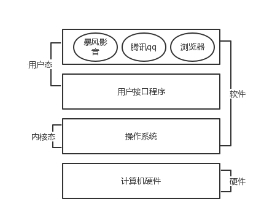
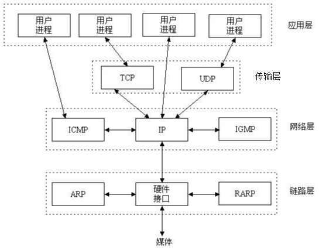
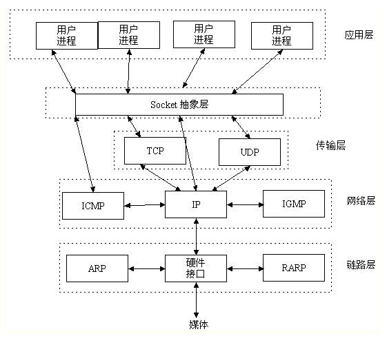

# 操作系统基础

操作系统:(Operating System，简称OS)是管理和控制计算机硬件与软件资源的计算机程序，是直接运行在“裸机”上的最基本的系统软件，任何其他软件都必须在操作系统的支持下才能运行。

​                                                       

操作系统应该分成两部分功能

1. 隐藏了丑陋的硬件调用接口（键盘、鼠标、音箱等等怎么实现的，就不需要你管了），为应用程序员提供调用硬件资源的更好，更简单，更清晰的模型（系统调用接口）。应用程序员有了这些接口后，就不用再考虑操作硬件的细节，专心开发自己的应用程序即可。
   例如：操作系统提供了文件这个抽象概念，对文件的操作就是对磁盘的操作，有了文件我们无需再去考虑关于磁盘的读写控制（比如控制磁盘转动，移动磁头读写数据等细节）

2. 将应用程序对硬件资源的竞态请求变得有序化
   例如：很多应用软件其实是共享一套计算机硬件，比方说有可能有三个应用程序同时需要申请打印机来输出内容，那么a程序竞争到了打印机资源就打印，然后可能是b竞争到打印机资源，也可能是c，这就导致了无序，打印机可能打印一段a的内容然后又去打印c...,操作系统的一个功能就是将这种无序变得有序。

# socket

回顾一下五层通讯流程

  

但实际上从传输层开始以及以下，都是操作系统帮咱们完成的，下面的各种包头封装的过程

  

Socket又称为套接字，它是应用层与TCP/IP协议族通信的中间软件抽象层，它是一组接口。在设计模式中，Socket其实就是一个门面模式，它把复杂的TCP/IP协议族隐藏在Socket接口后面，对用户来说，一组简单的接口就是全部，让Socket去组织数据，以符合指定的协议。当我们使用不同的协议进行通信时就得使用不同的接口，还得处理不同协议的各种细节，这就增加了开发的难度，软件也不易于扩展(就像我们开发一套公司管理系统一样，报账、会议预定、请假等功能不需要单独写系统，而是一个系统上多个功能接口，不需要知道每个功能如何去实现的)。于是UNIX BSD就发明了socket这种东西，socket屏蔽了各个协议的通信细节，使得程序员无需关注协议本身，直接使用socket提供的接口来进行互联的不同主机间的进程的通信。这就好比操作系统给我们提供了使用底层硬件功能的系统调用，通过系统调用我们可以方便的使用磁盘（文件操作），使用内存，而无需自己去进行磁盘读写，内存管理。socket其实也是一样的东西，就是提供了tcp/ip协议的抽象，对外提供了一套接口，同过这个接口就可以统一、方便的使用tcp/ip协议的功能了。

其实站在你的角度上看，socket就是一个模块。我们通过调用模块中已经实现的方法建立两个进程之间的连接和通信。也有人将socket说成ip+port，因为ip是用来标识互联网中的一台主机的位置，而port是用来标识这台机器上的一个应用程序。 所以我们只要确立了ip和port就能找到一个应用程序，并且使用socket模块来与之通信。

# 套接字家族

套接字起源于 20 世纪 70 年代加利福尼亚大学伯克利分校版本的 Unix,即人们所说的 BSD Unix。 因此,有时人们也把套接字称为“伯克利套接字”或“BSD 套接字”。一开始,套接字被设计用在同 一台主机上多个应用程序之间的通讯。这也被称进程间通讯,或 IPC。套接字有两种（或者称为有两个种族）,分别是基于文件型的和基于网络型的。

## 基于文件类型的套接字家族 

套接字家族的名字：AF_UNIX

unix一切皆文件，基于文件的套接字调用的就是底层的文件系统来取数据，两个套接字进程运行在同一机器，可以通过访问同一个文件系统间接完成通信

## 基于网络类型的套接字家族

套接字家族的名字：AF_INET

(还有AF_INET6被用于ipv6，还有一些其他的地址家族，不过，他们要么是只用于某个平台，要么就是已经被废弃，或者是很少被使用，或者是根本没有实现，所有地址家族中，AF_INET是使用最广泛的一个，python支持很多种地址家族，但是由于我们只关心网络编程，所以大部分时候我么只使用AF_INET)