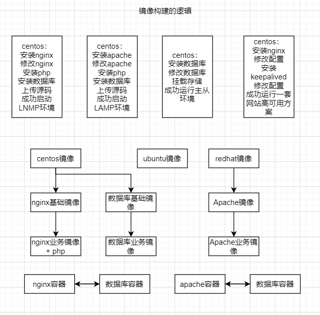

# 手动制作yum版nginx镜像：

Docker镜像制作类似于虚拟机的模板制作，即按照公司的实际业务将需要安装的软件、相关配置等基础环境配置完成，然后将虚拟机再提交为模板，最后再批量从模板批量创建新的虚拟机，这样可以极大地简化业务中相同环境的虚拟机运行环境的部署工作，Docker的镜像制作分为手动制作可自动制作（基于DockerFile），企业通常都是基于DockerFile制作镜像。

- 启动一个centos容器，安装好常用软件以及nginx

```bash
[root@docker-server ~]# docker run -it centos bash
# 安装wget、epel、nginx等相关常用软件
[root@0195bc1d0f7b ~]# yum install epel-release -y
[root@0195bc1d0f7b ~]# yum install nginx -y
[root@0195bc1d0f7b ~]# yum install vim wget pcre pcre-devel zlib zlib-devel openssl openssl-devel iproute net-tools iotop -y
```

- 关闭nginx后台运行

```bash
[root@0195bc1d0f7b ~]# vim /etc/nginx/nginx.conf
user nginx;
worker_processes auto;
error_log /var/log/nginx/error.log;
pid /run/nginx.pid;
daemon off;
```

- 自定义web界面

```bash
[root@0195bc1d0f7b ~]# echo 'eagleslab nginx' > /usr/share/nginx/html/index.html 
```

- 提交为镜像

```bash
[root@docker-server ~]# docker commit --help

Usage:  docker commit [OPTIONS] CONTAINER [REPOSITORY[:TAG]]

Create a new image from a container's changes

Options:
  -a, --author string    Author (e.g., "John Hannibal Smith
                         <hannibal@a-team.com>")
  -c, --change list      Apply Dockerfile instruction to the created image
  -m, --message string   Commit message
  -p, --pause            Pause container during commit (default true)
[root@docker-server ~]# docker commit -a "2404053206@qq.com" -m "my nginx image v1" 0195bc1d0f7b centos_nginx:v1
sha256:c29204bfca8d89a06a3bb841cc6ada3c8202798e8f92b5d24c592d48105379d7
[root@docker-server ~]# docker images
REPOSITORY     TAG       IMAGE ID       CREATED             SIZE
centos_nginx   v1        c29204bfca8d   9 seconds ago       386MB
mycentos       v1        acf250a6cabb   About an hour ago   209MB
nginx          latest    d1a364dc548d   2 weeks ago         133MB
hello-world    latest    d1165f221234   3 months ago        13.3kB
centos         latest    300e315adb2f   6 months ago        209MB

```

- docker commit**适用场景：**主要作用是将配置好的一些容器复用，再生成新的镜像。
commit是合并了save、load、export、import这几个特性的一个综合性的命令，它主要做了：
1、将container当前的读写层保存下来，保存成一个新层
2、和镜像的历史层一起合并成一个新的镜像
3、如果原本的镜像有3层，commit之后就会有4层，最新的一层为从镜像运行到commit之间对文件系统的修改。

- 从自己的镜像启动容器

```bash
[root@docker-server ~]# docker run -d -p 80:80 --name my_centos_nginx centos_nginx:v1 /usr/sbin/nginx
```


# 镜像构建逻辑



# DockerFile制作镜像

DockerFile可以说是一种可以被Docker程序解释的脚本，DockerFile是由一条条的命令组成的，每条命令对应linux下面的一条命令，Docker程序将这些DockerFile指令再翻译成真正的linux命令，其有自己的书写方式和支持的命令，Docker程序读取DockerFile并根据指令生成Docker镜像，相比手动制作镜像的方式，DockerFile更能直观地展示镜像是怎么产生的，有了写好的各种各样的DockerFIle文件，当后期某个镜像有额外的需求时，只要在之前的DockerFile添加或者修改相应的操作即可重新生成新的Docker镜像，避免了重复手动制作镜像的麻烦。

## 指令说明

配置指令

| 指令          | 说明                               |
| ------------- | ---------------------------------- |
| `ARG`         | 定义创建镜像过程中使用的变量       |
| `FROM`        | 指定所创建镜像的基础镜像           |
| `LABEL`       | 为生成的镜像添加元数据标签信息     |
| `EXPOSE`      | 声明镜像内服务监听的端口           |
| `ENV`         | 指定环境变量                       |
| `ENTRYPOINT`  | 指定镜像的默认入口命令             |
| `VOLUME`      | 创建一个数据卷挂载点               |
| `USER`        | 指定运行容器时的用户名或UID        |
| `WORKDIR`     | 配置工作目录                       |
| `ONBUILD`     | 创建子镜像时指定自动执行的操作指令 |
| `STOPSIGNAL`  | 指定退出的信号值                   |
| `HEALTHCHECK` | 配置所启动容器如何进行健康检查     |
| `SHELL`       | 指定默认shell类型                  |

操作指令

| 指令   | 说明                         |
| ------ | ---------------------------- |
| `RUN`  | 运行指定命令                 |
| `CMD`  | 启动容器时指定默认执行的命令 |
| `ADD`  | 添加内容到镜像               |
| `COPY` | 复制内容到镜像               |

### 配置指令

#### ARG

定义创建过程中使用到的变量

比如:`HTTP_PROXY 、HTTPS_PROXY 、FTP_PROXY 、NO_PROXY`不区分大小写

#### FROM

指定所创建镜像的基础镜像

为了保证镜像精简，可以选用体积较小的Alpin或Debian作为基础镜像

#### EXPOSE

声明镜像内服务监听的端口

```bash
EXPOSE 22 80 8443
```

该指令只是起到声明作用，并不会自动完成端口映射

#### ENTRYPOINT

指定镜像的默认入口命令，该入口命令会在启动容器时作为根命令执行，所有传入值作为该命令的参数

支持两种格式

- `ENTRYPOINT ["executable","param1","param2"]`exec调用执行
- `ENTRYPOINT command param1 param2`shell中执行

此时CMD指令指定值将作为根命令的参数

每个DockerFile中只能有一个ENTRYPOINT，当指定多个时只有最后一个起效

#### VOLUME

创建一个数据卷挂载点。

```bash
VOLUME ["/data"]
```

#### WORKDIR

为后续的`RUN 、CMD 、ENTRYPOINT`指令配置工作目录。

```bash
WORKDIR /path/to/workdir
```

可以使用多个`WORKDIR` 指令，后续命令如果参数是相对路径， 则会基于之前命令指定的路径

```bash
WORKDIR /a
WORKDIR b
WORKDIR c
RUN pwd
```

最终路径为`/a/b/c`

因此，为了避免出错，推荐`WORKDIR` 指令中只使用绝对路径。

### 操作指令

#### RUN

运行指定命令

每条RUN指令将在当前镜像基础上执行指定命令，并提交为新的镜像层

当命令较长时可以使用\来换行

#### CMD

CMD指令用来指定启动容器时默认执行的命令

支持三种格式

- `CMD ["executable","param1","param2"]`相当于执行`executable param1 param2`
- `CMD command param1 param2`在默认的shell中执行，提供给需要交互的应用
- `CMD ["param1","param2"]`提供给`ENTRYPOINT`的默认参数

每个Dockerfile 只能有一条`CMD`命令。如果指定了多条命令，只有最后一条会被执行。

#### ADD

添加内容到镜像

```bash
ADD <src> <dest>
```

该命令将复制指定的src路径下内容到容器中的dest路径下

src可以是DockerFIle所在目录的一个相对路径，也可以是一个url，还可以是一个tar

dest可以是镜像内绝对路径，或者相对于工作目录的相对路径

#### COPY

复制内容到镜像。

```bash
COPY <src> <dest>
```

`COPY` 与`ADD`指令功能类似，当使用本地目录为源目录时，推荐使用`COPY`。

## 制作nginx镜像

DockerFile可以说是一种可以被Docker程序解释的脚本，DockerFIle是由一条条的命令组成的，每条命令对应Linux下面的一条命令，Docker程序将这些DockerFile指令再翻译成真正的Linux命令，其有自己的书写方式和支持的命令，Docker程序读取DockerFile并根据指令生成Docker镜像。

- 下载镜像

```bash
[root@docker-server ~]# docker pull centos:7
```

- 创建目录环境

```bash
[root@docker-server opt]# mkdir -pv dockerfile/{web/{nginx,apache},system/{centos,ubuntu}}
mkdir: 已创建目录 "dockerfile"
mkdir: 已创建目录 "dockerfile/web"
mkdir: 已创建目录 "dockerfile/web/nginx"
mkdir: 已创建目录 "dockerfile/web/apache"
mkdir: 已创建目录 "dockerfile/system"
mkdir: 已创建目录 "dockerfile/system/centos"
mkdir: 已创建目录 "dockerfile/system/ubuntu"
```

- 进入到指定目录

```bash
[root@docker-server opt]# cd dockerfile/web/nginx/
[root@docker-server nginx]# pwd
/opt/dockerfile/web/nginx
```

- 下载源码包

```bash
[root@docker-server nginx]# wget http://nginx.org/download/nginx-1.20.1.tar.gz
[root@docker-server nginx]# ls
Dockerfile  nginx-1.20.1.tar.gz
```

- 编写DockerFile

```bash
[root@docker-server nginx]# vim Dockerfile 
# 第一行先定义基础镜像，后面的本地有效的镜像名，如果本地没有，会从远程仓库下载
FROM centos:7

# 镜像维护者的信息
MAINTAINER hugo 2763743788@qq.com

# 将编译安装nginx的步骤执行一遍
RUN yum install -y vim wget tree lrzsz gcc gcc-c++ automake pcre pcre-devel zlib zlib-devel openssl openssl-devel iproute net-tools iotop

# 上传nginx压缩包
ADD nginx-1.20.1.tar.gz /usr/local/src/

RUN cd /usr/local/src/nginx-1.20.1 \
&& ./configure --prefix=/usr/local/nginx --with-http_sub_module \
&& make \
&& make install \
&& cd /usr/local/nginx 

# 可以添加自己事先准备的配置文件
# ADD nginx.conf /usr/local/nginx/conf/nginx.conf

RUN useradd -s /sbin/nologin nginx \
&& ln -sv /usr/local/nginx/sbin/nginx /usr/sbin/nginx \
&& echo 'test nginx !' > /usr/local/nginx/html/index.html

# 声明端口号
EXPOSE 80 443

CMD ["nginx", "-g", "daemon off;"]
```

- 构建镜像

```bash
[root@docker-server nginx]# docker build -t nginx:v1 .
[root@docker-server nginx]# docker images | grep v1
nginx          v1        fbd06c1753c0   8 seconds ago   581MB
```

- 测试

```bash
[root@docker-server nginx]# docker run -d -it -p 80:80 nginx:v1
```


案例：https://blog.51cto.com/u_14080162/2464376

# 镜像上传

## 官方docker仓库

- 准备账户

登陆到docker hub官网创建账号，登陆后点击settings完善信息

- 填写账户基本信息


- 登陆仓库

```bash
[root@docker-server ~]# docker login docker.io
Login with your Docker ID to push and pull images from Docker Hub. If you don't have a Docker ID, head over to https://hub.docker.com to create one.
Username: smqy
Password:
WARNING! Your password will be stored unencrypted in /root/.docker/config.json.
Configure a credential helper to remove this warning. See
https://docs.docker.com/engine/reference/commandline/login/#credentials-store

Login Succeeded
[root@docker-server ~]# ls -a 
.                .bash_history  .bashrc  dockerfile    .tcshrc
..               .bash_logout   .cshrc   docker_in.sh  .viminfo
anaconda-ks.cfg  .bash_profile  .docker  .pki
[root@docker-server ~]# cat .docker/config.json 
{
	"auths": {
		"https://index.docker.io/v1/": {
			"auth": "YmJqMTAzMDp6aGFuZ2ppZTEyMw=="
		}
	}
}[root@docker-server ~]# 

```

- 给镜像tag标签并上传

```bash
[root@docker-server ~]# docker tag nginx:v1 docker.io/smqy/nginx:v1
[root@docker-server ~]# docker images
REPOSITORY     TAG       IMAGE ID       CREATED          SIZE
nginx          v1        fbd06c1753c0   12 minutes ago   581MB
smqy/nginx     v1        fbd06c1753c0   12 minutes ago   581MB
centos_nginx   v1        74acdcca8c97   21 hours ago     525MB
nginx          latest    2b7d6430f78d   3 weeks ago      142MB
centos         7         eeb6ee3f44bd   12 months ago    204MB
nginx          1.8       0d493297b409   6 years ago      133MB
[root@docker-server ~]# docker push docker.io/smqy/nginx:v1
The push refers to repository [docker.io/smqy/nginx]
4f86a3bf507f: Pushed
0d11c01ff3ef: Pushed
45fc5772a4e4: Pushed
174f56854903: Mounted from library/centos
v1: digest: sha256:385bfe364839b645f1b2aa70a1d779b0dca50256ea01ccbe4ebde53aabd1d96d size: 1164
```

- 到docker官网进行验证


- 更换到其他docker服务器下载镜像

```bash
[root@docker-server ~]# docker login docker.io
```

## 阿里云仓库

将本地镜像上传至阿里云，实现镜像备份与统一分发的功能

https://cr.console.aliyun.com/

注册账户、创建namespace、创建仓库、修改镜像tag以及上传镜像


1. 登录阿里云Docker Registry

```bash
$ docker login --username=牛老师 registry.cn-hangzhou.aliyuncs.com
Password:
WARNING! Your password will be stored unencrypted in /root/.docker/config.json.
Configure a credential helper to remove this warning. See
https://docs.docker.com/engine/reference/commandline/login/#credentials-store

Login Succeeded
```

用于登录的用户名为阿里云账号全名，密码为开通服务时设置的密码。

您可以在访问凭证页面修改凭证密码。

2. 从Registry中拉取镜像

```bash
$ docker pull registry.cn-hangzhou.aliyuncs.com/smqy/nginx:[镜像版本号]
```

3. 将镜像推送到Registry

```bash
$ docker login --username=孙茂群翊 registry.cn-hangzhou.aliyuncs.com
$ docker tag [ImageId] registry.cn-hangzhou.aliyuncs.com/smqy/nginx:[镜像版本号]
# docker tag  centos_nginx:v1  registry.cn-hangzhou.aliyuncs.com/smqy/nginx:v1
$ docker push registry.cn-hangzhou.aliyuncs.com/smqy/nginx:[镜像版本号]
docker push registry.cn-hangzhou.aliyuncs.com/smqy/nginx:v1
The push refers to repository [registry.cn-hangzhou.aliyuncs.com/smqy/nginx]
5d90084f25f2: Pushed
174f56854903: Pushed
v1: digest: sha256:0d4a376eeb6270baf8739b5bdca1f877e08fc31442ee38cea0fad9fdb01ed45a size: 742
```

请根据实际镜像信息替换示例中的[ImageId]和[镜像版本号]参数。

4. 选择合适的镜像仓库地址

从ECS推送镜像时，可以选择使用镜像仓库内网地址。推送速度将得到提升并且将不会损耗您的公网流量。

如果您使用的机器位于VPC网络，请使用 registry-vpc.cn-hangzhou.aliyuncs.com 作为Registry的域名登录。

5. 示例

使用"docker tag"命令重命名镜像，并将它通过专有网络地址推送至Registry。

```bash
$ docker images
REPOSITORY                                                         TAG                 IMAGE ID            CREATED             VIRTUAL SIZE
registry.cn-hangzhou.aliyuncs.com/smqy/nginx   v1        74acdcca8c97   22 hours ago     525MB
```

使用 "docker push" 命令将该镜像推送至远程。

```bash
$ docker push registry-vpc.cn-hangzhou.aliyuncs.com/acs/agent:0.7-dfb6816
```


